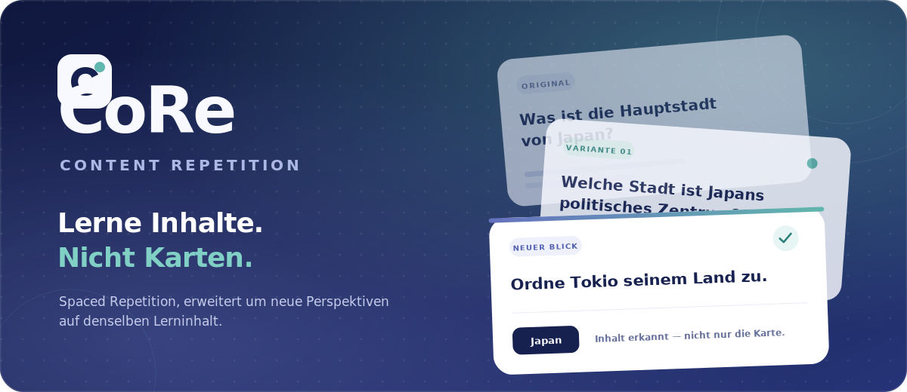

  

  
  
  

  <strong>CoRe erweitert Spaced Repetition um Content Repetition.</strong> 
  Derselbe Lerninhalt. Neue Formulierungen, neue Perspektiven, stabilerer Abruf.

---

## Wissen sollte die Formulierung überleben

Klassische Karteikarten können irgendwann zu vertraut werden: Man erkennt das Layout, den Wortlaut oder die Position einer Lücke – und verwechselt Wiedererkennen mit Verstehen.

CoRe verändert deshalb nicht nur den Wiederholungszeitpunkt, sondern auch die Form der Wiederholung. Reife Lerninhalte können als kontrollierte Varianten zurückkehren, während die ursprüngliche Karte als verlässlicher Anker erhalten bleibt.

  <strong>Original</strong>&nbsp;&nbsp;→&nbsp;&nbsp;<strong>stabiler Abruf</strong>&nbsp;&nbsp;→&nbsp;&nbsp;<strong>neue Perspektiven</strong>&nbsp;&nbsp;→&nbsp;&nbsp;<strong>Transfer</strong>

## Was CoRe besonders macht

<table>
  <tr>
    <td width="50%" valign="top">
      <h3>🔁 Inhalte statt Karten wiederholen</h3>
      Varianten bleiben mit ihrem Original verknüpft und werden erst dann relevant, wenn ein Lerninhalt dafür bereit ist.
    </td>
    <td width="50%" valign="top">
      <h3>🧠 Lernen, das mitwächst</h3>
      Fälligkeiten, vier Review-Bewertungen, Reifegrad und Lernhistorie formen eine persönliche Wiederholungsroutine.
    </td>
  </tr>
  <tr>
    <td width="50%" valign="top">
      <h3>📚 Vorhandenes Wissen mitnehmen</h3>
      Anki-Decks inklusive Unterstapeln und Medienreferenzen sowie Text-, CSV- und Tabelleninhalte finden ihren Weg in CoRe.
    </td>
    <td width="50%" valign="top">
      <h3>✨ Mit Kontext erstellen</h3>
      Karten entstehen manuell, aus Quellen oder als prüfbare KI-Entwürfe – mit Originalanker statt Blackbox.
    </td>
  </tr>
  <tr>
    <td width="50%" valign="top">
      <h3>🧪 Neue Zugänge erproben</h3>
      Lernstatistik gehört zum Kern; Deck-Graph, Lernplan und Chat mit dem eigenen Stapel bleiben klar gekennzeichnete Experimente.
    </td>
    <td width="50%" valign="top">
      <h3>🛡️ Persönliches bleibt persönlich</h3>
      Accountgebundene Lernstände, getrennte Reviewdaten und eine Cloud-first Grundlage halten den individuellen Fortschritt beim Lernenden.
    </td>
  </tr>
</table>

## Mehr als ein hübscheres Karteikartensystem

CoRe behandelt nicht die Karte, sondern den **Lerninhalt** als Zentrum. Jeder Inhalt besitzt genau eine Originalvariante. Umformulierungen, Cloze-Formen, Reverse-Karten und spätere KI-Varianten bleiben daran verankert – können aber ihren eigenen Lernstand und ihr eigenes Feedback tragen.

So entsteht aus einem Stapel keine Sammlung isolierter Vorder- und Rückseiten, sondern ein wachsendes Netz aus Inhalt, Quelle, Varianten und persönlicher Lernerfahrung.

## Aktueller Stand

CoRe ist ein **breiter, aktiv entwickelter Web-MVP**. Der künftige Beta-Kern konzentriert sich auf Account, Erstellen und Importieren, Kartenverwaltung, Lernen mit Content-Repetition, Statistik, Einstellungen und verlässliche accountgebundene Speicherung.

Die vorhandenen Flächen sind noch nicht überall wahrheitsgemäß nach Reife getrennt. Deck-Graph, Lernplan, Deck-Assistent, lokale Community-Demo und weitere KI-Flows sind Labs; große serverseitige APKG-Importe, produktive Community-Rechte sowie nicht abgenommene Auth- und Account-Lifecycle-Funktionen bleiben bis zu eigenen Freigabegates deaktiviert. Die offene Stabilisierung und ihre Abnahme stehen in der [Roadmap](docs/todo.md).

## Gebaut mit

  
  
  
  
  

  <a href="docs/specs.md">Produkt- und Engineering-Spezifikation</a>
  ·
  <a href="docs/anki-format-analysis.md">Anki-Format-Analyse</a>
  ·
  <a href="docs/file-naming-conventions.md">Dateinamenskonvention</a>
  ·
  <a href="docs/index.md">Dokumentation</a>
  ·
  <a href="docs/README.md">Entwicklerhinweise</a>

---

  <strong>CoRe — Content Repetition</strong> 
  Lerne Inhalte. Nicht Karten.

