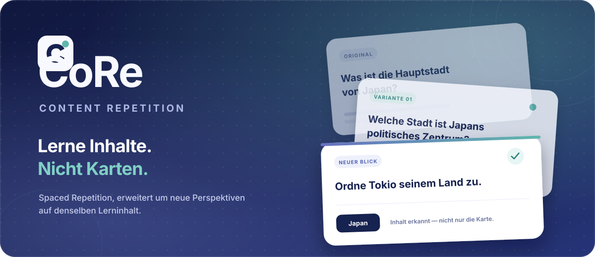

<p align="center">
  
</p>

<p align="center">
  <a href="https://core-hosted.vercel.app"></a>
  <a href="docs/specs.md"></a>
  <a href="docs/todo.md"></a>
</p>

<p align="center">
  <strong>CoRe erweitert Spaced Repetition um Content Repetition.</strong><br>
  Derselbe Lerninhalt. Neue Formulierungen, neue Perspektiven, stabilerer Abruf.
</p>

---

## Wissen sollte die Formulierung überleben

Klassische Karteikarten können irgendwann zu vertraut werden: Man erkennt das Layout, den Wortlaut oder die Position einer Lücke – und verwechselt Wiedererkennen mit Verstehen.

CoRe verändert deshalb nicht nur den Wiederholungszeitpunkt, sondern auch die Form der Wiederholung. Reife Lerninhalte können als kontrollierte Varianten zurückkehren, während die ursprüngliche Karte als verlässlicher Anker erhalten bleibt.

<p align="center">
  <strong>Original</strong>&nbsp;&nbsp;→&nbsp;&nbsp;<strong>stabiler Abruf</strong>&nbsp;&nbsp;→&nbsp;&nbsp;<strong>neue Perspektiven</strong>&nbsp;&nbsp;→&nbsp;&nbsp;<strong>Transfer</strong>
</p>

## Was CoRe besonders macht

<table>
  <tr>
    <td width="50%" valign="top">
      <h3>🔁 Inhalte statt Karten wiederholen</h3>
      Varianten bleiben mit ihrem Original verknüpft und werden erst dann relevant, wenn ein Lerninhalt dafür bereit ist.
    </td>
    <td width="50%" valign="top">
      <h3>🧠 Lernen, das mitwächst</h3>
      Fälligkeiten, vier Review-Bewertungen, Reifegrad und Lernhistorie formen eine persönliche Wiederholungsroutine.
    </td>
  </tr>
  <tr>
    <td width="50%" valign="top">
      <h3>📚 Vorhandenes Wissen mitnehmen</h3>
      Anki-Decks inklusive Unterstapeln und Medienreferenzen finden ihren Weg über APKG in CoRe.
    </td>
    <td width="50%" valign="top">
      <h3>✨ Mit Kontext erstellen</h3>
      Karten entstehen manuell oder aus unterstützten Importquellen – mit Originalanker statt Blackbox.
    </td>
  </tr>
  <tr>
    <td width="50%" valign="top">
      <h3>🧪 Neue Zugänge erproben</h3>
      Lernstatistik, Stapelverwaltung und nachvollziehbare Varianten gehören zum fokussierten Kern.
    </td>
    <td width="50%" valign="top">
      <h3>🛡️ Persönliches bleibt persönlich</h3>
      Accountgebundene Lernstände, getrennte Reviewdaten und lokale Speicherung mit accountgebundener Cloud-Synchronisierung halten den individuellen Fortschritt beim Lernenden.
    </td>
  </tr>
</table>

## Mehr als ein hübscheres Karteikartensystem

Jede CoRe-Karte besitzt einen eigenen Lernstand. Reverse-Richtungen und Cloze-Gruppen sind eigenständige Karten; KI-Umformulierungen bleiben an ihrer Grundkarte verankert und teilen deren Lernstand und Termin.

So entsteht aus einem Stapel keine Sammlung isolierter Vorder- und Rückseiten, sondern ein wachsendes Netz aus Inhalt, Quelle, Varianten und persönlicher Lernerfahrung.

## Aktueller Stand

CoRe ist ein **auf den Kartenlern-Kern reduzierter, aktiv entwickelter Web-MVP**. Der Beta-Kern konzentriert sich auf Account, Erstellen und Importieren, Kartenverwaltung, Lernen mit Content-Repetition, Statistik, Einstellungen und verlässliche accountgebundene Speicherung.

Labs-, breite KI-, Community- und Graph-Flächen sowie der serverseitige Groß-APKG-Pfad wurden entfernt. Davon ausgenommen ist die schmale textbasierte Variantenroute `/api/ai/card-variant`. Anki-Pakete (`.apkg`, `.colpkg`) werden bis einschließlich 2 GiB lokal verarbeitet; Google und Magic Link bleiben getrennt schaltbar. Die offene Stabilisierung und ihre Abnahme stehen in der [Roadmap](docs/todo.md).

## Dokumentation

Die gemeinsame [HTML-Dokumentation](docs/index.html) enthält Specs, Journeys,
UI-Elements und Kartentypen. Technisches Projektwissen bleibt in Markdown. Quellen und kurze Pflegeregeln:
[docs/README.md](docs/README.md). Bei Dokumentations- oder UI-Änderungen die
zuständigen Quellen und Demos aktualisieren, `npm run docs:build` ausführen und
mit `npm run check:docs` prüfen. Erzeugte HTML-Dateien nie direkt bearbeiten.

## Visueller Variantenvergleich

Der projektunabhängige Codex-Skill liegt unter [`.agents/skills/visual-ab-review/SKILL.md`](.agents/skills/visual-ab-review/SKILL.md), einschließlich Screenshot-Generator, HTML-Generator und [Formatbeispiel](.agents/skills/visual-ab-review/review.example.json). Contributors können diese vollständige Repository-Kopie direkt verwenden; alternativ ist eine globale Installation unter `~/.codex/skills/visual-ab-review` möglich. Bei beauftragten Skill-Aktualisierungen die Kopien mit der benannten Quelle abgleichen und die CoRe-Projektkonfiguration erhalten. Neue Projekte legen ihre Konfiguration anhand des [neutralen Beispiels](.agents/skills/visual-ab-review/visual-review.config.example.mjs) an.

Voraussetzungen: Node.js mit den Projektabhängigkeiten (`npm ci`), Chromium (`npx playwright install chromium`) und Python ab 3.10. Optional ermöglicht Pillow (`python -m pip install Pillow`) eine Rangliste nach Pixelanteil und kleinere eingebettete Bilder; ohne Pillow bleibt der Vergleich ausführbar. Es werden keine zusätzlichen npm-Abhängigkeiten benötigt.

Alle Befehle aus der Repository-Wurzel ausführen. Zunächst `npm run docs:build`, dann `npm run dev` starten (Port 5190). Die [Projektkonfiguration](visual-review.config.mjs) enthält zwei Katalogszenen ohne Anmeldung und sechs Viewports jeweils in Light und Dark. Weitere App-Zustände samt erforderlichem Demo- oder Anmelde-Setup bei der konkreten Änderung ergänzen; die [visuelle Pflichtmatrix](docs/operations.md#visuelle-pflichtmatrix) bleibt maßgeblich.

```sh
node .agents/skills/visual-ab-review/scenes.mjs --config visual-review.config.mjs --list
node .agents/skills/visual-ab-review/scenes.mjs --config visual-review.config.mjs --base http://127.0.0.1:5190 --out test-results/visual-review/shots --variant A
# Nach der Änderung und erneutem docs:build den Zielstand aufnehmen:
node .agents/skills/visual-ab-review/scenes.mjs --config visual-review.config.mjs --base http://127.0.0.1:5190 --out test-results/visual-review/shots --variant B
python .agents/skills/visual-ab-review/build.py rank test-results/visual-review/shots
```

Das Formatbeispiel nach `test-results/visual-review/spec.json` kopieren (PowerShell: `Copy-Item .agents/skills/visual-ab-review/review.example.json test-results/visual-review/spec.json`; macOS/Linux: `cp .agents/skills/visual-ab-review/review.example.json test-results/visual-review/spec.json`). Texte und Szenen anpassen, dann die eigenständige Vergleichsseite erzeugen:

```sh
python .agents/skills/visual-ab-review/build.py page test-results/visual-review/spec.json test-results/visual-review/review.html
```

`review.html` lokal im Browser öffnen, je Fall auswählen und den Ergebnis-Prompt in den Chat kopieren. Für parallele Vorher-/Nachher-Stände gilt der Worktree-Ablauf im Skill. Mit `--views mobile,mobile-dark,desktop,desktop-dark` weitere Ansichten aufnehmen; für alle Ansichten deren Namen aus der Konfiguration übergeben. Bei `"matrix": true` im Spec zeigt die Seite auch alle aufgenommenen Szenen und Ansichten. Aufnahmen, Spec und Vergleichsseite bleiben unter dem bereits Git-ignorierten `test-results/` und werden nach Abschluss gelöscht.

## Gebaut mit

<p align="center">
  
  
  
  
  
</p>

<p align="center">
  <a href="docs/specs.md">Produktvertrag</a>
  ·
  <a href="docs/anki-format-analysis.md">Anki-Format-Analyse</a>
  ·
  <a href="docs/file-naming-conventions.md">Dateinamenskonvention</a>
  ·
  <a href="docs/index.html">Docs öffnen</a> · <a href="docs/README.md">Dokumentationsquellen</a>
</p>

---

<p align="center">
  <strong>CoRe — Content Repetition</strong><br>
  <sub>Lerne Inhalte. Nicht Karten.</sub>
</p>
