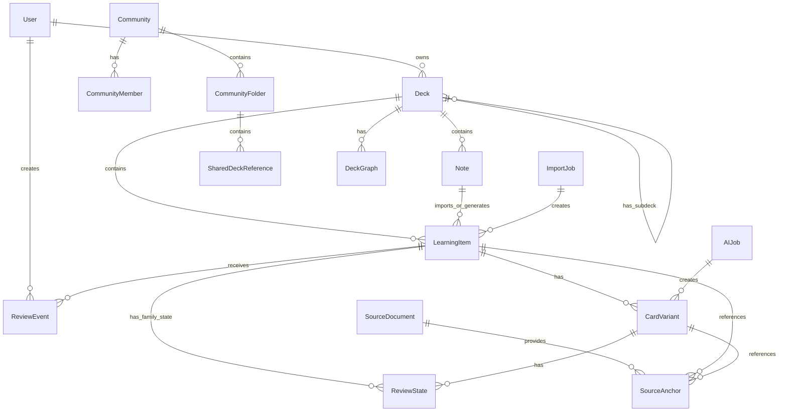
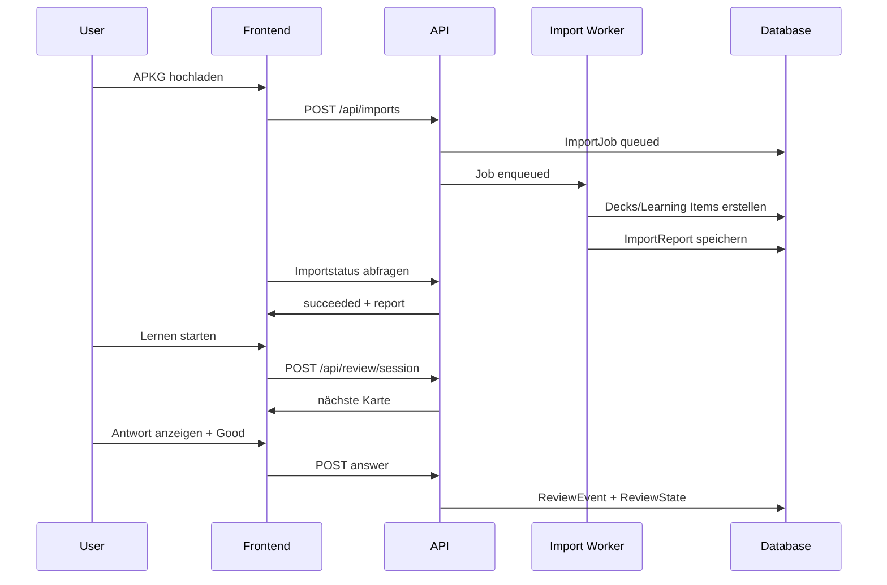
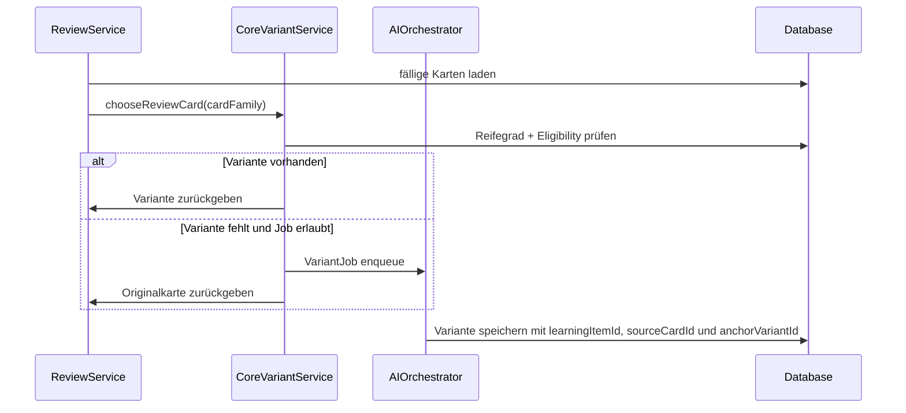

# CoRe — Content Repetition

**Produkt- und Engineering-Spezifikation**  
**Dateien:** `docs/specs.md` und `docs/specs.html`  
**Status:** Arbeitsfassung v0.4
**Datum:** 2026-07-13
**Quellenbasis:** Projektzusammenfassung des Auftraggebers + Speech-to-Text-Gruendergespraech + erneuter Gruendergespraech-Abgleich + aktueller Codebase-Stand + Hosting-/Database-/KI-Guide fuer Karteikarten-App + `docs/anki-format-analysis.md` + aktueller Test-/Infrastrukturstand

---

## Implementierungsstand 2026-07-13

Diese Spezifikation ist seit dem 2026-07-01 mit einer lokalen Vite/React-Implementierung verknüpft. Der aktuelle Stand ist ein breiter Web-MVP: Viele Produktabläufe sind klickbar, testbar und über kleine Module gekapselt. Ein Supabase-Projekt (`CoRe-Database`) und ein Vercel-Projekt (`core-hosted`) sind angebunden. Seit dem 2026-07-09 gibt es ein Pflicht-Login-Gate, Supabase-E-Mail/Passwort, accountgebundene lokale Cache-Keys, Cloud-first Autosave und eine einmalige Übernahme vorhandener lokaler Browserdaten. Seit dem 2026-07-14 ist auch der APKG-Medienpfad lokal implementiert: accountweite private Storage-Objekte, persistente Pending-Queue, Standard-/TUS-Uploads und Signed-URL-/Local-Fallback. CoRe ist trotzdem noch kein fertiges gehostetes Mehrnutzerprodukt: vollständiger Offline-Kaltstart, Medienexport/-sharing und Orphan-GC, KI-Serverjobs, Monitoring, Backups und Community-Rechte fehlen noch; die neue Medienmigration ist vor Remote-Nutzung separat auszurollen.

Wichtige Aenderung seit der ersten lokalen Spezifikationsfassung: Die bisherige Deck-`cards`-Collection bleibt im lokalen State aus Kompatibilitaetsgruenden bestehen, enthaelt fachlich aber Learning Items. `src/coreModel.ts` normalisiert neue und alte Karten ueber eine gemeinsame Creation Pipeline. Jedes Learning Item besitzt genau eine Original-Variante; Reverse-, Cloze-, importierte und KI-/Rephrase-Varianten sind daran verankert und koennen eigene Review-States, Performance- und Feedbackdaten tragen.

Die aktuelle Architektur macht bewusst keine breite Adapter-Vorleistung fuer noch unentschiedene Anbieter. Fuer den entschiedenen Startpfad wurden kleine Supabase-Module eingefuehrt: `src/supabaseClient.ts` kapselt die Browser-Client-Konfiguration, `src/cloudAuth.ts` kapselt Auth/Profile, `src/accountSession.ts` kapselt Auth-Phasen und Sync-Status, `src/accountStorage.ts` kapselt accountgebundene Browser-Cache-Keys, `src/syncDevice.ts` kapselt die stabile Browser-ID samt verständlichem Geräte-Label, und `src/cloudRepository.ts` kapselt accountgefilterte Tabellen-Loads, Geräte-Registrierung, Saves und Loeschsemantik fuer den ersten Online-MVP. React-Caller kennen weiterhin keine SQL-, RLS-, Row- oder User-Agent-Parsing-Details.

Produktivhinweise aus dem externen Karteikarten-Hosting-Guide wurden in diese zentrale Spezifikation uebernommen. Der relevante Zielpfad ist jetzt hier dokumentiert: Vercel als naheliegender Hosting-/Preview-/Domain-Pfad, Supabase Auth/Postgres/RLS als naheliegender Persistenzpfad, echte Tabellen statt grossem Store-Blob, Supabase Storage/Object Storage fuer grosse Medien und Dokumente, eigene `/api/ai/*`-Routen fuer geheime KI-Keys, sowie klare Env-Var- und Secret-Grenzen.

Dokumentationsstand nach Abgleich am 2026-07-07: Es gibt genau eine TODO-Markdown-Datei, `docs/todo.md`. Sie ist die einzige Roadmap-Quelle fuer offene Arbeit; neue TODO-Markdowns sollen nicht entstehen. `docs/specs.md` bleibt kanonisch, `docs/specs.html` ist die visuelle HTML-Fassung derselben Spezifikation, und `docs/anki-format-analysis.md` dokumentiert die Anki-Differenzentscheidungen hinter Import-, Medien- und Learning-Item-Ausbau.

Dokumentationsabgleich am 2026-07-09: Der nachgereichte Gruendergespraech-Auszug bestaetigt die bestehenden Kernentscheidungen zu Import, Kartenerstellung, Review, Content-Repetition, Community, Graph und sparsamer KI-Orchestrierung. Ergaenzt wurden vor allem zwei Schaerfungen: Varianten sollen mit wachsendem Reifegrad nur konservativ anspruchsvoller werden, und serverseitig wiederverwendbare Varianten muessen strikt von privaten Review-Events, Lernstaenden und persoenlichen Qualitaetsurteilen getrennt bleiben.

Datenbank-Release am 2026-07-10: Die Supabase-CLI-Konfiguration findet alle vier versionierten E-Mail-Templates. `20260709091315_sync_media_auth_operations.sql` wurde nach erfolgreichem Dry-Run remote angewendet; `npx supabase migration list --linked` bestaetigt jetzt alle vier Migrationen lokal und remote. Das erweiterte `supabase/verify_schema_v1.sql` bestaetigt Zielspalten, Tabellen, Composite Keys/FKs, RLS, Policies, Grants ohne `anon`-Zugriff und den privaten Bucket `core-media`. Der Performance-Advisor meldet keine Warnung; beim Security-Advisor bleibt ausschliesslich der bereits vorher vorhandene Hosted-Auth-Hinweis zur deaktivierten Leaked-Password-Protection offen.

E2E-Pruefbasis am 2026-07-10: Playwright startet Vite im getrennten Modus `e2e` und trennt die Suite in vier Projekte. `auth-gate-chromium` prueft das Login-Gate, gemappte Auth-Fehler und den sicheren React-Fehlerfallback mit drei sessionlosen Smokes ohne Account-Reset. `auth-resilience-chromium` prueft auf einem getrennten unkonfigurierten Vite-Port sowie ueber Browser-Netzwerkrouten fehlende Supabase-Konfiguration, Offline-Start und `session_expired`; alle drei cloudfreien Smokes sind gruen und erwarten deutsche Fehlertexte. `auth-setup` baut eine Supabase-Session auf und gibt sie als ignorierte, von `core.*`-App-Daten bereinigte `storageState` an fünfzehn `authenticated-chromium`-Produkt-Smokes weiter. `npm run test:e2e -- --list` bestaetigt alle 22 Tests. Fuer die kostenfreie vollstaendige Abnahme existiert `npm run test:e2e:local`: Der Befehl startet einen auf notwendige Dienste reduzierten lokalen Supabase-Stack, wendet ausstehende Migrationen an, liest den JSON-Status der installierten Supabase-CLI und akzeptiert URL-/Publishable-Key nur fuer Loopback-URLs, legt den lokalen Testaccount idempotent an, fuehrt Playwright aus und stoppt den Stack wieder. Die Status-Auswertung bleibt mit aelteren `KEY=VALUE`-Ausgaben kompatibel; der Start-Status mit lokalen Default-Schluesseln wird nicht in den Testlauf-Log geschrieben. Hosted-E2E bleibt ueber einen vorab angelegten Account und `.env.e2e.local` kompatibel. Vor jedem authentifizierten Lauf bereinigt das Setup ausschließlich Medien, Konflikte und Geräte des dedizierten Testaccounts und ersetzt dessen Snapshot über die RLS-geschützte Repository-Funktion mit der reproduzierbaren Welt-Hauptstadt-Fixture; eine Service Role ist nicht beteiligt. Das GitHub-Actions-Release-Gate `.github/workflows/ci.yml` fuehrt bei Pull Requests, Pushes auf `main` und manuellen Laeufen zuerst `npm run typecheck`, `npm test` und `npm run build` aus und startet danach alle Browser-Smokes mit lokalem Supabase ohne externe Zugangsdaten oder KI-Secrets. Im CI-Modus bleiben Retries deaktiviert; Fehlerberichte und Screenshots sowie Traces der sessionlosen Projekte werden sieben Tage als Artefakt aufbewahrt. `auth-setup` und `authenticated-chromium` erzeugen keine Traces, und `playwright/.auth/` sowie `.env`-Dateien werden nicht hochgeladen.

E2E-Abnahme am 2026-07-13: Der lokale Docker-/Supabase-Lauf mit `npm run test:e2e:local` ist einschließlich Geräte-Registrierung beim Auth-Boot, duplikatfreiem Geräte-Reload, Fehlerfallback, PDF-Auswahl, accountgebundener Konfliktentscheidung, Offline-Änderung und Reconnect-Flush sowie den bestehenden Produktszenarien mit 21/21 Browser-Smokes grün. Der Runner startet nur die benötigten Supabase-Dienste, verarbeitet die aktuellen JSON-Statusdaten, schreibt lokale Schlüssel nicht in den normalen Start-Log und stoppt den Stack nach dem Lauf. Der Modul-Testlauf umfasst nach M1 298 bestandene Tests; das getrennte RLS-Gate bleibt mit acht Smokes grün.

TypeScript-M1-Abnahme am 2026-07-13: `strict`/`noEmit`, der vollständige gemischte Modulgraph, die Type-Policy und der erste `.test.ts` sind grün. `src/coreTypes.ts` ist die kanonische Quelle der normalisierten Kernformen. `src/database.types.ts` wurde mit Supabase CLI 2.109.0 aus dem lokal migrierten Schema erzeugt; der gemeinsame Generate-/Check-Pfad erkennt eine absichtlich eingebrachte Abweichung und läuft vor RLS und Playwright. Bestehendes JavaScript bleibt mit `allowJs: true` und `checkJs: false` bis M2–M4 ausdrücklich permissiv. Das Datenbankschema und das sichtbare Produktverhalten wurden in M1 nicht geändert.

Cloud-Datenkorrektheit am 2026-07-14: `cloudRepository` mappt Revisionen, Soft-Deletes und Geräte-IDs bidirektional. `applyDeckMutation`, `applyCardMutation` und `softDeleteEntity` schützen Inserts, Updates und Tombstones atomar über `user_id`, `id` und Basisrevision; identische Retries werden ohne zweiten Revisionssprung bestätigt. Abweichende oder bereits gelöschte Remote-Rows erzeugen deterministische `sync_conflicts`, ohne bereits gelöste Konflikte erneut zu öffnen. Deckbaum-Löschungen bleiben lokal als Tombstones erhalten, bis der Server sie bestätigt. `appendReviewEvent` bestätigt nur ein per normalisiertem Readback inhaltlich identisches append-only Event. Nutzeränderbare Inhalte und Metadaten werden bei abweichender Basisrevision niemals automatisch vereinigt; reine Servermetadaten wie Revision, Zeitstempel und Geräte-ID werden ohne Inhaltskonflikt anerkannt. `SyncConflictPanel` zeigt accountgebundene offene und zurückgestellte Konflikte mit lokalen/Remote-Versionen und sicherem Feld-Merge. Entscheidungen werden per CAS im Repository angewendet, in genau die betroffene lokale Entität projiziert und bilden veraltete Snapshot-Mutationen neu; append-only Reviews laufen auch bei pausiertem Snapshot weiter. `syncEngine` verwaltet Browser-Netzstatus, genau einen Retry-Timer, exponentielles Backoff mit Jitter und Flush bei Wiederverbindung; nur eine leere Outbox gilt als gespeichert. `replaceAccountCloudState()` bleibt der ausdrücklich destruktive Pfad für Legacy-Import und E2E-Reset und löscht große Mengen veralteter append-only Rows in begrenzten Batches. Das lokale Zwei-Geräte-Gate bestätigt stale-write-Konflikte, genau einmal persistierte Offline-Reviews und nicht reaktivierbare Soft-Deletes.

Architektur-Audit am 2026-07-13: Die produktiv genutzten Modulschnittstellen bleiben kompatibel, ihre Invarianten wurden jedoch vertieft. `coreModel` synchronisiert Inhaltsänderungen atomar zwischen kanonischen Feldern, lokalen `cards`-Kompatibilitätsfeldern und der genau einen Originalvariante; inaktive, markierte oder abgelehnte Varianten bleiben erhalten und werden an den Originalanker repariert. APKG-Vorschau und Commit verwenden denselben normalisierten Learning-Item-Pfad, der APKG-Chunk wird im Creation-Workflow erst bei APKG-Nutzung geladen, und Reimports bewahren lokale Inhaltsänderungen einschließlich älterer Kompatibilitätsfelder sowie importierte Varianten anhand ihrer stabilen Anki-Quell-ID. `coreRepository` speichert Deck-Batches mit einem Zustands-Write und hält dabei die globale Dokumentprojektion konsistent. `cloudRepository` transportiert Titel, kanonische Inhalte, Konzepte, Quellenreferenzen sowie Review-Kompatibilitätsfelder verlustfrei und möglichst sparsam in reservierten Bereichen der vorhandenen JSONB-Spalten `cards.meta` und `review_events.flags`; bereits vorhandene Scheduler-Spalten werden nicht nochmals dupliziert und das Supabase-Schema ändert sich nicht. Die Sync-Outbox persistiert für vollständige Zustände nur kompakte Marker und liest den bereits accountgebunden gespeicherten Snapshot beim Wiederanlauf, sodass große Stapel nicht doppelt das Browser-Speicherlimit belegen. Die Welt-Hauptstadt-Fixture wird aus `fixtures/apkg/world-capitals.source.json` abgeleitet statt als zweites Datenliteral gepflegt. Echte Feature-Entfernungen sind ausdrücklich nicht Teil des Audits; mögliche Produktentscheidungen stehen in `docs/debatable-features.md`.

Cloud-Medienregel am 2026-07-14: `mediaStore` ist die accountgebundene öffentliche Medien-Seam für lokalen Preview-Cache, persistente Upload-Queue, Cloud-Synchronisierung und URL-Auflösung. Physische Objekte werden accountweit unter `{userId}/objects/{sha1}` gespeichert; mehrere aktive `media_assets`-Referenzen dürfen denselben Pfad verwenden, Größenkonflikte unter derselben SHA-1 werden abgewiesen. Standarduploads bis einschließlich 6 MB verwenden Supabase Storage ohne Upsert, größere Dateien lazy TUS mit 6-MB-Chunks, Resume-Fingerprint, aktuellem Token pro Request, Retry, Pause/Fortsetzen und expliziter Terminierung. `Deck.mediaAssets` enthält nur persistierte Metadaten, keine Bytes, Tokens oder Signed URLs. APKG-Preview bleibt lokal; nach dem Commit werden zuerst die Stapel cloudbestätigt und dann Medien hochgeladen. Fehler bleiben accountgebunden reloadfest pending. Reimport legt neue Referenzen vor dem Soft-Delete veralteter Referenzen an und entfernt ein Objekt nur ohne weitere aktive Pfadreferenz. Historische Crash-Orphans bleiben dem späteren Admin-GC vorbehalten.

Medien-Abnahme am 2026-07-14: 316 Modul-/API-Tests, zehn lokale RLS-/Sync-Smokes einschließlich echtem TUS-Upload über 6 MB und 22 Playwright-Flows sind grün. Der zusätzliche Browserflow importiert eine deterministische APKG-Medienfixture über `CreationScreen`, bestätigt die Cloud-Row und prüft die gerenderte Signed URL.

Ownership-/RLS-/Sync-Abnahme am 2026-07-14: `npm run test:rls:local` startet ausschließlich Loopback-Supabase, wendet Migrationen an, führt `supabase/verify_schema_v1.sql` als fehlschlagendes Struktur-Gate aus und prüft anschließend die Data API mit zwei angemeldeten Testnutzern sowie einem sessionlosen `anon`-Client. Acht Ownership-/RLS-Smokes decken eigene Lese-/Schreibzugriffe, unsichtbare und unveränderbare fremde Rows, abgewiesene Ownership-Fälschung, verweigerte `anon`-Zugriffe, accountgebundene Deck-/Card-FKs, gleiche lokale IDs, Geräte-Heartbeat sowie zwei konkurrierende Deck-Writes auf derselben Basisrevision mit persistiertem Konflikt ab. Ein neunter Test verwendet zwei authentifizierte Clients desselben Accounts mit getrennten Memory-Storages und Geräte-IDs für den vollständigen Zwei-Geräte-Vertrag. `npm run test:e2e:local` führt dasselbe Security- und Sync-Gate vor 21 Playwright-Flows aus; keine Service-Role-, Access- oder Refresh-Tokens gelangen in Vite, Playwright oder Fehlerartefakte.

Release-Diagnose am 2026-07-10: `vite.config.ts` injiziert ausschliesslich Version, Commit und Umgebung. Die Version stammt aus `package.json`, der Commit bevorzugt `VERCEL_GIT_COMMIT_SHA` vor `GITHUB_SHA` und faellt sonst auf `local` zurueck; die Umgebung wird auf Production, Preview, Development oder Test normalisiert. `src/appRuntime.ts` formatiert diese Werte fuer `ReleaseInfo` am Login-Gate, in den Einstellungen und im Fehlerfallback. `AppErrorBoundary` faengt React-Render-, Lifecycle- und Lazy-Load-Fehler ab, zeigt weder rohe Exception noch Stack oder Nutzerdaten und bietet Neuladen sowie Startseiten-Rueckkehr. Der Renderfehler-Trigger ist nur im Vite-Modus `e2e` aktiv und im Production-Bundle nicht enthalten.

Build- und PDF-Split am 2026-07-12: Nur Login-Gate und App-Shell laden eager; alle authentifizierten Screens und der Lernmodus laden per `React.lazy` mit deutschem `Suspense`-Status. `createCoreWorkspace()` behaelt seine asynchronen APKG-Interfaces und importiert APKG-/SQLite-/Zstd-Code erst bei Nutzung. Der tiefe `PdfDocumentViewer({ document, src, onSelection })` kapselt PDF.js-Runtime, Worker, kontinuierliche Anzeige, Fit-to-width, Navigation, Zoom, Textlayer und die Umrechnung der Auswahl in `pageNumber`/`bbox`. `vite.config.ts` trennt React und Supabase gezielt; der manifestbasierte Postbuild-Check in `scripts/verifyBuildChunks.ts` bricht oberhalb von 500.000 Byte je JavaScript-Chunk ab. Der verifizierte Build hat einen 248,30-kB-Entry, 192,48 kB React, 211,17 kB Supabase und als groessten budgetierten Chunk 431,65 kB PDF.js. Der getrennte PDF-Worker und WASM-Dateien bleiben separat geladene Assets.

| Bereich | Implementierte lokale Module / Screens |
|---|---|
| Dashboard, Statistik und Lernaktivitaet | `DashboardScreen`, `StatisticsScreen`, `libraryModel.createStudyHeatmapModel`, `libraryModel.createStudyHeatmapWindow`, `libraryModel.getStudyHeatmapVisibleWeekCount`, `libraryModel.createPerformanceStatisticsModel`, reduzierter Heute-Kopf mit Fällig-/Originalkarten-Kacheln, kompakter Heatmap-Kopf mit aktiven Tagen, rechtsbündiger Legende und Pfeilnavigation, aktive Hauptstapel mit Unterbaum-Aggregaten, responsive GitHub-/Anki-artige Jahres-Heatmap mit standardmäßigem Kalenderjahr von Januar bis Dezember, Monats- und Jahreswechselmarken, Leistungsstatistik mit Trefferquote, Bewertungsverteilung und Stapel-Auswertung |
| Account, Profil, Datenschutz | `SettingsScreen`, `LearningSettingsPanel`, `deckSettings.getGlobalDeckSettings`, `createCoreRepository().saveProfile()`, globale Lernvorgaben in `profile.schedulerPreferences` |
| Decks, Hierarchie, CoRe-Modus | `menuModel`, `DecksScreen`, `LearnScreen`, `DeckSettingsScreen`, `deckSettings`, `libraryModel`, `coreWorkspace.renameDeck`, `coreWorkspace.moveDeck`, `coreModel.createCoreDeck`, `deckSettings.coreMode`, `deckSettings.appearance`, echte Parent-/Child-Stapel aus APKG-Hierarchien, manuelle Unterstapel-Anlage hinter einem Button, Icon-/Farb-Customizing fuer neue Stapel, direkte Umbenennung, isolierte Lernoptionen je Stapel, aufklappbare, gestaffelt hinterlegte und direkt klick- und ziehbare Lernuebersicht, Learning-Item-Normalisierung |
| Import | `creationWorkflow`, `apkgImport`, `importService` fuer APKG/Text/CSV/Excel-Paste und normalisierte JSON-Payloads, Importberichte, Fingerprints/Dedupe, echte Unterstapel, Raw-Fallbacks, `collection.anki21b`/Zstd, Media-Manifeste, Reimport-Merge |
| Manuelle Erstellung | `creationWorkflow`, `ManualCreationPanel`, `RichTextEditor`, `richText`, `htmlSafety`, `documentModel`, `sourceAnchors`, `createBasicLearningItem`, `createBasicReverseLearningItem`, `createClozeLearningItem` |
| KI-Kartenerstellung | `creationWorkflow`, `aiOrchestrator.generateCardsFromDocument`, Draft-Review, Schema-Validation, normalisierte Draft-Items |
| Review/Scheduler | `deckSettings`, `reviewService`, `scheduler`, `reviewShortcuts`, `scheduler.formatIntervalLabel`, `scheduler.getReviewButtonOptions`, konfigurierbare Tages-Queue mit Neu-/Review-Limits und Reihenfolge, Lern-/Wiederlern- und Maximalintervalle, Zielerinnerung, vier Buttons mit Intervallvorschau, Tastatur, Front+Back nach Aufdeckung, FSRS-like State, Learning-Item-/Varianten-Events |
| Content Repetition | `coreVariantService`, `variantGeneration`, `variantSelection`, Eligibility, Rephrase, Variant-Level, Readiness/Coverage/Generation-Plan, Fallback nach Fehlern, Original-Variantenanker, Variantenstatus, Dedupe-Hash |
| Trust/Versionierung | `sourceAnchors`, `versionLog`, Variant-Feedback, Deaktivieren, Restore-Basis |
| Community | `communityModel`, kleine Gruppen, Ordner, Deck-Kopie ohne Reviewdaten |
| Deck Graph | `deckGraph`, Triggerlogik und SVG-Mindmap-Screen |
| KI-Orchestrierung | lokale Jobs, Modellrouter-Slots, strukturierte Outputs; aktuell kein eigener Hauptmenuepunkt |
| Chat-your-Deck | `deckAssistant.answerDeckQuestion`, `deckAssistant.answerDeckQuestionWithServer`, freie Gemma-4-31B-IT-Chatantworten per Default, optionale Quellenbindung per Checkbox mit belegten Karten-Zitaten und lokalem Quellen-Fallback; ueber den Heute-Sekundaereinstieg erreichbar, aber kein eigener Hauptmenuepunkt |
| Lernplan | `learningPlan.createLearningPlan`, Zieltermin, Tagesminuten, neue Karten, Varianten-Tage |
| Auth und Cloud-Persistenz | `AuthGateScreen`, `SettingsScreen`, `accountSession`, `accountStorage`, `syncDevice`, `syncEngine`, `supabaseClient`, `cloudAuth`, `cloudRepository`, Pflichtlogin, Supabase-E-Mail/Passwort, Profil-Upsert, accountgebundener Cache, Geräte-Registrierung vor dem Cloud-Load, revisionsbedingter Delta-Autosave, getrennte Mutations-Acknowledgements, Soft-Delete-Tombstones, einmaliger lokaler Importdialog |
| Release und Fehlerdiagnose | `appRuntime`, `ReleaseInfo`, `AppErrorBoundary`, sichtbare Version/Umgebung/Commit-Zuordnung und deutscher Wiederherstellungsfallback ohne rohe Fehler- oder Nutzerdaten |
| Build und Feature-Loading | `React.lazy`, deutscher `Suspense`-Fallback, dynamischer APKG-Pfad, getrennte React-/Supabase-Chunks, Vite-Manifest und harter 500.000-Byte-Postbuild-Check |
| Datenportabilitaet | `dataPortability`, JSON-Export/-Import ohne Passwort-Verifier, Cloud-Revisionen, Tombstones oder Geräte-IDs |

### Was lokal bereits funktioniert

- Cleanere Navigation fuer Heute, Erstellen, Lernen, Statistik, Graph und Community; Kartenstapel ist ueber die Lernen-Control-Leiste erreichbar, neue Stapel werden direkt auf der Lern-Ebene angelegt, Einstellungen ueber den Account-Button. Browser-Back/Forward steuert den Screen-Verlauf inklusive versteckter Screens und Lernmodus, ohne die App neu zu laden.
- App-Shell und Lernmodus nutzen die verfuegbare Browserbreite ohne feste Desktop-Maximalbreite; beim Herauszoomen waechst die Oberflaeche mit der Seitenbreite.
- Dashboard mit reduziertem Heute-Kopf, Fällig-/Originalkarten-Kacheln, aktiven Hauptstapeln mit aggregierten Unterstapel-Zahlen und GitHub-/Anki-artiger Jahres-Heatmap aus lokalen Review-Events; der Heatmap-Kopf zeigt aktive Tage sowie rechtsbündige Legende und Pfeilnavigation, die Heatmap zeigt standardmäßig das aktuelle Kalenderjahr von Januar bis Dezember, nutzt breite Flächen mit mitwachsenden Wochen-Spalten aus, fällt auf schmaleren Viewports auf ganze Wochenausschnitte zurück und ist per Pfeil-Buttons bzw. Tastaturpfeilen navigierbar.
- Eigener Statistik-Reiter zur Leistungs-Auswertung aus lokalen Review-Events: Reviews, Trefferquote, Lernserie, Antwortzeit, Bewertungsverteilung, 14-Tage-Trend, Varianten-Reviews und Stapel mit auffällig vielen schweren Antworten.
- Deck-Verwaltung mit Suche/Filter, sichtbarer Parent-/Child-Hierarchie, Unterstapel-Einstieg zur Lern-Ebene, direktem Umbenennen, Drag-and-drop-Verschieben nach Anki-Semantik, Stapelbaum-Loeschen, aggregierten Elternstapel-Zahlen, CoRe-Modus pro Stapel, `deckSettings.appearance` fuer Stapel-Icon und Iconfarbe sowie Kartenbearbeitung mit Versionseintraegen. Die Lernuebersicht zeigt dieselbe Hierarchie als aufklappbare, gestaffelt hinterlegte Stapelliste mit spaltenbündigen Neu-, Faellig- und Gesamtzahlen ohne wiederholte Desktop-Zelllabels, CoRe-Status, Haupt-/Unterstapel-Anlage hinter einem Button mit Icon-/Farb-Customizing, direktem Zahnrad-Einstieg in eine isolierte Einstellungsseite nur fuer den gewählten Stapel, startet Lernen per Klick auf die Stapelzeile und unterstützt direktes Anki-artiges Ziehen auf Stapelzeilen; Hauptstapel-Hintergründe umschließen sichtbare Unterstapel logisch wie eine Klammer.
- Frische lokale Browser-States werden mit einem reproduzierbaren Teststapel `Welt-Hauptstädte` geseedet: 245 Hauptstadtkarten aus dem ODbL-lizenzierten `mledoze/countries`-Snapshot, gruppiert in sieben Kontinent-Unterstapel und mit dreimonatiger realistischer Lernhistorie inklusive 1.952 Review-Events, fälligen Karten, CoRe-reifen Karten und hartnäckigen, aber stabil bewältigten Karten; die zugehoerige echte APKG-Fixture liegt im Repository.
- Kompatible Learning-Item-Creation-Pipeline fuer Basic, Reverse, Cloze, importierte Varianten und KI-Drafts; Legacy-Karten werden beim Lesen normalisiert.
- APKG-Basic-Import inklusive Importbericht, echtem Unterstapel-Mapping aus Anki-Hierarchien, HTML-Sanitization, Raw-/Fallback-Feldern, lesbarer `collection.anki21b`/Zstd-Unterstuetzung, Media-Manifesten pro Unterstapel, lokalem Browser-Medienspeicher und Reimport-Merge ohne Verlust lokaler Content-Edits.
- Text-, CSV-, normalisierte JSON- und Excel-/Tabellen-Paste-Importe laufen ueber dieselbe Normalisierungsschicht; Fingerprints, Duplicate-Erkennung, Parent-/Hierarchy-Felder und Import-Warnungen sind im Modul abgesichert.
- Erstellen-Screen mit drei grossformatigen, zentrierten Einstiegskacheln fuer manuelle Erstellung mit optionaler PDF-/Textquelle, Import und KI-Drafts; manuelle Kartenerstellung mit Anki-artig untereinander angeordneter Vorder- und Rueckseite, Pinnfunktion pro Kartenfeld, kompaktem Rich-Text-Editor, bestehendem/neuem Stapelziel, Basic, Umgekehrt, Lueckentext und Multiple Choice. Free Text wird nicht mehr als normaler Kartentyp angeboten; alte Free-Text-Daten werden defensiv wie Basic behandelt.
- Rich-Text-Normalisierung und HTML-Safety sind in `src/richText.ts` und `src/htmlSafety.ts` gekapselt; React-Screens sollen keine eigene Sanitization- oder Text-zu-HTML-Logik duplizieren.
- Der tiefe PDF.js-Viewer zeigt Dokumente kontinuierlich und fit-to-width, bietet Seitennavigation und Zoom und liefert Textauswahlen als stabile PDF-Seite und Bounding Box an den Creation-Workflow. Ein Browser-Smoke prueft die Uebernahme in das aktive Kartenfeld und den gespeicherten Quellenanker.
- Deterministische KI-Drafts aus Quellentext mit Schema-Validation, Draft-Review und Annahme in die Bibliothek.
- Fullscreen-Review mit Antwortaufdeckung, Tages-Queue fuer ganze Stapel/Unterbaeume, stapelspezifischem Neue-Karten- und Review-Kontingent, wählbarer Neu-/Review-Reihenfolge, konfigurierbaren Lern-/Wiederlern-/Maximalintervallen und Zielerinnerung, vier Ratings mit naechster Intervallanzeige, Tastatursteuerung, Review-Events, Learning-Item-Kompatibilitaetsfeldern, FSRS-like Scheduler-State und Maturity-XP. Bereits bewertete Karten erscheinen erst wieder, wenn ihr gespeichertes `dueAt` erreicht ist.
- Content-Repetition-Varianten fuer geeignete reife Karten, inklusive Originalanker-Minikarte, konservativen Variant-Levels, Fallback nach Fehlern, Deaktivieren und Fehler-Feedback.
- Kleine lokale Community-Logik mit Ordnern und Deck-Kopien ohne fremde Reviewdaten.
- Lokaler Deck-Graph/Mindmap, Chat-your-Deck mit freier Gemma-4-31B-IT-Antwort per Default, optionaler Quellenbindung mit Zitaten, Heute-Sekundaereinstieg, Lernplan-Generator, AI-Job-Datenmodell und JSON-Datenportabilitaet.
- Supabase Browser-Client ueber `VITE_SUPABASE_URL` und `VITE_SUPABASE_PUBLISHABLE_KEY`, Pflicht-Login-Gate, echte E-Mail/Passwort-Registrierung und Anmeldung, Profil-Upsert in `public.profiles`, accountgebundener Browser-Cache, stabile Geräte-ID mit automatischem Browser-/Betriebssystem-Label, Registrierung vor dem Cloud-Load, einmalige lokale Datenuebernahme und revisionsbedingter Delta-Autosave fuer Decks, Karten/Learning Items, Varianten, Review Events, Dokumente und AI Jobs. Unveränderte Rows werden nicht geschrieben, Review-Events bleiben append-only, Mutationstypen werden getrennt bestätigt und Remote-Tombstones werden nicht reaktiviert.
- Sichtbare Release-Information am Login-Gate, in den Einstellungen und im sicheren React-Fehlerfallback; angezeigt werden ausschliesslich App-Version, normalisierte Umgebung und kurzer Build-Commit. Der Fallback bietet Neuladen und Startseiten-Rueckkehr, ohne Exception, Stack, Secrets oder Nutzerdaten auszugeben.
- Authentifizierte Screens, Lernmodus, APKG-Stack und PDF.js werden bedarfsgeladen. React und Supabase liegen in getrennten Vendor-Chunks; der Production-Build ist ohne Chunk-Warnung und wird durch ein hartes 500.000-Byte-Gate abgesichert.
- Zweite Supabase-Migration `20260709074255_cloud_variant_schema_alignment.sql`: `card_variants` ist mit Originalvarianten, Variantentyp, Variant-Level, Generation Source, Ankerfeldern, Aktivstatus und Performance JSON kompatibel; `json-import` ist in `decks.source` und `cards.source` erlaubt; `anon`-Grants auf Core-Tabellen sind entfernt. Dritte Migration `20260709082140_account_scoped_primary_keys.sql`: account-owned Tabellen nutzen zusammengesetzte Primary Keys `(user_id, id)`, damit zwei Accounts dieselben lokalen IDs besitzen koennen, ohne Daten zu teilen.
- Vierte Supabase-Migration `20260709091315_sync_media_auth_operations.sql`: remote angewendete additive Spalten fuer Revisionen, Soft-Deletes und Geraete-IDs sowie neue Tabellen fuer Medien, Sync-Geraete, Konflikte und Audit-Events; der private Bucket `core-media`, explizite Grants und accountgebundene RLS-/Storage-Policies sind verifiziert.

### Was erwartungsgemaess noch nicht funktioniert

- Das Vercel-Projekt, das automatisierte CI-Release-Gate und das Preview-/Production-/Rollback-Runbook sind eingerichtet. `https://core-hosted.vercel.app` ist als kanonische Production-URL gesetzt; der Redirect-Vertrag wurde in Hosted Supabase angewendet und die erste Production-Abnahme am 2026-07-10 erfolgreich protokolliert. Eine vollstaendige Betriebsumgebung mit Monitoring und Backups fehlt weiterhin; eine eigene Domain ist fuer die aktuelle Release-Basis nicht erforderlich.
- Es gibt angewendete Supabase/Postgres-Migrationen mit RLS-Policies, expliziten `authenticated`-Grants, ohne `anon`-Grants auf Core-Tabellen und mit account-scoped Primary Keys fuer die wichtigsten Nutzerdaten. Der App-Persistenzpfad schreibt und liest Decks, Karten, Varianten, Review Events, Dokumente und AI Jobs ueber Supabase-Tabellen, schützt konkrete Entity-Mutationen per Basisrevision, registriert Geräte accountgebunden und speichert Mutationen in einer reloadfesten Outbox. Konfliktzeilen werden erzeugt und in den Einstellungen als sichere Fachfeldprojektion mit lokaler, Remote-, manueller oder zurückgestellter Entscheidung bearbeitet. Browser-Netzstatus, gecapptes Wiederverbindungs-Backoff und Reconnect-Flush sind vorhanden; das lokale Zwei-Geräte-Gate deckt stale Snapshots, idempotente Offline-Reviews und dauerhafte Soft-Deletes ab.
- Accounts koennen ueber Supabase E-Mail/Passwort erstellt und angemeldet werden; OAuth, Magic Link, Account-Recovery-Feinschliff und E-Mail-Template-Politur fehlen noch.
- KI-Kartenerstellung, Varianten und Graph sind weiterhin lokal/deterministisch simuliert; Chat-your-Deck hat als erster produktiver KI-Pfad eine Vercel-Serverroute `/api/ai/chat` fuer Gemma 4 31B IT und schreibt serverautoritatives Token-/Kosten-Telemetrie-Metadaten in `ai_jobs`. Es gibt noch keine produktive Prompt-/Eval-Pipeline, Nutzer-/Deck-Budgets oder serverseitige Job-Queue fuer laengere KI-Aufgaben.
- Lange KI-Jobs laufen weiterhin nicht in einer Queue oder Worker-Infrastruktur; `ai_jobs` bleibt das capability-spezifische Chat-Ledger. Nur große APKG-Importe besitzen den getrennten Trigger.dev-Jobpfad.
- Datei- und Dokumentverarbeitung ist bewusst begrenzt: PDF-/Text-Auslesung, visueller PDF-Viewer, browserseitiger APKG-Import bis 250 MiB und der lokal abgenommene serverseitige APKG-Pfad bis 1 GiB sind vorhanden; robuste DOCX-Extraktion, OCR, Bildregionen, erweiterte PDF-Werkzeuge, Medienexport/-sharing und globales Orphan-GC fehlen noch. Die Hosted-Ressourcenabnahme des großen APKG-Pfads steht aus.
- Community ist lokal und privacy-sicher modelliert, aber ohne echte Mitgliederverwaltung, Berechtigungen, Einladungen oder Moderation.
- Export/Import ist als lokaler JSON-Portabilitaetspfad vorhanden, aber noch kein interoperabler Anki-/Cloud-/Backup-Standard.
- Normalisierte JSON-Importe sind modulnah vorbereitet, aber noch kein eigener sichtbarer Importkanal in der UI und noch kein stabiler externer Austauschstandard.
- Mobile, PWA-Offline, Push-Benachrichtigungen, Zahlungen, Admin-/Support-Werkzeuge und produktive Observability sind nicht umgesetzt.

### Aktuelle Ausbauhaltung

Naechste Arbeit sollte nicht zuerst neue Adapter-Schichten bauen, sondern die bestehenden tiefen Module stabilisieren und dann gezielt reale Adapter an den Stellen einfuehren, an denen die Produktentscheidung gefallen ist: Hosting/Deployment, Persistenz/Auth, LLM/Job-Queue, Dokumentverarbeitung und spaeter Sync/Community-Rechte. Weitere KI-Coding-Arbeit liest zuerst die kompakte Root-Anweisung `AGENTS.md` und laedt danach nur die fuer die Aufgabe relevanten Abschnitte dieser Spezifikation. `docs/todo.md` wird nur fuer Scope-, Prioritaets-, Status- oder Planungsfragen konsultiert; abgeschlossene Eintraege sind nur fuer die Pruefung frueherer Arbeit oder Evidenz relevant.

---

## 0. Zweck dieses Dokuments

Diese Spezifikation übersetzt die Gründerdiskussion und den Projektkontext in eine menschenlesbare, zugleich KI- und entwicklungsfreundliche Grundlage für die Softwareentwicklung von **CoRe — Content Repetition**.

Das Dokument soll drei Rollen gleichzeitig bedienen:

1. **Founder/Product:** gemeinsame Begriffe, klare Produktgrenzen, MVP-Scope, offene Entscheidungen.
2. **Design/UX:** konkrete Screens, Interaktionen, Review-Modus, Karten-Erstellung, Community-Flows.
3. **Engineering/KI:** Datenmodelle, API-Skizzen, KI-Orchestrierung, Triggerlogik, Validierung, Aufgabenmodule.

### 0.1 Sprachkonvention

- **MUSS** = verbindliche Anforderung für den jeweiligen Scope.
- **SOLL** = stark empfohlen, aber im MVP ggf. verschiebbar.
- **KANN** = optional, späterer Ausbau oder Experiment.
- **MVP** = erster testbarer Produktkern, nicht zwingend marktreif.
- **Später** = Roadmap nach MVP, aber architektonisch früh berücksichtigen.

### 0.2 Wichtige Annahmen

- Aktuell wird CoRe zunächst als **Desktop-Website** umgesetzt. Primärer Design- und QA-Zielviewport ist **1440 × 900 px**; als Desktop-Mindestbreite gilt **1280 px**. Unterhalb von **1024 px** genügt vorerst eine lesbare responsive Fallback-Nutzung, kein eigener Mobile-Produktfokus.
- Das Frontend nutzt mindestens **React + Tailwind CSS**; das Build-/App-Framework bleibt in dieser Spezifikation offen. Wenn mit „Beat React Stack“ `Vite + React` gemeint war, passt diese Spezifikation dazu.
- Layoutentscheidungen nutzen konkrete Pixel-Breiten statt kontinuierlich wachsender Maximalbreiten: App-Canvas **1280–1440 px**, normale Content-Spalten **720–960 px**, breite Arbeitsflächen **1180–1280 px**, Review-Karten bis **1040 px**, Dokument-/Editor-Splits je mindestens **560 px**.
- Typografie nutzt wenige feste Stufen statt eines Kontinuums: Schriftgrößen **12 / 14 / 16 / 18 / 24 / 32 / 40 px** und Font-Weights **400 / 600 / 700**. `clamp()`, viewport-skalierte Schrift und beliebige Zwischenwerte wie `17px`, `22px` oder `font-weight: 500` sind nur begründete Ausnahmen.
- KI-Funktionen werden nicht als monolithisches „ein LLM macht alles“ gedacht, sondern als orchestrierte Funktionen mit Triggern, Kostenkontrolle, Kontextmanagement und Validierung.
- CoRe soll Anki nicht kopieren, sondern Anki-kompatible Lernlogik als Ausgangspunkt nutzen und um inhaltliche Wiederholung, Varianten und Kontext erweitern.

### 0.3 Dokumentationsstruktur

Die gepflegte Projektdokumentation liegt im Ordner `docs/`:

- `docs/index.md`: Dokumentationskarte fuer Menschen und KI-Agenten.
- `docs/specs.md`: diese kanonische Produkt- und Engineering-Spezifikation.
- `docs/specs.html`: generierte, visuelle HTML-Fassung derselben Spezifikation.
- `docs/todo.md`: priorisierter Gap-Backlog vom lokalen MVP zum produktionsfaehigen Produkt.
- `docs/README.md`: Projektueberblick, lokaler Start, Scripts und Dokumentlinks.
- `docs/anki-format-analysis.md`: Anki-Differenzanalyse fuer Import-, Medien-, Template- und Learning-Item-Entscheidungen.

TODO-Markdown-Inventar: Aktuell existiert genau `docs/todo.md`. Offene Aufgaben, Roadmap-Priorisierung und Code-Sicht auf naechste Schritte werden dort gebuendelt; weitere TODO-Markdowns sollen nur angelegt werden, wenn diese Spezifikation explizit geaendert wird.

`AGENTS.md` bleibt bewusst auf Root-Ebene, weil Coding-Agenten dort die Arbeitsregeln automatisch finden. Supabase-Schema- und Verify-SQL bleiben im Ordner `supabase/`, weil sie lauffaehige technische Artefakte und keine Prosadokumente sind.

---

## 1. Executive Summary

**CoRe** steht für **Content Repetition** und ist eine moderne Lernplattform, die ein zentrales Problem klassischer Karteikartensysteme adressiert: Lernende erkennen nach vielen Wiederholungen häufig die Karte selbst — Layout, Wortlaut, Lückenposition, optische Muster — statt den Inhalt wirklich aktiv abrufen zu können.

CoRe erweitert klassisches **Spaced Repetition** um **inhaltliche Wiederholung**. Karten werden nicht nur zeitlich geplant, sondern ab einem geeigneten Lernfortschritt inhaltlich variiert. Die Plattform kann Fragen umformulieren, Lückentexte umbauen, verwandte Karten bündeln, einzelne Aspekte herausgreifen oder aus Dokumenten neue Karten erzeugen. Gleichzeitig bleibt die ursprüngliche Karte als **Anker** erhalten, damit Nutzende jederzeit nachvollziehen können, worauf eine KI-Variation basiert.

Die erste Version fokussiert auf:

- Import und Nutzung bestehender Anki-Stapel.
- Manuelle Kartenerstellung mit typischen Karteitypen.
- KI-gestützte Kartenerstellung aus Dateien.
- Review-Flow mit vier Antwortoptionen wie `Again / Hard / Good / Easy`.
- Erste Content-Repetition-Varianten mit Kontroll- und Undo-Mechanismen.
- Stapelweise Steuerung, ob CoRe aus, automatisch oder manuell läuft.
- Eine kleine Community-/Gruppenlogik zum Teilen von Kartenstapeln ohne toxische Social-Metriken.
- Sparsame, triggerbasierte KI-Orchestrierung mit günstigen/kleinen Modellen für leichte Aufgaben und stärkeren Modellen nur bei Bedarf.

---

## 2. Produktvision

### 2.1 Leitbild

CoRe soll eine Lernplattform für große Wissensbestände werden, die Lernende nicht nur an die nächste Karte erinnert, sondern aktiv prüft, ob der Inhalt unabhängig von der ursprünglichen Darstellung verstanden und abrufbar ist.

> **Kurzform:** CoRe ist nicht „Anki mit schöner UI“, sondern eine Plattform, die bestehende Anki-Logik übernimmt, durch KI, Kontext, Variantenbildung und Wissensstrukturierung erweitert und dadurch Kartenblindheit reduziert.

### 2.2 Positionierung

| Dimension | Klassische Karteikarten-App | CoRe |
|---|---|---|
| Wiederholung | Zeitlich geplant | Zeitlich + inhaltlich variiert |
| Kartenstabilität | Karte bleibt meist identisch | Karte kann ab Reifegrad variiert werden |
| Lernproblem | Gefahr von Wiedererkennung | Fokus auf echten Abruf |
| KI-Rolle | Karten generieren oder Chat | Karten erzeugen, variieren, validieren, vernetzen |
| Vertrauen | Nutzer prüft Karte manuell | Originalanker, Quellenanker, Versionierung, Undo |
| Anki | Konkurrenz oder Importoption | Kompatible Grundlage und Migrationspfad |
| Community | Öffentliches Teilen oder Export | Kleine Gruppen, strukturierte Ordner, keine toxischen Metriken |

### 2.3 Primäre Zielgruppen

1. **Medizinstudierende**  
   Große Wissensmengen, hohe Prüfungsfrequenz, viele bestehende Anki-Stapel, hoher Nutzen durch Fall-/Kontextvarianten.

2. **Jurastudierende**  
   Hoher Bedarf an Definitionen, Prüfungsschemata, Abgrenzungen, Fallkonstellationen und präziser sprachlicher Variation.

3. **Power-User bestehender Karteikartensysteme**  
   Menschen mit großen Decks, bestehender Anki-Gewohnheit und Bedarf an Import, Review-Effizienz und Automatisierung.

4. **Spätere Erweiterung:** alle Lernenden mit großen Wissensbeständen, berufliche Weiterbildung, Zertifizierungen, Sprachen, Fortbildungen.

### 2.4 Kernnutzenversprechen

CoRe soll Lernenden ermöglichen:

- Bestehende Anki-Stapel weiterzuverwenden.
- Karten schneller aus PDFs, Word-Dokumenten, Bildern oder Textquellen zu erstellen.
- Karten in einer cleanen, ablenkungsarmen Umgebung zu lernen.
- Automatisch neue Varianten zu erhalten, sobald eine Karte reif genug ist.
- Zu jeder KI-veränderten Karte das Original und ggf. die Quelle zu sehen.
- Karten mit kleinen Gruppen zu teilen, ohne Leistungsdruck durch öffentliche Lernstände.
- Stapel als Wissensnetz/Mindmap zu betrachten und später mit dem Deck zu chatten.

---

## 3. Problemdefinition: Kartenblindheit

### 3.1 Ausgangsproblem

Klassische Karteikarten funktionieren gut für Spaced Repetition, können aber bei sehr häufigem Lernen einen Nebeneffekt erzeugen: Lernende erkennen nach einer Weile nicht mehr primär den Inhalt, sondern die wiederkehrende äußere Form der Karte.

Typische Wiedererkennungsanker:

- exakter Wortlaut der Frage,
- Anfang und Ende der Formulierung,
- Position einer Lücke,
- optische Länge der Antwort,
- Groß-/Kleinschreibung einzelner Signalwörter,
- Layout oder Formatierung,
- Reihenfolge in einem Stapel,
- bestimmte Bilder oder Bildausschnitte.

### 3.2 CoRe-Gegenstrategie

CoRe führt **Content Repetition** ein:

- Zunächst wird die Originalkarte gelernt, damit ein stabiler Einstieg entsteht.
- Nach mehreren erfolgreichen Wiederholungen kann CoRe denselben Inhalt anders abfragen.
- Die Variante soll nicht als Variante angekündigt werden, weil sonst neue Meta-Wiedererkennung entsteht.
- Nach dem Aufdecken kann der Ursprung als Anker sichtbar werden.
- Nicht jede Karte ist sinnvoll variierbar; das System muss Karten erkennen, die nicht oder nur eingeschränkt variiert werden sollen.

### 3.3 Produktziel

CoRe ist erfolgreich, wenn Nutzende nach einiger Zeit Inhalte auch dann abrufen können, wenn:

- Frageanfang und Frageende anders formuliert sind,
- dieselbe Information in einem anderen Kartentyp erscheint,
- mehrere zusammenhängende Karten kombiniert werden,
- eine Frage stärker kontextualisiert wird,
- irrelevante optische Hinweise entfernt wurden.

---

## 4. Produktprinzipien

### P1 — Anki-kompatibel starten, CoRe-spezifisch weiterdenken

CoRe MUSS bestehende Anki-Stapel importieren können, damit Nutzende nicht bei null anfangen. Die interne Datenstruktur SOLL aber nicht nur eine Kopie des Anki-Formats sein, sondern Varianten, Quellenanker, KI-Jobs, Reifegrad und Community-Sharing sauber abbilden.

### P2 — Originale bleiben vertrauenswürdige Anker

Jede automatisch erzeugte oder veränderte Karte MUSS auf eine Originalkarte, ein Dokument oder eine manuell bestätigte Quelle zurückführbar sein.

### P3 — KI darf nicht unsichtbar falsche Lerninhalte erzeugen

KI-Ausgaben MÜSSEN validierbar, versionierbar und rückgängig machbar sein. Wo fachliche Genauigkeit kritisch ist, SOLL CoRe klare Review-/Freigabeschritte anbieten.

### P4 — Lernen bleibt ruhig, fokussiert und nicht sozial toxisch

Der Review-Modus MUSS clean und ablenkungsarm sein. Community-Funktionen DÜRFEN keine fremden Lernstände, Online-Status, Streaks oder ähnliche Vergleichsdaten anzeigen.

### P5 — CoRe ist stapelweise steuerbar

Nicht jeder Stapel eignet sich für Varianten. Nutzende MÜSSEN pro Stapel bzw. sinnvoller Stapelebene entscheiden können, ob Content Repetition aus, automatisch oder manuell genutzt wird.

### P6 — KI wird sparsam orchestriert

CoRe SOLL leichte Aufgaben günstigen oder lokalen Modellen geben und schwere Aufgaben nur bei Bedarf an stärkere Modelle auslagern. KI-Jobs SOLLEN gebündelt, entprellt und durch Trigger gesteuert werden.

### P7 — Zunächst Desktop-Website mit klaren UI-Tokens

CoRe SOLL im ersten Umsetzungspfad desktop-first als Website gebaut werden. Kernflows MÜSSEN bei **1440 × 900 px** effizient nutzbar sein und bei **1280 px** Breite ohne horizontales Hauptscrolling funktionieren. Tablet und Smartphone bleiben responsive lesbar, sind aber bis zur PWA-/Mobile-Phase nicht der primäre Abnahmemaßstab.

Breiten, Schriftgrößen und Schriftgewichte SOLLEN aus festen Tokens kommen, nicht aus einem freien Kontinuum. Die verbindlichen UI-Tokens für den ersten Desktop-Build sind: App-Canvas **1280–1440 px**, Content-Spalten **720–960 px**, breite Arbeitsflächen **1180–1280 px**, Review-Karten bis **1040 px**, Dokument-/Editor-Spalten mindestens **560 px**, Schriftgrößen **12 / 14 / 16 / 18 / 24 / 32 / 40 px** und Gewichte **400 / 600 / 700**.

---

## 5. Glossar und Domänenmodell

| Begriff | Bedeutung |
|---|---|
| **CoRe** | Produktname; steht für Content Repetition. |
| **Content Repetition** | Erweiterung von Spaced Repetition durch inhaltliche Varianten derselben Lerninhalte. |
| **Stapel / Deck** | Sammlung von Karten, ggf. mit Unterstapeln. |
| **Unterstapel** | Hierarchische Deck-Ebene, insbesondere aus Anki-Importen wichtig. |
| **Note** | Logische Wissenseinheit mit Feldern, aus der eine oder mehrere Karten entstehen können. |
| **Karte / Card** | Konkretes Review-Objekt mit Vorderseite, Rückseite oder anderem Kartentyp. |
| **Kartentyp / Template** | Basic, Reverse, Cloze, Image Occlusion, zukünftige Spezialtypen. |
| **Originalkarte** | Ausgangskarte, die importiert oder manuell erstellt wurde. |
| **Variante** | KI- oder regelbasiert erzeugte alternative Abfrage desselben Inhalts. |
| **Anker** | Referenz zwischen Variante und Originalkarte bzw. Quelle. |
| **Quellenanker** | Referenz auf PDF-Seite, Textbereich, Bildausschnitt oder importiertes Feld. |
| **Review Event** | Einzelne Bewertung einer Karte mit `Again`, `Hard`, `Good` oder `Easy`. |
| **Review State** | Aktueller Lernzustand einer Karte oder Kartenfamilie. |
| **Reifegrad / Maturity** | Zusammenfassender Fortschrittswert, ab dem Varianten erlaubt werden können. |
| **CoRe-Modus** | Stapelbezogene Einstellung: `off`, `auto`, `manual`. |
| **Eligibility** | Entscheidung, ob eine Karte überhaupt sinnvoll variiert werden kann. |
| **Community** | Kleine, bewusst begrenzte Gruppe zum Teilen von Stapeln. |
| **Deck Graph / Mindmap** | KI-generierte Übersicht über Themen, Begriffe und Zusammenhänge eines Stapels. |
| **AI Job** | Hintergrundverarbeitung für Importanalyse, Varianten, Kartengenerierung, Graphen etc. |

---

## 6. Informationsarchitektur der App

### 6.1 Hauptbereiche

Die App SOLL folgende Hauptbereiche enthalten:

1. **Dashboard / Heute lernen**
   - Tagesübersicht: fällige Karten und Originalkarten als reduzierte Kopfmetriken.
   - Startpunkt für Review-Sessions.
   - GitHub-/Anki-artige Jahres-Heatmap für gelernte Karten pro Tag mit Monatsmarken, Jahreszahl am sichtbaren Jahreswechsel, Intensitätsstufen, rechtsbündiger Legende und aktiven Tagen; standardmäßig ist das aktuelle Kalenderjahr von Januar bis Dezember sichtbar, breite Viewports werden durch flexible Wochen-Spalten ausgefüllt, und auf schmaleren Viewports bleibt ein breitenabhängiger Ausschnitt aus ganzen Wochen ohne horizontalen Slider per Pfeilen navigierbar.

2. **Review / Lernen**
   - Fullscreen oder nahezu Fullscreen.
   - Ablenkungsarm, klare Typografie.
   - Antwort aufdecken, vier Review-Buttons.
   - Einstieg in Kartenstapel-Verwaltung und neue Karten über eine direkte Control-Leiste statt über eigene Hauptmenüpunkte.

3. **Statistik / Leistung**
   - Trefferquote, Antwortverteilung und Lernserie aus lokalen Review-Events.
   - 14-Tage-Trend für aktuelle Lernaktivität.
   - Stapel-Auswertung, damit schwache oder auffällige Decks sichtbar werden.

4. **Erstellen**
   - Manuelle Karte.
   - Dokumentviewer + Auswahl-zu-Feld.
   - KI-Kartengenerierung.

5. **Graph / Mindmap**
   - Überblick pro Stapel.
   - Themenknoten mit Kartenverlinkung.
   - Regenerierung durch Trigger oder manuellen Button.

6. **Communitys**
   - Kleine Gruppen.
   - Ordnerstruktur.
   - Stapel ansehen, übernehmen, kopieren oder verlinken.

7. **Einstellungen**
   - Profil, Hochschule, Sprache.
   - Scheduler-Parameter.
   - KI-Kosten-/Modellpräferenzen.
   - Datenschutz und Exportoptionen.

### 6.2 Navigationsvorschlag

```text
/                         Dashboard
/decks                    Kartenstapel-Übersicht
/decks/:deckId            Stapel-Detailansicht
/decks/:deckId/review     Review-Session
/decks/:deckId/create     Manuelle Kartenerstellung
/decks/:deckId/import     Import-Wizard
/decks/:deckId/ai-create  KI-Kartenerstellung
/statistics               Leistungsstatistik
/decks/:deckId/graph      Mindmap / Deck Graph
/cards/:cardId            Karten-Detail / Versionen / Anker
/communities              Community-Übersicht
/communities/:id          Community-Workspace
/settings                 Einstellungen
```

### 6.3 Desktop-first Leitlinien

- CoRe wird zunächst als Desktop-Website optimiert: primärer Zielviewport **1440 × 900 px**, Desktop-Mindestbreite **1280 × 720 px**, responsive Fallback-Grenze **1024 px**.
- Die App-Shell SOLL mit einer linken Navigation von **208 px**, Desktop-Gutters von **32–48 px** und einem App-Canvas von **1280–1440 px** arbeiten. Inhaltsflächen wachsen nicht endlos mit sehr breiten Viewports.
- Dashboard, Stapelverwaltung und Community SOLLEN normale Arbeitsflächen von **1180–1280 px** nutzen; lesende Text-/Formspalten bleiben bei **720–960 px**.
- Review SOLL eine ruhige Kartenfläche bis **1040 px** nutzen; die eigentliche Frage-/Antworttypografie kommt aus den festen Stufen **24 / 32 / 40 px**, je nach Inhalt und Bildschirmhöhe.
- Manuelle Kartenerstellung mit Dokumentviewer SOLL auf Desktop als Zwei-Spalten-Fläche funktionieren: Dokument und Editor je mindestens **560 px**, bei **1440 px** Zielbreite bevorzugt ungefähr **50 / 50** geteilt.
- Hauptbereich-Header SOLLEN nur Eyebrow und Titel zeigen. Neue Tabs orientieren sich an den bestehenden Tabs: keine dritte beschreibende Untertitelzeile und keine dekorativen rechten Header-Icons; echte Aktionen liegen als Controls im Screen-Inhalt.
- Unter **1024 px** dürfen Deck-Verwaltung und Dokumentviewer in Tabs oder eine Einspalten-Ansicht wechseln. Mobile/PWA, Offline-Queue, Push und native Touch-Optimierung bleiben spätere Ausbaupunkte.

---

## 7. MVP-Scope

### 7.1 MVP-Ziel

Der MVP soll beweisen, dass CoRe mehr ist als ein weiteres Karteikarten-Frontend:

- Anki-/APKG-nahe Decks können importiert werden.
- Nutzer können Karten lernen.
- Die App kann geeignete Karten ab einem Reifegrad variieren.
- Varianten bleiben kontrollierbar und rückführbar.
- Eine erste Form von KI-Kartenerstellung aus Dokumenten funktioniert.
- Die UX ist cleaner und zugänglicher als klassische Power-User-Tools.

### 7.2 MVP-Mussumfang

| Bereich | MVP-Anforderung |
|---|---|
| Account | Registrierung/Login, Profil, optional Hochschule. |
| Decks | Deck-/Unterdeck-Hierarchie, Stapelübersicht, Such-/Filterfunktion. |
| Import | APKG-Import mindestens für Basic Front/Back; Importarchitektur für weitere Formate vorbereiten. |
| Card CRUD | Basic-Karten erstellen, bearbeiten, löschen; später weitere Typen. |
| Review | Fullscreen-Lernmodus, Antwort aufdecken, vier Buttons. |
| Scheduler | Anki-inspirierte Scheduling-Schnittstelle; genaue Parameter austauschbar. |
| CoRe-Modus | Pro Stapel `off/auto/manual`. Default: `auto`, aber leicht änderbar. |
| Varianten | Erste KI-Umformulierungen für geeignete Textkarten; Originalanker anzeigen. |
| Trust | Varianten-Status, Original anzeigen, Undo/Discard, Versionierung mindestens rudimentär. |
| KI-Erstellung | Datei hochladen, Parameter setzen, Kartenentwürfe generieren, Nutzer bestätigt Import. |
| KI-Orchestrierung | Hintergrundjobs, Trigger, Kosten-/Modellkapselung, strukturierte Outputs. |

### 7.3 MVP-Sollumfang

- Cloze-/Lückentext-Basisunterstützung.
- Text-/CSV-/Excel-Import als einfachere Alternative zu APKG.
- Manuelle Kartenerstellung mit Dokumentviewer für PDF/Text.
- Auswahl-zu-Feld für markierten Text.
- Erste Community-Gruppe mit Ordnerstruktur.
- Erste Graph-/Mindmap-Generierung pro Stapel.
- Review-Keyboard-Shortcuts.

### 7.4 MVP-Nichtziele

- Hosting, produktive Deployment-Pipeline, Domains und Monitoring.
- Datenbank, serverseitige Persistenz, Multi-Device-Sync und Konfliktloesung.
- Echte externe Authentifizierung, E-Mail-Verifikation, OAuth-Provider und Account-Recovery.
- Weitere externe LLM-Provider, produktive Prompt-/Eval-Pipeline, Nutzer-/Deck-Budgets und Admin-Telemetrie.
- Serverseitige Job-Queue, Worker, Medienstorage und OCR-/Dokumentenpipeline.

- Vollständige Anki-Kompatibilität für alle exotischen Note Types.
- Perfekter Import jeder historischen Anki-Variation.
- Vollständiger mobiler Offline-Betrieb.
- Öffentliche Social-Plattform.
- Fremde Lernstände, Rankings, Streaks anderer Nutzer.
- Automatische Bildvarianten durch KI. Bildkarten können existieren; KI-Bildvariation ist ausdrücklich nicht priorisiert.
- Fachlich garantierte KI-Korrektheit ohne menschliche Freigabe.

---

## 8. Funktionale Anforderungen

## 8.1 Account, Profil und Onboarding

### FR-AUTH-001 — Account erstellen

Nutzende MÜSSEN einen Account erstellen und sich anmelden können.

**Felder:**

- Name oder Anzeigename.
- E-Mail.
- Passwort oder OAuth-Provider.
- Optionale Hochschule/Universität.
- Optionale Studienrichtung/Fachbereich.
- Bevorzugte Sprache.

### FR-AUTH-002 — Hochschule erfassen

Die App SOLL beim Onboarding optional fragen, an welcher Hochschule der Nutzer studiert. Diese Information KANN später für Community-Findung, Deck-Empfehlungen oder Kursstruktur genutzt werden.

**Nicht erlaubt im MVP:** öffentliche Anzeige als Leistungsranking oder Vergleichsmerkmal.

### FR-AUTH-003 — Datenschutzgrundsatz

Lernstände sind privat. Standardmäßig DÜRFEN weder Lernfortschritt, fällige Karten, Online-Status noch Streaks mit anderen Nutzenden geteilt werden.

---

## 8.2 Kartenstapel und Deck-Hierarchie

### FR-DECK-001 — Deck-Hierarchie

In der Stapelverwaltung MUESSEN Stapel direkt umbenannt, manuell als Haupt- oder Unterstapel angelegt und als ganzer Stapelbaum geloescht werden koennen. Die alte sichtbare Drag-and-drop-Griffbedienung gehoert nicht mehr zur Stapelverwaltung.

Die Lernuebersicht MUSS dieselbe Reparenting-Semantik direkt auf der Stapelzeile anbieten: Stapel koennen ohne sichtbaren Drag-Handle gezogen werden, ein Klick auf nicht-interaktive Zeilenbereiche startet die Lernsitzung, interaktive Buttons bleiben eigene Klickziele, und die linke Outdent-/freie Panel-Flaeche zieht Unterstapel wieder aus ihrem aktuellen Oberstapel heraus.

Die Lernuebersicht MUSS sichtbare Stapel als verschachtelte hellgraue Gruppen darstellen: Hauptstapel-Flächen sind sehr hell, tiefere Unterstapel-Flächen werden stufenweise etwas dunkler, benachbarte Gruppen haben klare Lücken, und der Eltern-Hintergrund bleibt hinter den sichtbaren Kindern erhalten.

Die Lernuebersicht MUSS auf Desktop Neu-, Fällig- und Gesamtzahlen für Haupt- und Unterstapel in gemeinsamen Spalten ausrichten. Die Desktop-Zeilen zeigen nur die Zahlen, während die Spaltenüberschriften die Bedeutung liefern; die mobile Zeile darf die erklärenden Wörter weiter direkt neben den Zahlen anzeigen.

CoRe MUSS Stapel und Unterstapel abbilden können. Importierte Anki-Hierarchien können tief verschachtelt sein und SOLLEN so weit wie möglich erhalten bleiben. Lern- und Verwaltungsuebersichten MUESSEN Unterstapel als echte Hierarchie anzeigen; Elternstapel bleiben als aggregierter Lernstart fuer ihren Unterbaum funktionsfaehig. Nutzende MUESSEN manuell Hauptstapel und beliebig tief verschachtelte Unterstapel anlegen koennen.

Die direkte Stapel-Anlage in der Lernuebersicht SOLL initial hinter einem Button verborgen sein. Im geoeffneten Anlage-Panel koennen Nutzende neben Name und Ebene ein Stapel-Icon aus einer festen Lucide-Allowlist und eine Iconfarbe ueber denselben CoRe-Farbpicker waehlen, der auch in der manuellen Kartenerstellung fuer Stift-/Markerfarben genutzt wird.

**Beispiel:**

```text
Medizin
  └── Vorklinik
      └── Anatomie
          ├── Bewegungsapparat
          └── Neuroanatomie
```

### FR-DECK-002 — Stapelübersicht

Die Stapelübersicht MUSS pro Stapel mindestens anzeigen:

- Stapelname.
- Anzahl Karten.
- Fällige Karten heute.
- Neue Karten.
- Unterstapel hierarchisch und auf-/zuklappbar.
- CoRe-Modus (`off`, `auto`, `manual`).
- Stapel-Icon und Iconfarbe aus `deckSettings.appearance`.
- Importstatus oder Syncstatus, falls relevant.
- Optional: letzte KI-Aktualisierung / Graphstatus.

### FR-DECK-003 — CoRe-Modus pro Stapel

Nutzende MÜSSEN pro Stapel oder pro definierter Stapelebene einstellen können:

| Modus | Bedeutung |
|---|---|
| `off` | Nur Originalkarten, keine Varianten. Sinnvoll z. B. für Vokabelstapel. |
| `auto` | System entscheidet ab Reifegrad und Eligibility, wann Varianten erscheinen. Default. |
| `manual` | Nutzer triggert bewusst Variantenlernen oder Variantenerstellung. |

**UX-Anforderung:** Der Modus muss direkt in der Stapelübersicht sichtbar und schnell änderbar sein. Eine dreistufige Steuerung, Segment-Control oder Ampel-Metapher ist geeignet. Ein klassischer binärer Toggle reicht nicht, weil drei Zustände benötigt werden.

### FR-DECK-004 — Stapelaktionen

Auf jedem Deck SOLLEN folgende Aktionen verfügbar sein:

- Lernen starten.
- Karten anzeigen.
- Karte erstellen.
- Unterstapel erstellen.
- Stapel umbenennen.
- Importieren.
- KI-Karten generieren.
- CoRe-Modus ändern.
- Graph/Mindmap öffnen.
- Teilen oder in Community veröffentlichen.
- Einstellungen.
- Stapel inklusive Unterstapeln loeschen.

---

## 8.3 Import

### FR-IMPORT-001 — Importwege

Im Bereich **Erstellen** MUSS es drei grosse Einstiege geben, neue Karten hinzuzufügen. Die Einstiege erscheinen als gleich gewichtete, zentrierte Auswahlkacheln mit Icon-Flaeche, Kategoriehinweis, Titel, Trennlinie und kurzer Beschreibung. Die manuelle Kartenerstellung steht links und kann bei Bedarf PDF-/Textquellen anhaengen:

A. **Manuelle/analoge Kartenerstellung** — inklusive optionalem Dokumentviewer fuer PDF-/Textquellen.
B. **Import** — primär APKG/Anki, später Text/CSV/Excel.
C. **KI-gestützte Kartenerstellung** — aus Datei oder Textquelle.

### FR-IMPORT-002 — APKG-Import MVP

Der MVP MUSS APKG-Dateien importieren können, mindestens für:

- Basic Card: Front/Back.
- Medienanhänge, sofern einfach referenzierbar.
- Deck- und Unterdecknamen.
- Tags, sofern vorhanden.

**Implementierungsstand 2026-07-14:** `src/apkgImport.ts` liest APKG-Dateien als ZIP, sucht `collection.anki21b`, `collection.anki21` und `collection.anki2`, akzeptiert direkte SQLite-Collections und dekomprimiert Zstd über `fzstd`. Legacy-Modelle aus `col.models` und moderne V18-Notetypes aus `notetypes`, `fields` und `templates` werden privat vereinheitlicht; der defensive SQLite-Reader unterstützt dafür auch `WITHOUT ROWID`-Index-B-Bäume. Native Deck-Trenner `U+001F` werden nur an der Importgrenze zu kanonischen `::`-Pfaden. Basic Reverse, tatsächlich erzeugte optionale Reverse-Cards, Cloze-Card-Ordnungen und unbekannte Notetypes werden ohne beliebige Template-, CSS- oder JavaScript-Ausführung in Learning Items und verankerte Varianten übersetzt. Legacy-`media`-JSON und moderne MediaEntries werden als Manifest mit Dateiname, ZIP-Entry, SHA-1, Größe und MIME-Typ ausgewertet. Die Vorschau cached Bytes ausschließlich accountgebunden in IndexedDB; ein Session-Fallback warnt vor fehlender Reload-Garantie. Beim Commit bestätigt `creationWorkflow` zuerst die normalisierten Stapel in der Cloud und übergibt danach die Medien an die persistente Standard-/TUS-Upload-Queue. React erhält ausschließlich den versionierten Importbericht, aufgelöste Cloud- oder lokale Objekt-URLs sowie verständliche Pending-/Missing-Status.

Reimports speichern `ankiImportIdentityV1` in vorhandenen Card-/Varianten-JSONB-Metadaten: GUID ist der primäre Note-Schlüssel; Card-ID beziehungsweise GUID plus Template-Ordinal identifizieren Varianten. Legacy-`anki-note-*`-/`anki-card-*`-IDs und Inhaltsfingerprints bleiben Fallbacks. Geänderte Anki-Note-/Card-IDs erzeugen dadurch keine Duplikate; lokale Inhalte, Variantenstatus und Review-State bleiben erhalten. Es gibt keine neue Datenbankspalte oder produktive Parser-Abhängigkeit.

### FR-IMPORT-003 — APKG-Ausbau

Die Importarchitektur MUSS so gebaut werden, dass weitere Anki-Formate und Note Types ergänzt werden können:

- Basic + Reverse.
- Cloze / Lückentext.
- Image Occlusion.
- Custom Note Types mit Mapping-UI.
- Karten mit HTML/Markdown/MathJax.
- Medien: Bilder, Audio, ggf. Video.

### FR-IMPORT-004 — Unknown Note Type Handling

Wenn CoRe einen Anki-Kartentyp nicht sicher versteht, darf der Import nicht komplett scheitern. Stattdessen SOLL ein Fallback greifen:

1. Rohdaten speichern.
2. Mapping-Vorschlag erzeugen.
3. Nutzer kann Felder auf Front/Back/Cloze/etc. mappen.
4. Nicht unterstützte Features werden sichtbar markiert.
5. Originaldaten bleiben für spätere Reimporte erhalten.

### FR-IMPORT-005 — Lernfortschritt importieren

CoRe SOLL perspektivisch Lernfortschritt aus Anki übernehmen können, damit bereits gelernte Decks in CoRe weitergelernt werden können.

**MVP-Variante:** Importierte Karten starten mit neutralem Review-State, aber die Datenstruktur enthält bereits Felder für:

- letztes Review-Datum,
- Intervall,
- Ease / Difficulty,
- Wiederholungsanzahl,
- Lapse-/Fehlerhistorie,
- fälliges Datum,
- ursprüngliche Scheduler-Daten.

**Wichtig:** Diese Funktion erfordert eine genaue Analyse des APKG-/Anki-Speicherformats und sollte als eigenes Engineering-Modul geplant werden.

### FR-IMPORT-006 — Exportpolitik

Im MVP KANN CoRe keinen vollwertigen Export anbieten, weil die Plattform-Sharing-Logik zunächst wichtiger ist. Es SOLL aber architektonisch möglich bleiben, später Export oder Datenportabilität einzuführen, um Nutzervertrauen zu sichern und Kritik zu vermeiden.

### FR-IMPORT-007 — Serverseitige Variantenhaltung

Varianten SOLLEN serverseitig gespeichert und über Content Hashes dedupliziert werden. Wenn mehrere Nutzer denselben geteilten Stapel verwenden, müssen identische Varianten nicht erneut erzeugt werden.

Geteilte Varianten gehoeren fachlich zum geteilten Deck- bzw. Learning-Item-Inhalt. Persoenliche Review-States, Review-Events, Lernfortschritte, Antwortzeiten und nutzerspezifische Fehlerurteile bleiben dagegen privat und duerfen nicht als Community-Signal sichtbar werden. Spaetere aggregierte Qualitaetssignale sind nur zulaessig, wenn sie datenschutzrechtlich sauber anonymisiert und produktseitig bewusst freigegeben sind.

**Dedupe-Schlüssel-Vorschlag:**

```text
variant_hash = hash(
  source_card_id_or_content_hash,
  transform_type,
  transform_profile,
  model_version,
  normalized_output_content
)
```

---

## 8.4 Manuelle Kartenerstellung

### FR-CREATE-001 — Basic-Karten

Nutzende MÜSSEN Karten mit Vorderseite und Rückseite erstellen können.

**Felder:**

- Deck/Unterdeck.
- Vorderseite als Rich-Text-Inhalt mit Fett, Kursiv, Unterstreichung, Listen, Textfarbe und Highlighting.
- Rückseite als Rich-Text-Inhalt mit denselben Basisformatierungen.
- Vorder- und Rückseite stehen in der lokalen UI untereinander; beide Felder können per Pinnadel nach dem Speichern fuer die nächste Karte behalten werden.
- Tags.
- Medienanhänge.
- Notizen/Quelle optional.

### FR-CREATE-002 — Typische Kartentypen

CoRe SOLL typische Karteitypen anbieten:

| Typ | MVP | Beschreibung |
|---|---:|---|
| Basic Front/Back | Ja | Klassische Frage/Antwort. |
| Basic + Reverse | Soll | Optional automatisch Gegenrichtung erzeugen. |
| Cloze | Soll | Lückentext mit einer oder mehreren Lücken. |
| Image Occlusion | Später/Soll | Bildbereiche verdecken, besonders relevant für Medizin. |
| Multi-Field Note | Später | Flexible Notizen mit mehreren generierten Karten. |
| Case/Vignette | Später | Fallbasierte Varianten, z. B. Medizin/Jura. |

**Lokaler Stand 2026-07-07:** `createBasicLearningItem`, `createBasicReverseLearningItem` und `createClozeLearningItem` bilden den gemeinsamen Erstellungspfad. Basic erzeugt genau eine Original-Variante; Reverse und Cloze erzeugen zusaetzliche aktive Varianten, die an diese Original-Variante gebunden sind. Der Review waehlt fuer Reverse die Rueckseite als Frage und die Vorderseite als Antwort; Cloze-Varianten blenden `{{c1::...}}`-Gruppen in der Frage aus und zeigen nach dem Aufdecken den vollstaendigen Text.

### FR-CREATE-003 — Dokumentviewer in der Kartenerstellung

Die manuelle Kartenerstellung SOLL einen integrierten Dokumentviewer anbieten. Ziel ist, dass Nutzende nicht zwischen PDF/Word/Bild und CoRe split-screen-artig hin- und herwechseln müssen.

**Unterstützte Quellen:**

- PDF.
- Textdateien.
- Word-Dokumente, sofern technisch verfügbar.
- Bilder, mindestens als Anzeige; OCR später optional.

### FR-CREATE-004 — Auswahl-zu-Karte-Funktion

Wenn ein Nutzer in einem Dokument Text markiert, SOLL der markierte Text automatisch in das aktuell aktive Kartenfeld eingefügt werden.

**Beispiel:**

1. Nutzer öffnet `Anatomie.pdf` im Erstellmodus.
2. Nutzer klickt in das Feld `Vorderseite`.
3. Nutzer markiert Text im PDF.
4. CoRe fügt den markierten Text in `Vorderseite` ein.
5. Nutzer klickt in `Rückseite`.
6. Nutzer markiert weiteren Text.
7. CoRe fügt ihn in `Rückseite` ein.

**MVP-Einschränkung:** Zunächst nur textbasierte PDFs/Dokumente. OCR und Bildregionen später.

### FR-CREATE-005 — Quellenanker bei manueller Erstellung

Wenn eine Karte aus einem Dokument markierten Text übernimmt, SOLL CoRe einen Quellenanker speichern:

- Dokument-ID.
- Seitenzahl.
- Textauswahl.
- Optional Bounding Box.
- Zeitpunkt der Erstellung.
- Zielkartenfeld.

So kann später nachvollzogen werden, woher eine Karte stammt.

---

## 8.5 KI-gestützte Kartenerstellung

### FR-AICREATE-001 — Datei zu Karten

Nutzende MÜSSEN perspektivisch Dateien hochladen und daraus automatisch Kartenentwürfe generieren lassen können.

**MVP-Dateitypen:**

- PDF mit extrahierbarem Text.
- Reiner Text / Markdown.
- Optional Word.

### FR-AICREATE-002 — Parametrisierbare Generierung

Vor der Generierung MUSS der Nutzer zentrale Parameter steuern können:

| Parameter | Werte / Beispiel |
|---|---|
| Sprache | Deutsch, Englisch, Quellsprache beibehalten. |
| Umfang | wenige Karten, ausgewogen, viele Karten. |
| Detaillierungsgrad | grob, normal, fein granular. |
| Kartentypen | Basic, Cloze, gemischt. |
| Fokus | Prüfungswissen, Definitionen, Zusammenhänge, Fakten, Fallbezug. |
| Quelle | gesamtes Dokument, Seitenbereich, markierter Abschnitt. |
| Freigabe | Entwürfe prüfen vor Import oder direkt importieren. |

### FR-AICREATE-003 — Kartenentwurf statt stiller Import

KI-generierte Karten SOLLEN zunächst als Entwürfe erscheinen. Nutzende können:

- Karte übernehmen.
- Karte bearbeiten.
- Karte verwerfen.
- Mehr/weniger Details anfordern.
- In anderen Kartentyp umwandeln.
- Quelle anzeigen.

### FR-AICREATE-004 — Quellenanker und Halluzinationsschutz

Jede KI-generierte Karte MUSS einen Quellenanker oder zumindest eine nachvollziehbare Textstelle besitzen. Falls die KI keine Quelle angeben kann, MUSS die Karte als unsicher markiert werden.

### FR-AICREATE-005 — Strukturierte KI-Ausgabe

KI darf keine frei unstrukturierte Textwand zurückgeben. Sie MUSS in einem validierbaren JSON-Schema antworten.

**Beispiel-Schema:**

```json
{
  "cards": [
    {
      "type": "basic",
      "front": "Welche Struktur trennt ...?",
      "back": "...",
      "tags": ["Anatomie", "Beispiel"],
      "sourceAnchors": [
        {
          "documentId": "doc_123",
          "page": 12,
          "quote": "kurzer Belegauszug",
          "confidence": 0.86
        }
      ],
      "confidence": 0.82,
      "warnings": []
    }
  ]
}
```

---

## 8.6 Review-Flow und Lernmodus

### FR-REVIEW-001 — Clean Fullscreen

Der Lernmodus MUSS ablenkungsarm sein. Die Karte steht im Zentrum, Navigation und Seitenleisten sind ausgeblendet oder stark reduziert.

**Designrichtung:**

- Weiß oder sehr ruhiger Hintergrund.
- Wenig visuelle Elemente.
- Gute Lesbarkeit.
- Große Touch-Ziele.
- Optional dezente Shade/Surface.

### FR-REVIEW-002 — Karte nicht klassisch „wegdrehen“

Beim Aufdecken der Antwort darf die Vorderseite nicht verschwinden. Stattdessen SOLL die Ansicht nach dem Aufdecken so aussehen:

```text
[Vorderseite / Frage]
────────────────────
[Rückseite / Antwort]
```

Der Nutzer soll Frage und Antwort gleichzeitig sehen können.

### FR-REVIEW-003 — Vier Review-Buttons

CoRe MUSS vier Bewertungsstufen anbieten:

- `Again` / Nicht gewusst.
- `Hard` / Schwer.
- `Good` / Gut.
- `Easy` / Leicht.

Diese Logik orientiert sich an Anki-Gewohnheiten und verhindert eine zu grobe dreistufige Bewertung.

### FR-REVIEW-004 — Varianten nicht vorab kennzeichnen

Wenn eine Variante gelernt wird, SOLL sie vor dem Aufdecken optisch wie eine normale Karte aussehen. Eine Kennzeichnung wie „KI-Variante“ oder „Variante von Karte X“ vor der Antwort ist zu vermeiden, weil sie neue Meta-Wiedererkennung erzeugen könnte.

### FR-REVIEW-005 — Original-Anker nach dem Aufdecken

Nach dem Aufdecken MUSS der Nutzer Zugriff auf den Anker erhalten:

- Originalkarte mit Vorder- und Rückseite.
- Änderungs-/Variationshinweis.
- Optional Diff: was wurde geändert?
- Quelle, falls vorhanden.

**UI-Vorschlag:**

- Kleines ausklappbares Panel „Original anzeigen“.
- Oder Split-/Bottom-Panel nach Antwortanzeige.
- Auf Mobile als Bottom Sheet.

### FR-REVIEW-006 — Varianten bewerten

Review-Events auf Varianten SOLLEN sowohl die Variante als auch die Originalkartenfamilie beeinflussen. Eine Variante ist kein völlig unabhängiges Wissensobjekt, aber die App muss unterscheiden können:

- Nutzer kann Originalinhalt nicht.
- Nutzer kann nur diese Variante nicht.
- Variante ist schlecht formuliert.
- KI-Variante ist fachlich falsch.

Daher SOLLEN Zusatzaktionen existieren:

- „Variante schlecht“.
- „Inhaltlich falsch melden“.
- „Nicht mehr zeigen“.
- „Original lernen“.

---

## 8.7 Content-Repetition-Engine

### FR-CORE-001 — Varianten erst ab Reifegrad

CoRe SOLL Karten nicht sofort variieren. Erst die ersten Wiederholungen dürfen ruhig mit der Originalkarte stattfinden, damit die Lernenden einen stabilen Bezug zum Inhalt aufbauen.

**Startheuristik:**

- Keine Variante bei neuen Karten.
- Keine Variante nach dem ersten `Good`.
- Varianten frühestens nach ca. 3–4 guten Wiederholungen oder äquivalentem Reifegrad.
- Parameter pro Deck oder Nutzer einstellbar, aber zugänglich gehalten.

### FR-CORE-002 — Reifegrad als berechneter Wert

Jede Karte oder Kartenfamilie SOLL einen Reifegrad besitzen. Dieser KANN aus mehreren Faktoren entstehen:

- Anzahl erfolgreicher Reviews.
- Verteilung von `Again/Hard/Good/Easy`.
- Zeit seit letzter Wiederholung.
- Lapses / Rückfälle.
- Stabilität des Intervalls.
- Nutzerinteraktionen mit Varianten.
- Manuelle Vertrauensentscheidung.

**Beispiel:**

```ts
type MaturityBand = "new" | "learning" | "young" | "mature" | "variant_ready" | "mastered";
```

### FR-CORE-003 — Backfall-/Recovery-Logik

Wenn eine bereits gut gelernte Karte einmal vergessen wird, SOLL sie nicht vollständig auf null fallen. CoRe soll abbilden, dass ein bekannter Inhalt nach einem Rückfall schneller wieder auf Reife kommen kann.

### FR-CORE-004 — Eligibility: nicht jede Karte variieren

CoRe MUSS entscheiden, ob eine Karte sinnvoll variierbar ist.

**Nicht oder nur eingeschränkt geeignet:**

- Reine Vokabelkarten.
- Sehr kurze Front/Back-Paare ohne Kontext.
- Karten, bei denen exakte Formulierung selbst Prüfungsgegenstand ist.
- Bildkarten, solange Bildvariation nicht zuverlässig ist.
- Mathematische Formeln, bei denen kleine Änderungen Sinn zerstören.
- Karten mit hoher fachlicher Präzisionsanforderung ohne Quelle.

**Eligibility-Ausgabe:**

```json
{
  "eligible": true,
  "score": 0.78,
  "allowedTransforms": ["rephrase", "cloze_conversion", "aspect_focus"],
  "blockedTransforms": ["image_variation"],
  "reason": "Ausreichend textlicher Kontext und klarer Antwortkern."
}
```

### FR-CORE-005 — Blacklist / Do-not-transform

Nutzende und System MÜSSEN Karten, Tags oder ganze Stapel von Varianten ausschließen können.

Blacklist-Ebenen:

- globaler Kartentyp,
- Deck,
- Unterdeck,
- Tag,
- einzelne Karte,
- einzelne Transformation,
- einzelne Variante.

### FR-CORE-006 — Erste Transformationsart: Umformulierung

Die erste Version der Content-Repetition SOLL mit vorsichtiger Umformulierung starten.

**Ziel:**

- Inhalt bleibt gleich.
- Antwort bleibt fachlich gleichwertig.
- Frageanfang und Frageende werden verändert.
- Auffällige optische Marker werden reduziert.
- Großgeschriebene Signalwörter werden nicht identisch wiederholt, sofern fachlich möglich.
- Lückenpositionen können verändert werden, falls Cloze unterstützt wird.

### FR-CORE-007 — Weitere Transformationsarten

| Transform | Beschreibung | MVP |
|---|---|---:|
| `rephrase` | Frage anders formulieren, Antwort gleichwertig. | Ja |
| `front_back_style_shift` | Aus Aussage eine Frage machen oder umgekehrt. | Soll |
| `cloze_conversion` | Basic-Karte in Lückentext überführen. | Soll |
| `cloze_shift` | Lücke an anderer inhaltlich sinnvoller Stelle. | Später |
| `aspect_focus` | Einen Teilaspekt einer Karte separat abfragen. | Später |
| `combine_related` | Zwei verwandte Karten bündeln. | Später |
| `split_dense_card` | Dichte Karte in mehrere kleine Karten zerlegen. | Später |
| `case_vignette` | Kontext-/Fallfrage erstellen. | Später |
| `compare_contrast` | Zwei Begriffe/Mechanismen abgrenzen. | Später |
| `reverse_reasoning` | Von Antwort/Phänomen zur Ursache fragen. | Später |

### FR-CORE-008 — Variantenanzahl begrenzen

CoRe darf nicht endlos Varianten erzeugen. Zu viele Varianten verursachen Kosten, Unübersichtlichkeit und möglicherweise schlechtere Qualität.

**Regeln:**

- Pro Karte initial max. 1–3 aktive Varianten.
- Weitere Varianten nur bei Bedarf, Nutzerwunsch oder nach Qualitätsfeedback.
- Schlechte Varianten werden deaktiviert, nicht nur versteckt.
- Varianten sollen wiederverwendet werden, wenn Decks geteilt werden.

### FR-CORE-009 — Automatischer Modus

Im `auto`-Modus entscheidet CoRe:

1. Ist der Deck-Modus `auto`?
2. Ist die Karte reif genug?
3. Ist die Karte variierbar?
4. Gibt es eine gute bestehende Variante?
5. Falls nein: ist Variantengenerierung nach Trigger-/Kostenlogik erlaubt?
6. Zeige Original oder Variante.

Der Automatikmodus SOLL Variantenstufen an den Reifegrad koppeln: Fruehe Varianten bleiben nahe am Original und veraendern vor allem Wiedererkennungs-Cues; hoehere `variant_level` duerfen erst nach stabil guter Performance anspruchsvollere Transformationen wie `aspect_focus`, `compare_contrast` oder spaeter `case_vignette` waehlen. Nach Fehlern faellt die Auswahl wieder auf einfachere Varianten oder das Original zurueck.

**Pseudocode:**

```ts
function chooseReviewCard(cardFamily, deckSettings, userSettings) {
  if (deckSettings.coreMode === "off") return originalDueCard(cardFamily);

  const state = getReviewState(cardFamily);
  const eligible = getEligibility(cardFamily.originalCard);

  if (!eligible.eligible) return originalDueCard(cardFamily);
  if (state.maturityXp < deckSettings.variantThresholdXp) return originalDueCard(cardFamily);

  if (deckSettings.coreMode === "manual" && !userRequestedVariantSession()) {
    return originalDueCard(cardFamily);
  }

  const variant = findBestActiveVariant(cardFamily);
  if (variant) return variant;

  enqueueVariantJobIfAllowed(cardFamily);
  return originalDueCard(cardFamily);
}
```

### FR-CORE-010 — Manuell-Modus

Im `manual`-Modus entscheidet der Nutzer bewusst, wann Varianten gelernt oder erzeugt werden. Beispiele:

- „Heute nur Varianten lernen“.
- „Für diesen Stapel Varianten generieren“.
- „Diese Karte einmal anders abfragen“.
- „Zurück zu Originalen“.

Kurzzeitige Variantensessions wie „Heute nur Varianten lernen“ SOLLEN den dauerhaften Deck-Modus nicht heimlich umstellen. Ein Nutzer kann eine solche Session beenden und anschliessend wieder Originalkarten im normalen Scheduler lernen; eine dauerhafte Aenderung des Stapelmodus braucht eine ausdrueckliche Aktion.

### FR-CORE-011 — Variantentransparenz ohne Lernstörung

Vor dem Aufdecken soll die Karte nicht als Variante auffallen. Nach dem Aufdecken muss Transparenz möglich sein. Das löst den Konflikt zwischen Lernwirkung und Vertrauen.

---

## 8.8 Anker, Vertrauen, Undo und Versionierung

### FR-TRUST-001 — Originalanker

Jede Variante MUSS auf mindestens ein Learning Item und dessen Original-Variante verweisen. `sourceCardId` bleibt als Compatibility-Feld erlaubt, darf aber nicht der einzige fachliche Anker sein.

**Zu speichern:**

- `learningItemId`.
- `sourceCardId` / `cardId` als lokale Compatibility-Aliasse.
- `anchorVariantId` oder `parentVariantId`.
- Transformationsart.
- Erzeugungszeitpunkt.
- Modell/Version.
- Prompt-/Parameterprofil.
- Confidence.
- Validierungsstatus.

### FR-TRUST-002 — Quellenanker

Falls die Originalkarte oder KI-Karte aus einem Dokument stammt, SOLL die Quelle sichtbar sein:

- Dokumentname.
- Seite.
- Textauszug.
- Markierter Bereich.
- Import-/Erstellzeitpunkt.

### FR-TRUST-003 — Versionierung

Karten und Varianten SOLLEN versioniert werden. Jede Änderung erzeugt eine neue Version oder mindestens einen Änderungslogeintrag.

**Versionierte Objekte:**

- Karteninhalt.
- Felder.
- Kartentyp.
- KI-Varianten.
- Quellenanker.
- Tags.
- Deck-Zuordnung.

### FR-TRUST-004 — Undo / Restore

Nutzende MÜSSEN KI-Änderungen rückgängig machen können:

- Variante verwerfen.
- Variante deaktivieren.
- Original wiederherstellen.
- Vorherige Version anzeigen.
- Vorherige Version wiederherstellen.

### FR-TRUST-005 — KI-Fehler melden

Jede Variante und KI-generierte Karte SOLL Feedbackoptionen haben:

- Fachlich falsch.
- Unklar formuliert.
- Zu leicht.
- Zu schwer.
- Doppelt.
- Nicht zum Original passend.

Dieses Feedback speist Qualitätsmetriken und kann zukünftige KI-Jobs beeinflussen.

---

## 8.9 Community und Teilen

### FR-COMM-001 — Kleine Gruppen statt Social Network

CoRe SOLL kleine Communities ermöglichen. Ziel ist der Austausch von Karten, nicht sozialer Leistungsdruck.

**Default-Konzept:**

- Nutzer erstellt Community.
- Community hat Name.
- Zugang über Passwort, Einladungscode oder Link.
- Bewusste Größenbegrenzung, z. B. max. 20 Personen.
- Rollen: Owner, Admin, Member, Viewer.

### FR-COMM-002 — Keine toxischen Lernmetriken

Nicht anzeigen:

- Lernstand anderer.
- Streaks anderer.
- Wer gerade online ist.
- Anzahl heute gelernter Karten anderer.
- Rankings.
- Vergleichsstatistiken.

### FR-COMM-003 — Ordnerstruktur

Communitys SOLLEN eine Ordnerlogik haben, in der Kartenstapel abgelegt werden können.

**Beispiel:**

```text
Community: Medizin Erstes Studienjahr
  └── Vorklinik
      ├── Anatomie
      │   ├── Deck von Anna
      │   ├── Deck von Ben
      │   └── Gemeinsamer Bewegungsapparat
      └── Biochemie
```

### FR-COMM-004 — Karten übernehmen

Nutzende SOLLEN aus einer Community:

- ganzen Stapel kopieren,
- Unterstapel kopieren,
- einzelne Karten übernehmen,
- Stapel in eigene Bibliothek ziehen,
- optional Updates eines geteilten Stapels verfolgen.

### FR-COMM-005 — Serverseitige Wiederverwendung von Varianten

Wenn Community-Mitglieder denselben Stapel nutzen, SOLLEN bereits erzeugte Varianten wiederverwendet werden können, sofern:

- Quelle und Originalkarte identisch sind,
- Transformationsprofil identisch oder kompatibel ist,
- Variante qualitätsgeprüft oder nicht negativ markiert ist,
- Berechtigungen dies erlauben.

Diese Wiederverwendung betrifft nur den geteilten Inhalts- und Variantenpool. Private Review-Events, persoenliche Scheduler-Zustaende, Streaks, Online-Status und individuelle Lernleistung bleiben ausgeschlossen.

### FR-COMM-006 — Community-Freigabe

Ein Deck kann privat, community-geteilt oder später öffentlich sein.

| Sichtbarkeit | Bedeutung |
|---|---|
| `private` | Nur Besitzer. |
| `community` | Mitglieder bestimmter Communitys. |
| `unlisted` | Zugriff per Link, später optional. |
| `public` | Später, ggf. moderiert. |

---

## 8.10 Deck Graph / Mindmap

### FR-GRAPH-001 — Graph pro Stapel

CoRe SOLL pro Stapel eine KI-generierte Übersicht der Themen anbieten. Diese kann als Mindmap oder Netzwerk dargestellt werden.

**Ziele:**

- Gesamtüberblick über ein großes Deck.
- Themencluster erkennen.
- Karten mit Begriffen verlinken.
- Lücken oder Dopplungen sichtbar machen.
- Später Einstiegspunkt für Chat-your-Deck.

### FR-GRAPH-002 — Graph-Knoten

Knoten können sein:

- Thema.
- Begriff.
- Unterthema.
- Karte.
- Dokumentquelle.
- Lernziel.

### FR-GRAPH-003 — Graph-Kanten

Kanten können repräsentieren:

- gehört zu,
- erklärt,
- verursacht,
- ist Beispiel für,
- grenzt ab,
- prüft denselben Inhalt wie,
- stammt aus Quelle.

### FR-GRAPH-004 — Triggerlogik

Der Graph SOLL nicht bei jeder neuen Karte neu berechnet werden. Geeignete Trigger:

- Nutzer klickt „Graph generieren“.
- Es wurden seit letzter Generierung mindestens 10 neue Karten hinzugefügt.
- Deck ist für eine Weile inaktiv / Ruhephase.
- Importjob wurde abgeschlossen.
- Nutzer öffnet Graph und Daten sind veraltet.

---

## 8.11 Chat-your-Deck und Lernplan — spätere Module

### FR-CHAT-001 — Chat mit Stapel

Später SOLL der Nutzer mit einem Deck chatten können:

- „Erkläre mir Thema X anhand meiner Karten.“
- „Welche Karten hängen mit Y zusammen?“
- „Welche Karten sollte ich vor der Prüfung wiederholen?“
- „Finde Widersprüche oder Dopplungen.“

### FR-CHAT-002 — Quellengebundene Antworten

Chat-Antworten MÜSSEN auf Karten, Dokumente oder Graphknoten referenzieren. Freie Halluzination ohne Bezug zur Wissensbasis ist zu vermeiden.

### FR-PLAN-001 — Lernplan

Später KANN CoRe Lernpläne erzeugen:

- Zieltermin / Prüfung.
- tägliche verfügbare Zeit.
- fällige Karten.
- neue Karten.
- schwache Themencluster.
- Variationstage.

---

## 9. UX-Spezifikation

## 9.1 Onboarding Flow

1. Account erstellen.
2. Profil: Name, Sprache, Hochschule optional.
3. Auswahl: „Ich importiere Anki“, „Ich erstelle Karten“, „Ich lasse KI Karten erstellen“.
4. Kurze Erklärung von CoRe:
   - Originalkarten lernen.
   - Ab Reifegrad Varianten.
   - Original bleibt als Anker sichtbar.
5. Ersten Stapel anlegen oder importieren.

### Akzeptanzkriterien

- Nutzer versteht innerhalb von 60 Sekunden, dass CoRe nicht nur ein Kartengenerator ist.
- Import und Kartenerstellung sind direkt erreichbar.
- KI-Funktionen wirken kontrollierbar, nicht magisch oder riskant.

---

## 9.2 Deck Overview

### Layout

```text
[Header: Kartenstapel]        [Neue Karte] [PDF/Text] [Import] [KI erstellen]

[Suche / Filter]

Deck-Zeile:
[CoRe-Modus]  Deckname                 Fällig  Neu  Gesamt  Aktionen
(auto)        Medizin / Anatomie       42      12   1240    Lernen · Graph · ...
(off)         Spanisch Vokabeln        18      0    800     Lernen · ...
(manual)      Jura AT                  30      5    600     Varianten · ...
```

### CoRe-Modus-Steuerung

Eine Deck-Zeile MUSS den aktuellen Modus sichtbar machen. Varianten:

- Segment-Control: `Aus | Auto | Manuell`.
- Ampel-/Status-Chip mit Dropdown.
- Dreistufiger Slider nur, wenn eindeutig bedienbar.

**Nicht ideal:** einfacher Toggle, weil `manual` sonst schwer erklärbar ist.

---

## 9.3 Import Wizard

### Schritte

1. Datei wählen.
2. Datei analysieren.
3. Preview: Decks, Unterdecks, Kartentypen, Medien, Warnungen.
4. Mapping prüfen, falls nötig.
5. Ziel auswählen: neuer Stapel oder bestehender Stapel.
6. Import starten.
7. Importbericht anzeigen.

### Importbericht

- Versionierter APKG-Bericht mit Paket- und Medienformat.
- Erkannte Stapel samt Pfad, Note- und Card-Anzahl.
- Erkannte Notetypes, Klassifikation, Templates sowie gemappte und nicht gemappte Felder.
- Erkannte, referenzierte und fehlende Medien samt Dateiname, Größe und SHA-1; Cache-/Cloudstatus stammt ausschließlich aus `mediaStore`.
- Reimport-Zahlen für neue, wiedererkannte, übersprungene und durch lokale Änderungen geschützte Learning Items.
- Vollständige Warnungen, Fehler, Lernfortschrittstatus und weiterhin kompatible Summen.
- nächste empfohlene Aktion: Lernen, Karten prüfen, Graph generieren.

---

## 9.4 Manuelle Kartenerstellung mit Dokumentviewer

### Desktop Layout

```text
┌─────────────────────────────┬──────────────────────────────┐
│ Dokumentviewer              │ Karteneditor                  │
│ PDF / Text / Bild           │ Deck: Anatomie                │
│                             │ Typ: Basic                    │
│ Markierung im Dokument      │ [Vorderseite aktiv]           │
│ fügt Text in aktives Feld   │ [Rückseite]                   │
│ ein                         │ Tags, Quelle, Speichern       │
└─────────────────────────────┴──────────────────────────────┘
```

### Mobile Layout

- Tab 1: Dokument.
- Tab 2: Karte.
- Aktives Feld wird in einer Sticky-Leiste angezeigt.
- Markieren fügt in aktives Feld ein.
- Bei kleinen Screens ggf. „Auswahl übernehmen“-Button statt automatischem Einfügen, falls Browserauswahl unzuverlässig ist.

### Edge Cases

- PDF ohne Textlayer: Hinweis „Text kann nicht direkt übernommen werden; OCR später“.
- Mehrspaltiges PDF: Textauswahl kann unsauber sein; Nutzer kann vor Einfügen bearbeiten.
- Markierung zu lang: Hinweis und Vorschlag, Karte aufzuteilen.

---

## 9.5 KI-Kartenerstellung Wizard

### Schritte

1. Quelle wählen: Datei, Text, Dokumentabschnitt.
2. Parameter wählen: Anzahl, Dichte, Sprache, Typen.
3. Vorschau der extrahierten Inhalte.
4. KI generiert Entwürfe.
5. Nutzer prüft Entwürfe.
6. Übernahme in Deck.
7. Optional: Graph aktualisieren, Varianten noch nicht direkt erzeugen.

### Entwurfs-UI

Jede generierte Karte zeigt:

- Vorderseite.
- Rückseite.
- Typ.
- Tags.
- Quelle.
- Confidence.
- Warnungen.
- Aktionen: übernehmen, bearbeiten, verwerfen.

---

## 9.6 Review Session

### Vor Antwort

```text
┌──────────────────────────────────────┐
│                                      │
│   Welche Struktur ...?               │
│                                      │
│             [Antwort anzeigen]       │
│                                      │
└──────────────────────────────────────┘
```

Keine sichtbare Information, ob Original oder Variante.

### Nach Antwort

```text
┌──────────────────────────────────────┐
│ Welche Struktur ...?                 │
│ ──────────────────────────────────── │
│ Antwort: ...                         │
│                                      │
│ [Original anzeigen] [Quelle] [Flag]  │
│                                      │
│ [Again] [Hard] [Good] [Easy]         │
└──────────────────────────────────────┘
```

### Original-Anker Panel

```text
Originalkarte
Vorderseite: ...
Rückseite: ...

Variation: rephrase
Quelle: Anatomie.pdf, S. 12
Aktionen: Variante deaktivieren · Fehler melden · Original lernen
```

---

## 10. Datenmodell

Die Datenstruktur muss drei Welten verbinden:

1. Klassische Karten-/Decklogik.
2. Scheduling und Review-Historie.
3. KI/Varianten/Quellen/Community.

**Aktueller lokaler Modellstand 2026-07-06:** Im Browser-State heisst die Deck-Collection weiterhin `cards`, damit bestehende lokale Daten kompatibel bleiben. Semantisch sind diese Eintraege aber Learning Items: Sie tragen `canonicalQuestion`, `canonicalAnswer`, `learningItemState`/`reviewState`, Quellenanker, Versionen und eine Variantenliste. Die Variantenliste enthaelt immer genau eine `isOriginal: true`-Variante als unveraenderlichen Lernanker; weitere Varianten referenzieren sie ueber `anchorVariantId`/`parentVariantId`.

**Produktiver Datenbankpfad 2026-07-14:** Für CoRe ist Supabase/Postgres der initial angebundene Zielpfad. Karteikartenstapel werden nicht als großer Store-Blob, sondern über echte Tabellen für Decks, Learning Items/Cards, Varianten, Review Events, Dokumente, Medienreferenzen und AI Jobs gespeichert. Die ersten vier Migrationen sind remote angewendet. `20260714093443_account_wide_media_references.sql` ist lokal inklusive Preflight, Composite Card-/Deck-/User-FK, nicht-eindeutigem Storage-Pfad-Lookup und partieller aktiver Referenz-Eindeutigkeit verifiziert, aber noch nicht remote ausgerollt. Repository-Mapping, Tombstone-Projektion, revisionsgeprüfte Mutationen, Konfliktauflösung, Wiederverbindungs-Backoff, accountgebundene Cloud-Medien und das lokale Zwei-Geräte-Gate sind umgesetzt; für vollständigen Offline-Betrieb bleiben insbesondere Kaltstart/PWA, globale Medien-Reconciliation und Export-/Sharing-Regeln offen.

### 10.1 Entity-Übersicht



### 10.2 Tabellen / Collections

#### `users`

| Feld | Typ | Beschreibung |
|---|---|---|
| `id` | uuid | Primärschlüssel. |
| `email` | string | Login. |
| `display_name` | string | Anzeigename. |
| `created_at` | timestamp | Erstellung. |
| `updated_at` | timestamp | Änderung. |

#### `profiles`

| Feld | Typ | Beschreibung |
|---|---|---|
| `user_id` | uuid | FK zu users. |
| `university` | string nullable | Hochschule. |
| `field_of_study` | string nullable | Fach. |
| `preferred_language` | string | z. B. `de`. |
| `timezone` | string | Für Scheduling. |

#### `decks`

| Feld | Typ | Beschreibung |
|---|---|---|
| `id` | uuid | Deck-ID. |
| `owner_id` | uuid | Besitzer. |
| `parent_deck_id` | uuid nullable | Unterdeck-Hierarchie. |
| `name` | string | Name. |
| `description` | text nullable | Beschreibung. |
| `visibility` | enum | `private/community/unlisted/public`. |
| `source_type` | enum | `manual/import/community/ai`. |
| `source_import_id` | uuid nullable | Importreferenz. |
| `created_at` | timestamp | Erstellung. |
| `updated_at` | timestamp | Änderung. |

#### `deck_settings`

| Feld | Typ | Beschreibung |
|---|---|---|
| `deck_id` | uuid | FK. |
| `core_mode` | enum | `off/auto/manual`. |
| `appearance` | json | Lokale Darstellung: `iconKey` aus fester Allowlist und `iconColor` als Hex-Farbe. Wird im aktuellen Supabase-Pfad im bestehenden `deck_settings` JSONB gespeichert. |
| `variant_threshold_xp` | number | Mindest-Reifegrad. |
| `max_active_variants_per_card` | int | Standard 1–3. |
| `scheduler_profile` | json | Scheduling-Parameter. |
| `ai_policy` | json | Modell-/Kosten-/Triggerpräferenzen. |

#### `notes`

| Feld | Typ | Beschreibung |
|---|---|---|
| `id` | uuid | Note-ID. |
| `deck_id` | uuid | Zieldeck. |
| `note_type` | string | Basic, Cloze, Custom etc. |
| `fields` | json | Flexible Felder. |
| `tags` | string[] | Tags. |
| `source` | json | Import/manuell/KI. |
| `anki_note_guid` | string nullable | Für Anki-Import. |
| `created_at` | timestamp | Erstellung. |

#### `learning_items`

Serverseitig SOLL diese Tabelle die fachliche Einheit tragen, die lokal aus Kompatibilitaetsgruenden noch in `deck.cards[]` liegt.

| Feld | Typ | Beschreibung |
|---|---|---|
| `id` | uuid | Learning-Item-ID; lokal weiterhin kompatibel als Card-ID nutzbar. |
| `note_id` | uuid nullable | Optionale Note-/Import-Quelle. |
| `deck_id` | uuid | Zieldeck. |
| `card_type` | enum | `basic/basic-reversed/cloze/image-occlusion/multiple-choice/free-text/multi-field/case-vignette`; `free-text` bleibt nur fuer Legacy-Daten, nicht fuer neue UI-Erstellung. |
| `source_type` | enum | `manual/anki_import/ai_generated/mixed`. |
| `source_ref_id` | string nullable | Externe Import-/Quellenreferenz. |
| `canonical_question` | rich_text | Semantische Kernfrage. |
| `canonical_answer` | rich_text | Semantische Kernantwort. |
| `immutable_original` | json | Originalfront, Originalback, Felder, HTML und Content-Hash. |
| `tags` | string[] | Normalisierte Tags. |
| `concepts` | string[] | Optionale Konzepte fuer Graph/Plan. |
| `draft_status` | enum | `draft/accepted` fuer KI- und Review-first-Erstellung. |
| `status` | enum | `active/suspended/deleted`. |
| `content_hash` | string | Dedupe ueber semantischen Inhalt. |
| `version_log` | json | Append-only Aenderungshistorie. |
| `created_at` | timestamp | Erstellung. |
| `updated_at` | timestamp | Aenderung. |

#### `cards`

`cards` kann in einer spaeteren Serverarchitektur eine konkrete Review-/Template-Projektion aus `learning_items` bleiben. Im aktuellen lokalen Code ist `cards[]` jedoch die Compatibility Collection fuer Learning Items.

| Feld | Typ | Beschreibung |
|---|---|---|
| `id` | uuid | Card-ID. |
| `note_id` | uuid | Note. |
| `deck_id` | uuid | Deck. |
| `card_type` | enum | `basic/cloze/image_occlusion/...`. |
| `front` | rich_text | Vorderseite. |
| `back` | rich_text | Rückseite. |
| `template` | json | Layout/Template. |
| `media_refs` | json | Bilder/Audio. |
| `is_original` | boolean | True für importierte/manuelle Originalkarte. |
| `original_card_id` | uuid nullable | Für abgeleitete Karten. |
| `content_hash` | string | Dedupe. |
| `status` | enum | `active/suspended/deleted`. |
| `created_at` | timestamp | Erstellung. |
| `updated_at` | timestamp | Änderung. |

#### `card_variants`

| Feld | Typ | Beschreibung |
|---|---|---|
| `id` | uuid | Variant-ID. |
| `learning_item_id` | uuid | Fachlicher Parent. |
| `card_id` | uuid | Compatibility-Alias fuer lokale Card-ID. |
| `source_card_id` | uuid | Compatibility-Alias fuer lokale Card-/Learning-Item-ID. |
| `variant_type` | enum | `basic/reverse/cloze/mcq/transfer/case/image_occlusion/custom`. |
| `variant_level` | int | 1 fuer Original, hoeher fuer abgeleitete Varianten. |
| `front` | rich_text | Variantenfrage. |
| `back` | rich_text | Variantenantwort. |
| `generation_source` | enum | `original/ai_generated/user_edited/imported`. |
| `parent_variant_id` | uuid nullable | Direkter Ableitungsanker. |
| `anchor_variant_id` | uuid nullable | Antwortseitig sichtbarer Original-/Ursprungsanker. |
| `is_original` | boolean | Genau eine Original-Variante pro Learning Item. |
| `is_active` | boolean | Schneller aktiver/inaktiver Status. |
| `transform_type` | enum | `original/rephrase/front_back_style_shift/cloze_conversion`. |
| `transform_profile` | json | Parameter. |
| `model_run_id` | uuid nullable | KI-Lauf. |
| `confidence` | number | 0–1. |
| `quality_status` | enum | `draft/active/rejected/flagged/disabled`. |
| `content_hash` | string | Dedupe. |
| `review_state` | json nullable | Eigener Varianten-Review-State, falls die Variante separat gelernt wurde. |
| `performance` | json | Variantenqualitaet und Review-Metriken. |
| `feedback` | json[] | Nutzermeldungen wie fachlich falsch oder deaktiviert. |
| `created_at` | timestamp | Erstellung. |

#### `review_states`

| Feld | Typ | Beschreibung |
|---|---|---|
| `id` | uuid | State-ID. |
| `learning_item_id` | uuid nullable | Zugehoeriges Learning Item. |
| `reviewable_type` | enum | `learning_item/card/variant/card_family`. |
| `reviewable_id` | uuid | LearningItem/Card/Variant/Family. |
| `user_id` | uuid | Nutzer. |
| `due_at` | timestamp | Nächste Fälligkeit. |
| `interval_days` | number | Intervall. |
| `ease` | number | Ease-Faktor oder kompatibles Feld. |
| `difficulty` | number nullable | Für alternative Scheduler. |
| `stability` | number nullable | Für alternative Scheduler. |
| `repetitions` | int | Reviews. |
| `lapses` | int | Rückfälle. |
| `maturity_xp` | number | CoRe-Reife. |
| `maturity_band` | enum | `new/learning/young/mature/variant_ready/mastered`. |
| `last_reviewed_at` | timestamp | Letzte Wiederholung. |

#### `review_events`

| Feld | Typ | Beschreibung |
|---|---|---|
| `id` | uuid | Event-ID. |
| `user_id` | uuid | Nutzer. |
| `deck_id` | uuid | Deck-Kontext. |
| `learning_item_id` | uuid | Learning Item / lokale Card-ID. |
| `variant_id` | uuid nullable | Variante, falls Variante reviewt wurde. |
| `reviewable_type` | enum | `card/variant`. |
| `reviewable_id` | uuid | Objekt. |
| `source_card_id` | uuid nullable | Bei Variante. |
| `rating` | enum | `again/hard/good/easy`. |
| `answered_at` | timestamp | Zeitpunkt. |
| `response_time_ms` | int nullable | Optional. |
| `scheduler_before` | json | Debug/History. |
| `scheduler_after` | json | Debug/History. |
| `flags` | json | z. B. Variante schlecht. |

#### `source_documents`

| Feld | Typ | Beschreibung |
|---|---|---|
| `id` | uuid | Dokument-ID. |
| `owner_id` | uuid | Besitzer. |
| `filename` | string | Dateiname. |
| `mime_type` | string | Typ. |
| `storage_url` | string | Dateiablage. |
| `text_extraction_status` | enum | `pending/success/failed`. |
| `metadata` | json | Seiten, Größe etc. |
| `created_at` | timestamp | Upload. |

#### `source_anchors`

| Feld | Typ | Beschreibung |
|---|---|---|
| `id` | uuid | Anchor-ID. |
| `document_id` | uuid nullable | Quelle. |
| `card_id` | uuid nullable | Karte. |
| `variant_id` | uuid nullable | Variante. |
| `page_number` | int nullable | Seite. |
| `text_quote` | text nullable | kurzer Beleg. |
| `char_start` | int nullable | Textposition. |
| `char_end` | int nullable | Textposition. |
| `bbox` | json nullable | PDF/Bildkoordinaten. |
| `confidence` | number nullable | KI-Vertrauen. |

#### `ai_jobs`

| Feld | Typ | Beschreibung |
|---|---|---|
| `id` | uuid | Job-ID. |
| `job_type` | enum | `card_generation/variant_generation/eligibility/graph/chat`. |
| `status` | enum | `queued/running/succeeded/failed/cancelled`. |
| `user_id` | uuid | Auftraggeber. |
| `deck_id` | uuid nullable | Kontext. |
| `input_ref` | json | Karten, Dokumente, Trigger. |
| `policy` | json | Modell-/Kostenpolitik. |
| `result_ref` | json nullable | Ergebnis. |
| `error` | json nullable | Fehler. |
| `created_at` | timestamp | Erstellt. |
| `started_at` | timestamp nullable | Start. |
| `finished_at` | timestamp nullable | Ende. |

#### `model_runs`

| Feld | Typ | Beschreibung |
|---|---|---|
| `id` | uuid | Run-ID. |
| `provider` | string | Anbieter oder lokal. |
| `model` | string | Modellname. |
| `prompt_version` | string | Prompt. |
| `input_tokens` | int nullable | Kosten. |
| `output_tokens` | int nullable | Kosten. |
| `cost_estimate` | number nullable | Kosten. |
| `latency_ms` | int nullable | Laufzeit. |
| `structured_output` | json | Ergebnis. |
| `validation_status` | enum | `valid/invalid/repaired/rejected`. |

#### `communities`

| Feld | Typ | Beschreibung |
|---|---|---|
| `id` | uuid | Community-ID. |
| `name` | string | Name. |
| `owner_id` | uuid | Owner. |
| `join_mode` | enum | `password/invite_link/approval`. |
| `max_members` | int | Default 20. |
| `created_at` | timestamp | Erstellung. |

#### `community_folders`

| Feld | Typ | Beschreibung |
|---|---|---|
| `id` | uuid | Ordner-ID. |
| `community_id` | uuid | Community. |
| `parent_folder_id` | uuid nullable | Hierarchie. |
| `name` | string | Ordnername. |
| `created_by` | uuid | Nutzer. |

#### `shared_deck_references`

| Feld | Typ | Beschreibung |
|---|---|---|
| `id` | uuid | Referenz-ID. |
| `community_id` | uuid | Community. |
| `folder_id` | uuid | Ordner. |
| `deck_id` | uuid | Geteiltes Deck. |
| `shared_by` | uuid | Nutzer. |
| `permission` | enum | `view/copy/contribute/admin`. |
| `created_at` | timestamp | Zeitpunkt. |

### 10.3 TypeScript-Domänentypen

Seit M1 ist `src/coreTypes.ts` die kanonische Typquelle für die normalisierten Kernformen. Der folgende Auszug dokumentiert die fachliche Oberfläche; die vollständigen Untertypen für Settings, Scheduler, Variantenperformance, Quellenanker, Versionen und Sync-Metadaten stehen im Modul selbst. Bestehende JavaScript-Module verwenden diese Typquelle erst bei ihrer Migration in M2/M3, damit M1 kein verdeckter Big-Bang-Rewrite wird.

```ts
export type CoreMode = "off" | "auto" | "manual";
export type ReviewRating = "again" | "hard" | "good" | "easy";
export type CardType =
  | "basic"
  | "basic-reversed"
  | "cloze"
  | "image-occlusion"
  | "multiple-choice"
  | "free-text"
  | "multi-field"
  | "case-vignette";
export type DeckSource =
  | "anki-apkg"
  | "manual"
  | "ai-assisted"
  | "community"
  | "text-import"
  | "csv-import"
  | "json-import"
  | "spreadsheet-import";
export type LearningItemSourceType =
  | "manual"
  | "text_import"
  | "csv_import"
  | "json_import"
  | "anki_import"
  | "ai_generated"
  | "mixed";
export type CardVariantType = "basic" | "reverse" | "cloze" | "mcq" | "transfer" | "case" | "image_occlusion" | "custom";
export type VariantGenerationSource = "original" | "ai_generated" | "user_edited" | "imported";
export type ReviewableType = "learning_item" | "card" | "variant" | "card_family";

export interface Deck {
  id: string;
  ownerId: string;
  parentDeckId: string | null;
  name: string;
  description: string;
  source: DeckSource;
  visibility: "private" | "community" | "unlisted" | "public";
  deckSettings: DeckSettings;
  cards: LearningItem[]; // local compatibility collection name
  cardCount: number;
  revision: number;
  deletedAt: string | null;
  updatedByDeviceId: string | null;
}

export interface DeckSettings {
  coreMode: CoreMode;
  appearance: DeckAppearance;
  newCardsPerDay: number;
  maximumReviewsPerDay: number;
  newReviewOrder: "reviews-first" | "new-first" | "mixed";
  newCardsTodayOverride: {
    date: string;
    limit: number;
  } | null;
  variantThresholdXp: number;
  maxActiveVariantsPerCard: number;
  schedulerProfile: SchedulerProfile;
  aiPolicy: AIPolicy;
}

export interface DeckAppearance {
  iconKey: string; // default: "book-open"; validiert gegen die lokale Deck-Icon-Allowlist
  iconColor: string; // Hex-Farbe, default: "#4f5eb1"
}

export interface LearningItem {
  id: string;
  noteId: string | null;
  deckId: string;
  cardType: CardType;
  kind: CardType;
  sourceType: LearningItemSourceType;
  sourceRefId: string | null;
  canonicalQuestion: RichTextContent;
  canonicalAnswer: RichTextContent;
  originalFront: RichTextContent;
  originalBack: RichTextContent;
  immutableOriginal: ImmutableOriginal;
  tags: string[];
  concepts: string[];
  variants: CardVariant[];
  learningItemState: ReviewState;
  reviewState: ReviewState; // compatibility alias
  sourceAnchors: SourceAnchor[];
  mediaRefs: MediaRef[];
  draftStatus: "draft" | "accepted";
  status: "active" | "suspended" | "deleted";
  versionLog: VersionEntry[];
  revision: number;
  deletedAt: string | null;
  updatedByDeviceId: string | null;
}

export interface CardVariant {
  id: string;
  learningItemId: string;
  cardId: string;
  sourceCardId: string;
  variantType: CardVariantType;
  variantLevel: number;
  front: RichTextContent;
  back: RichTextContent;
  generationSource: VariantGenerationSource;
  parentVariantId: string | null;
  anchorVariantId: string | null;
  isOriginal: boolean;
  isActive: boolean;
  transformType: TransformType;
  confidence: number;
  qualityStatus: "draft" | "active" | "rejected" | "flagged" | "disabled";
  sourceAnchors: SourceAnchor[];
  reviewState: ReviewState | null;
  modelRunId: string | null;
  revision: number;
  deletedAt: string | null;
  updatedByDeviceId: string | null;
}

export type TransformType =
  | "original"
  | "rephrase"
  | "front_back_style_shift"
  | "cloze_conversion";

export interface ReviewState {
  id: string;
  learningItemId: string;
  reviewableType: ReviewableType;
  reviewableId: string;
  state: "new" | "learning" | "review" | "relearning";
  dueAt: string;
  intervalDays: number;
  ease: number;
  difficulty: number;
  stability: number;
  desiredRetention: number;
  retrievability: number | null;
  reps: number;
  repetitions: number;
  lapses: number;
  maturityXp: number;
  maturityBand: "new" | "learning" | "young" | "mature" | "variant_ready" | "mastered";
}
```

`RichTextContent` und `MediaRef` sind im aktuellen Browsermodell Strings. Strukturierte, aber vom Kernmodell nicht validierte Payloads wie `importMeta`, Graphdaten, fremde Providerdaten und JSON-Kompatibilitätsfelder bleiben `unknown`; ein TypeScript-Cast ersetzt dort keine Laufzeitvalidierung. Die von der Supabase-CLI erzeugte Datei `src/database.types.ts` ist die alleinige Quelle für `Database`, `Json` sowie Row-/Insert-/Update-Typen und wird nicht manuell gepflegt.

### 10.4 Supabase/Postgres-Zielmodell

Der produktive Persistenzpfad soll an den bestehenden tiefen Modulen ansetzen, nicht an React-Callern:

- `src/coreRepository.ts` bleibt die lokale Persistenzgrenze fuer den laufenden Browser-State. `src/accountStorage.ts` trennt diesen Cache pro Supabase-Account. `src/cloudRepository.ts` ist der Supabase-Tabellenpfad fuer accountgefiltertes Laden, Replace-Speichern, Autosave und Loeschsemantik.
- `src/coreWorkspace.ts` bleibt die Kommandoflaeche fuer App-Aktionen, damit UI-Screens keine Tabellen- oder RLS-Details kennen.
- `src/coreModel.ts` bleibt die Quelle der Dateninvarianten: genau eine Original-Variante pro Learning Item, abgeleitete Varianten mit Anker, append-only Review Events, unveraenderliches `immutableOriginal`.
- `src/apkgImport.ts` und `src/mediaStore.ts` bleiben die Grenzen fuer APKG-/Medienlogik; produktive Storage-Referenzen duerfen diese Details nicht in React-Screens ziehen.

Der aktuelle SQL-Anker unter `supabase/core_schema_v1.sql` enthaelt bereits diese produktionsnahen Tabellen:

- `profiles`
- `core_portable_exports`
- `decks`
- `cards`
- `card_variants`
- `review_events`
- `source_documents`
- `ai_jobs`

Fuer den ersten Online-MVP dient `cards` produktiv weiterhin als Learning-Item-Tabelle, weil die lokale Compatibility Collection `deck.cards[]` fachlich bereits Learning Items enthaelt. Eine spaetere Umbenennung in `learning_items` darf nur als koordinierte Migration passieren, nicht als zweite Wahrheit parallel zur bestehenden Tabelle. `card_variants` speichert seit `20260709074255_cloud_variant_schema_alignment.sql` auch Originalvarianten, Ankerfelder, Variantentyp, Variant-Level, Generation Source, Aktivstatus und Performance JSON. Seit `20260709082140_account_scoped_primary_keys.sql` sind die account-owned Tabellen ueber `(user_id, id)` primaer identifiziert, damit lokale IDs accountuebergreifend wiederverwendet werden duerfen.

Der lokale Compatibility-State trägt für revisionierte Entitäten `revision`, `deletedAt` und `updatedByDeviceId`, Review-Events zusätzlich `createdByDeviceId`. Beim Laden werden Soft-Deletes nicht in sichtbare Collections aufgenommen, sondern als minimale `cloudTombstones` erhalten. Deckbaum-Löschungen erzeugen lokale Tombstones für Decks, Karten und Varianten, damit entfernte Collections nicht als bloß fehlende Snapshot-Rows verloren gehen. Reguläre Saves delegieren Deck-, Card- und Delete-Pläne an konkrete Repository-Interfaces, überspringen unveränderte Rows und aktualisieren geänderte Rows nur mit passender Basisrevision; der bestätigte Server-State aktualisiert anschließend ausschließlich Sync-Metadaten und überschreibt keine zwischenzeitlich neueren lokalen Inhalte.

Die vierte Migration ergänzt unter anderem `sync_devices`. Der Browser speichert nur eine origin-stabile Geräte-ID; `src/syncDevice.ts` leitet zur Laufzeit ein verständliches Label aus Browser und Betriebssystem ab. `registerAccountSyncDevice()` bezieht `user_id` ausschließlich aus der authentifizierten Supabase-Session und führt vor jedem Account-Cloud-Load einen Upsert auf `(user_id, id)` aus. Dabei werden `label`, `user_agent` und `last_seen_at` aktualisiert, während `created_at` unverändert bleibt. Dieselbe Browser-ID darf wegen des zusammengesetzten Schlüssels in mehreren Accounts getrennt existieren. User-Agent und Label werden weder exportiert noch geloggt oder in der UI angezeigt.

Der Flush-Vertrag transportiert Geräte-ID und Mutation-IDs bis in `cloudRepository`. Snapshot-Saves bestätigen ausschließlich die zugehörigen `statePatch`-IDs nach erfolgreichem Persisted-State-Reload; ein einzelnes Review bestätigt seine eigene Mutation erst nach Upsert und inhaltlich identischem Readback. Review-Mutationen laufen vor dem Snapshot und dürfen daher unabhängig bestätigt werden. Ein Revisionsfehler schreibt über `markConflict()` eine deterministische, accountgebundene Konfliktzeile und lässt die nicht bestätigten Snapshot-IDs mit Retry-Zähler in der Outbox. Die IDs sind weiterhin Korrelations- und Acknowledgement-Metadaten und werden nicht als eigenes Mutation-Ledger in Postgres gespeichert.

Supabase-spezifische Leitplanken:

- Tabellen in einem exposed Schema brauchen explizite Grants fuer die Rollen, die ueber die Data API zugreifen sollen.
- RLS muss auf allen nutzerdatenhaltenden Tabellen aktiv sein.
- `to authenticated` allein ist keine Autorisierung; Policies muessen Ownership oder Membership pruefen.
- UPDATE-Policies brauchen `using` und `with check`, damit Nutzer keine Zeilen auf andere `user_id`s umhaengen.
- Autorisierung darf nicht aus nutzerveraenderbaren `user_metadata` abgeleitet werden.
- Views, Security-Definer-Funktionen und Storage-Policies muessen separat gegen RLS-/Bypass-Risiken geprueft werden.
- `supabase/verify_schema_v1.sql` ist ein fehlschlagendes Verify-Gate fuer Zieltabellen/-spalten, RLS, Policies, Grants, Constraints und Bucket-Konfiguration; `tests/rls/ownership-smoke.test.ts` prueft zusaetzlich echte Nutzer-A/Nutzer-B/`anon`-Zugriffe ueber die Data API.

---

## 11. API-Spezifikation

Die API kann REST, RPC oder GraphQL sein. Für den MVP ist eine klare REST/RPC-Hybridstruktur gut geeignet.

### 11.1 Decks

```http
GET    /api/decks
POST   /api/decks
GET    /api/decks/:deckId
PATCH  /api/decks/:deckId
DELETE /api/decks/:deckId
PATCH  /api/decks/:deckId/settings
GET    /api/decks/:deckId/tree
GET    /api/decks/:deckId/cards
```

### 11.2 Cards / Learning Items

Im lokalen MVP heissen Learning Items in vielen APIs und State-Pfaden noch `cards`. Eine produktive API SOLL entweder `learning-items` als kanonischen Namen einfuehren oder `cards` explizit als Compatibility-Alias dokumentieren.

```http
POST   /api/cards
GET    /api/cards/:cardId
PATCH  /api/cards/:cardId
DELETE /api/cards/:cardId
GET    /api/cards/:cardId/versions
POST   /api/cards/:cardId/restore-version
GET    /api/cards/:cardId/anchors
```

### 11.3 Import

```http
POST   /api/imports
GET    /api/imports/:importId
POST   /api/imports/:importId/confirm
POST   /api/imports/:importId/cancel
GET    /api/imports/:importId/report
```

**Import Request:**

```json
{
  "type": "apkg",
  "fileId": "file_123",
  "targetDeckId": null,
  "options": {
    "preserveHierarchy": true,
    "importMedia": true,
    "importReviewProgress": false,
    "unknownNoteTypeStrategy": "mapping_required"
  }
}
```

### 11.4 Review

```http
POST   /api/review/session
GET    /api/review/session/:sessionId/next
POST   /api/review/session/:sessionId/answer
POST   /api/review/session/:sessionId/flag
POST   /api/review/session/:sessionId/end
```

**Answer Request:**

```json
{
  "reviewableType": "variant",
  "reviewableId": "var_123",
  "learningItemId": "card_123",
  "variantId": "var_123",
  "sourceCardId": "card_123",
  "rating": "good",
  "responseTimeMs": 8200,
  "flags": []
}
```

### 11.5 CoRe Variants

```http
GET    /api/cards/:cardId/variants
POST   /api/cards/:cardId/variants/generate
PATCH  /api/variants/:variantId
POST   /api/variants/:variantId/activate
POST   /api/variants/:variantId/disable
POST   /api/variants/:variantId/flag
GET    /api/variants/:variantId/original
```

### 11.6 KI-Kartenerstellung

```http
POST   /api/ai/chat
POST   /api/ai/card-generation/jobs
GET    /api/ai/jobs/:jobId
POST   /api/ai/jobs/:jobId/cancel
POST   /api/ai/card-generation/jobs/:jobId/accept-card
POST   /api/ai/card-generation/jobs/:jobId/reject-card
POST   /api/ai/card-generation/jobs/:jobId/accept-all
```

### 11.7 Dokumente

```http
POST   /api/documents
GET    /api/documents/:documentId
GET    /api/documents/:documentId/text
GET    /api/documents/:documentId/page/:pageNumber
POST   /api/documents/:documentId/anchors
```

### 11.8 Communitys

```http
GET    /api/communities
POST   /api/communities
GET    /api/communities/:communityId
POST   /api/communities/:communityId/join
GET    /api/communities/:communityId/folders
POST   /api/communities/:communityId/folders
POST   /api/communities/:communityId/share-deck
POST   /api/shared-decks/:sharedDeckId/copy-to-my-decks
```

### 11.9 Graph

```http
GET    /api/decks/:deckId/graph
POST   /api/decks/:deckId/graph/generate
GET    /api/decks/:deckId/graph/status
```

### 11.10 Produktive API- und Secret-Grenzen

Fuer den Vite/Vercel/Supabase-Pfad gilt:

```text
Browser
  -> Supabase Client mit Publishable Key
      -> Supabase Auth + Postgres RLS schuetzen Nutzerdaten

Browser
  -> /api/ai/*
      -> Serverless Function liest OPENAI_API_KEY / GOOGLE_API_KEY / ANTHROPIC_API_KEY aus process.env
      -> externer KI-Anbieter
      -> validierte Draft-Antwort zurueck an Browser
```

Browser-sichtbar sind nur nicht-geheime Werte wie `VITE_SUPABASE_URL`, `VITE_SUPABASE_PUBLISHABLE_KEY` und Featureflags. Nicht in den Browser gehoeren `OPENAI_API_KEY`, `GOOGLE_API_KEY`, `GEMINI_API_KEY`, `ANTHROPIC_API_KEY`, `SUPABASE_SECRET_KEY`, `SUPABASE_SERVICE_ROLE_KEY` oder andere Admin-/Provider-Secrets.

Aktueller erster KI-Proxy: `POST /api/ai/chat` nutzt serverseitig ausschliesslich `process.env.GOOGLE_API_KEY`, ruft die Gemini Interactions API mit `model: "gemma-4-31b-it"`, `store: false` und einem Ausgabelimit von 2048 Tokens auf und gibt eine freie KI-Antwort zurueck, solange `sourceBound` nicht aktiv ist. Bei `sourceBound: true` nimmt die Route hoechstens fuenf lokal ermittelte Kartenbelege entgegen, verlangt mindestens eine Quelle und gibt eine quellengebundene Antwort zurueck. Der Response-Parser akzeptiert sowohl das aktuelle `steps`-/`model_output`-Schema als auch das aeltere `outputs`-Textschema der Interactions API. Providerfehler protokollieren nur HTTP-Status und Schema-/Content-Typen, niemals Prompt-, Antwort- oder Key-Inhalte.

Jeder Chat-Aufruf braucht einen aktuellen Supabase-Bearer-Token, eine serverseitig aus `profiles.privacy` gelesene Einwilligung `google-gemma-chat-v1` und einen UUID-`Idempotency-Key`. `api/ai/chatProtection.ts` kapselt die Tokenpruefung per `auth.getUser`, 20 Nutzer- und 200 IP-Aufrufe je zehn Minuten, HMAC-pseudonymisierte Redis-Schluessel sowie 90 Sekunden Pending- und zehn Minuten Completed-Idempotenz. Fehler der Auth-/Upstash-Infrastruktur werden fail-closed behandelt. Die Antwort bleibt fuer Browser und Zwischenstationen `private, no-store`; nur die bereinigte Erfolgsantwort darf fuer technische Wiederholungen zehn Minuten in Upstash liegen. KI-Routen sollen Drafts zurueckgeben, die erst ueber normale Modellpfade gespeichert werden.

---

## 12. KI-Orchestrierung

## 12.1 Grundsatz

KI-Funktionen dürfen nicht bei jeder kleinen Änderung automatisch feuern. CoRe braucht eine **effiziente, kontextbewusste Orchestrierung**.

### Ziele

- Kosten niedrig halten.
- Latenz niedrig halten.
- Nutzerkontrolle bewahren.
- Doppelte Jobs vermeiden.
- Kleine Modelle für leichte Aufgaben nutzen.
- Große Modelle nur bei hohem Nutzen oder Unsicherheit nutzen.

---

## 12.2 KI-Fähigkeiten als Module

| Capability | Aufgabe | Modellklasse | Trigger |
|---|---|---|---|
| `eligibility_classifier` | Prüft, ob Karte variierbar ist. | klein/günstig/lokal | nach Import, bei Review-Reife |
| `variant_rephrase` | Erzeugt vorsichtige Umformulierung. | mittel | ab Reifegrad oder manuell |
| `card_generator` | Erzeugt Karten aus Dokument. | mittel/groß | Nutzerauftrag |
| `source_anchor_validator` | Prüft Quellenbezug. | klein/mittel | nach KI-Ausgabe |
| `graph_builder` | Erstellt Themen-Mindmap. | mittel | manuell, batch, 10 Karten |
| `deck_summarizer` | Fasst Deck zusammen. | klein/mittel | für Graph/Chat |
| `chat_retriever` | Sucht relevante Karten. | Embeddings/Search | Chat-Anfrage |
| `quality_checker` | Findet unsichere/falsche Varianten. | mittel/groß | nach Generation, Flag |

### 12.3 Modellrouter

Ein interner Model Router SOLL entscheiden:

```ts
interface AIModelRouter {
  selectModel(task: AITask, policy: AIPolicy, context: AIContext): ModelChoice;
}

interface AIPolicy {
  costTier: "low" | "balanced" | "quality";
  allowLocalModels: boolean;
  allowExternalModels: boolean;
  maxCostPerJob?: number;
  requireSourceAnchors: boolean;
  requireHumanApprovalForNewCards: boolean;
}
```

### 12.4 Trigger- und Batchlogik

KI-Jobs SOLLEN nur unter definierten Bedingungen entstehen.

**Beispiele:**

- Variante erst generieren, wenn Karte `variant_ready` ist.
- Graph erst neu generieren, wenn 10 neue Karten seit letzter Graph-Version hinzugekommen sind.
- Importanalyse als Batch nach Importabschluss.
- Deck-Summary erst nach Ruhephase.
- Nutzertrigger überschreibt Batch-Verzögerung.

```ts
interface AITriggerPolicy {
  debounceMs: number;
  minNewCardsForGraphRefresh: number;
  allowIdleProcessing: boolean;
  idleAfterMs: number;
  maxConcurrentJobsPerUser: number;
  maxConcurrentJobsPerDeck: number;
}
```

### 12.5 Kontextmanagement

CoRe SOLL nicht blind den gesamten Stapel in jeden Prompt geben. Stattdessen:

- Relevante Karte(n) auswählen.
- Deck-Metadaten geben.
- Tags und Nachbarschaft aus Graph geben.
- Quellenanker geben.
- Bei Varianten nur nötiges Original + ggf. verwandte Karten.
- Bei Graph Batch-Summaries statt alle Rohkarten, wenn Deck groß ist.

### 12.6 Strukturierte Outputs und Validierung

Jeder KI-Job MUSS ein erwartetes Output-Schema haben. Die App validiert:

- JSON ist syntaktisch korrekt.
- Pflichtfelder existieren.
- Quellenanker vorhanden, wenn erforderlich.
- Antwort ist nicht leer.
- Variante verweist auf Original.
- Transformationsart passt zur Eligibility.
- Keine unzulässigen Felder oder HTML-Skripte.

Bei Fehler:

1. einmal automatische Reparatur versuchen,
2. sonst Job als `failed` oder `needs_review` markieren,
3. Nutzer transparent informieren.

### 12.7 Prompt Contract: Variant Rephrase

**Input:**

```json
{
  "sourceCard": {
    "front": "...",
    "back": "...",
    "type": "basic",
    "tags": ["..."],
    "sourceAnchors": []
  },
  "constraints": {
    "preserveMeaning": true,
    "changeOpeningAndEnding": true,
    "reduceVisualRecognition": true,
    "doNotAddNewFacts": true,
    "language": "de",
    "maxVariants": 2
  }
}
```

**Output:**

```json
{
  "variants": [
    {
      "front": "...",
      "back": "...",
      "transformType": "rephrase",
      "semanticDelta": "none",
      "confidence": 0.91,
      "warnings": [],
      "changedRecognitionCues": ["opening", "ending", "case_pattern"]
    }
  ]
}
```

### 12.8 Prompt Contract: Eligibility Classifier

```json
{
  "eligible": false,
  "score": 0.22,
  "reason": "Reine Vokabelkarte mit exakter Übersetzung; Umformulierung würde Prüfziel verändern.",
  "allowedTransforms": [],
  "recommendedCoreMode": "off_or_original_only"
}
```

### 12.9 Prompt Contract: Card Generation from Document

```json
{
  "cards": [
    {
      "type": "basic",
      "front": "...",
      "back": "...",
      "granularity": "medium",
      "sourceAnchors": [
        {"page": 4, "quote": "...", "confidence": 0.84}
      ],
      "confidence": 0.86,
      "warnings": []
    }
  ],
  "coverage": {
    "sourcePages": [1, 2, 3, 4],
    "estimatedCoverage": 0.72,
    "omittedSections": ["Literaturverzeichnis"]
  }
}
```

### 12.10 KI-Proxy, Kosten- und Abuse-Schutz

Produktive KI-Aufrufe laufen nicht direkt aus dem Browser zum Anbieter. CoRe nutzt als ersten umgesetzten Pfad `POST /api/ai/chat` fuer freie Chat-Antworten mit Gemma 4 31B IT; quellengebundene Chat-your-Deck-Antworten sind per Checkbox optional. Weitere Serverrouten wie `/api/ai/generate-cards`, `/api/ai/rephrase-variant` oder `/api/ai/build-graph` bleiben Ausbaupfade und muessen Provider-Keys ebenfalls nur aus serverseitigen Env Vars lesen.

Der bestehende Chat erfuellt folgende Mindestanforderungen; neue Providerpfade muessen denselben oder einen strengeren Vertrag erhalten:

- nur erlaubte HTTP-Methoden akzeptieren,
- Same-Origin- und Supabase-Auth-Pruefung durchfuehren,
- Request-Groessen begrenzen,
- Modell-Allowlist serverseitig erzwingen,
- Output-/Tokenlimit setzen,
- IP- und User-Rate-Limits nutzen,
- wiederholte und parallele Aufrufe ueber einen accountgebundenen Idempotenzschluessel absichern,
- keine Roh-Secrets oder kompletten Promptinhalte unkontrolliert loggen,
- strukturierte KI-Ausgabe validieren,
- KI-Ergebnisse als Drafts behandeln und nicht ungeprueft persistieren.

Der Chat akzeptiert maximal 48 KiB Request, 600 Zeichen Frage, fuenf Evidenzen mit jeweils 900 Zeichen pro Textfeld, 13.500 Evidenzzeichen und 16.000 Zeichen finalen Prompt. Das Modell ist fest auf `gemma-4-31b-it`, die Ausgabe auf 2048 Tokens und der Providerlauf auf 45 Sekunden begrenzt. Karteninhalt ist im Prompt als nicht vertrauenswuerdige Evidenz abgegrenzt; patientenbezogene Diagnose- und Behandlungsanweisungen sind ausgeschlossen.

Jeder nach Auth, Einwilligung und Rate-Limit zugelassene Chatlauf wird ueber `api/ai/jobLedger.ts` als `contract_version = 1` reserviert. Das Modul kapselt den serverautoritativen Supabase-Pfad, atomare CAS-Uebergaenge `queued -> running -> succeeded|failed`, Fingerprint-Konflikte, parallele Claims, maximal drei Provider-Versuche und ein auf 30 Sekunden begrenztes Retry-Fenster. Ein bereits erfolgreicher Job loest nach Ablauf des zehnminuetigen Upstash-Ergebnisses keinen neuen Provideraufruf aus. Ist der Ledger vor dem Provideraufruf nicht verfuegbar oder kann der Abschluss danach nicht bestaetigt werden, faellt die Route geschlossen aus.

Persistiert werden nur Strukturmetadaten, Status, Provider/Modell, sanitisiertes Fehlerpaar, nullable Tokenzaehler, Preisversion und Kostenprojektion. Fragen, Evidenzen, Antworten, Providerpayloads und Secrets gehoeren nicht in `ai_jobs`; `result_ref` beschreibt nur den kurzlebigen Upstash-Cache. Gemma 4 wird mit der offiziellen Preisgrundlage vom 2026-07-09 als `0 USD` erfasst. Nutzer-/Deck-Budgets und eine Admin-Sicht bleiben Folgeslices.

---

## 13. Scheduling und Reifegrad

## 13.1 Scheduler-Schnittstelle

CoRe soll sich an Anki-Gewohnheiten orientieren, nutzt lokal aber inzwischen einen FSRS-like Scheduler-State. Die genaue Formel bleibt intern austauschbar, aber der aktuelle Interface-Vertrag ist nicht mehr nur SM-2-nahe: Review-State traegt `schedulerVersion: "fsrs_v1"`, `stability`, `difficulty`, `desiredRetention`, `retrievability`, `preferredVariantLevel`, optionalen Fallback-State und weiterhin Compatibility-Felder wie `repetitions`, `lapses`, `maturityXp` und `maturityBand`.

```ts
interface Scheduler {
  getNextDue(state: ReviewState, rating: ReviewRating, context: ReviewContext): ReviewState;
}

interface ReviewContext {
  now: Date;
  deckSettings: DeckSettings;
  isVariant: boolean;
  sourceCardState?: ReviewState;
}
```

### 13.2 Vier Buttons

| Button | Bedeutung | Scheduling-Tendenz |
|---|---|---|
| Again | Nicht gewusst | kurz zurücksetzen, Lapse erhöhen |
| Hard | Schwer | kleines Intervall, leichte Reifezunahme oder Stagnation |
| Good | Gewusst | normales Intervall, Reife steigt |
| Easy | Sehr leicht | größeres Intervall, Reife steigt stärker |

### 13.3 Reifegrad, FSRS-State und Variant-Readiness

Maturity XP bleibt eine CoRe-eigene Compatibility-Abstraktion, um die Frage zu beantworten: Darf diese Kartenfamilie inhaltlich variiert werden? Der lokale Scheduler nutzt zusaetzlich FSRS-nahe Felder:

- `stability`: wie lange eine Karte voraussichtlich abrufbar bleibt.
- `difficulty`: wie schwer die Karte fuer den Nutzer ist.
- `desiredRetention`: Ziel-Retention fuer Intervallberechnung.
- `retrievability`: berechnete aktuelle Abrufwahrscheinlichkeit.
- `preferredVariantLevel`: konservative Stufe fuer nahe Varianten.
- `forcedVariantId` / `fallbackUntilCorrect`: Rueckfall auf einfachere Variante oder Original nach Fehlern.

`preferredVariantLevel` SOLL nicht nur technisch gespeichert, sondern als Lernqualitaetsregel verstanden werden: CoRe steigert die Variantenanspruchsstufe erst, wenn eine Kartenfamilie wiederholt stabil beantwortet wurde. Anfangs geht es um eine andere Formulierung desselben Inhalts; spaeter koennen einzelne Aspekte, Abgrenzungen oder Fallkontexte hinzukommen.

**Beispiel-Update:**

```ts
function updateMaturityXp(oldXp: number, rating: ReviewRating, wasVariant: boolean) {
  const delta = {
    again: -18,
    hard: 2,
    good: 12,
    easy: 18,
  }[rating];

  const variantBonus = wasVariant && (rating === "good" || rating === "easy") ? 4 : 0;
  return Math.max(0, oldXp + delta + variantBonus);
}
```

**Beispiel-Bänder:**

| XP | Band | Bedeutung |
|---:|---|---|
| 0–20 | `new` | neu / instabil |
| 21–50 | `learning` | im Aufbau |
| 51–80 | `young` | bekannt, aber nicht stabil |
| 81–120 | `mature` | stabiler Abruf |
| 121–180 | `variant_ready` | Content Repetition erlaubt |
| 181+ | `mastered` | robuste Beherrschung |

Diese Werte sind Platzhalter und müssen empirisch getestet werden.

**Lokaler Stand 2026-07-07:** `src/scheduler.ts` stellt `scheduleWithFsrsLikeModel`, `calculateRetrievability`, `getSchedulerStateForItem` und `applyReviewRating` bereit. `src/coreVariantService.ts` leitet daraus Maturity-Stages wie `new`, `learning`, `early_review`, `variant_ready`, `mature`, `mastered` und `relearning` ab und erzeugt Readiness, Coverage, Generation-Recommendation und Generation-Plan fuer die UI.

### 13.4 Varianten-Scheduling

Es gibt zwei mögliche Modelle:

#### Modell A — Varianten teilen den Review-State der Originalkarte

Vorteil: Einfacher.  
Nachteil: Schlechte Variante kann Original fälschlich abwerten.

#### Modell B — Varianten haben eigenen State + Familien-State

Vorteil: Präziser.  
Nachteil: Komplexer.

**Empfehlung:** Modell B.

```text
CardFamilyState  ← aggregiert Wissensstand
OriginalState    ← Originalkarte
VariantState     ← einzelne Variante
```

**Lokaler Stand 2026-07-07:** `reviewService.answerVariant` und `reviewService.recordReviewRating` schreiben append-only Review-Events mit `learningItemId`, `variantId`, `reviewableType`, `reviewableId`, `schedulerVersion`, `schedulerBefore`, `schedulerAfter`, `variantLevel`, `variantType` und optionaler `fallbackInfo`. Bei Variantenreviews wird ein eigener Variantenstate aktualisiert und zusaetzlich der Learning-Item-/Family-State fortgeschrieben. Nach `again` auf einer hoeheren Variante kann CoRe per `getVariantFallbackTarget` eine einfachere Variante oder das Original erzwingen, bis wieder korrekt geantwortet wurde. Damit bleibt der lokale MVP kompatibel mit dem alten Card-basierten Modell und setzt Modell B praktisch um.

### 13.5 Tagesintervall-Diskussion

Die Gründerdiskussion weist darauf hin, dass sehr kurze Wiederholintervalle möglicherweise zu stark Recognition fördern können. CoRe SOLL daher Scheduling-Parameter zugänglich machen, ohne Nutzer mit Expertensettings zu überfordern.

**MVP:** sinnvolle Defaults.  
**Umgesetzt:** einfache Profile und individuelle Regler:

- Standard.
- Intensiv vor Prüfung.
- Entspannt.
- Eigene Einstellungen mit Tageslimits, Queue-Reihenfolge, Lern-/Wiederlernschritten, ersten Intervallen, Zielerinnerung, Maximalintervall und optional weniger Kurzintervallen.

**Lokaler Stand 2026-07-10:** `src/deckSettings.ts` normalisiert Presets, globale `profile.schedulerPreferences` und stapelspezifische Werte. Das Zahnrad einer Stapelzeile öffnet `DeckSettingsScreen` für genau diesen Stapel. `SettingsScreen` verwendet denselben `LearningSettingsPanel` global; Speichern aktualisiert vorhandene Stapel und setzt die Vorgabe für neue oder importierte Stapel. `reviewService.createDailyReviewQueue` verwendet Tageslimits und Reihenfolge, während `scheduler.ts` Lern-/Wiederlernintervalle, Zielerinnerung und Maximalintervall in Vorschau und Commit berücksichtigt.

---

## 14. Technische Architektur

## 14.1 Frontend

**Empfohlener Aufbau:**

- React.
- Tailwind CSS.
- TypeScript.
- Komponentenbibliothek optional, aber Designsystem früh definieren.
- Routing nach App-Framework.
- Server-State via Query-Layer.
- Form-State robust für Karteneditor.
- Rich-Text-Editor für Karteninhalte.
- PDF Viewer für Dokumentmodus.

### Verbindlicher Sprach- und Migrationsvertrag

**Entscheidung ab 2026-07-13, abgeschlossen am 2026-07-14:** TypeScript ist die Standardsprache für Anwendungs-, Domänen-, Test-, Tooling- und Serverlogik. Die vier Arbeitspakete M1 bis M4 aus `docs/todo.md` sind abgeschlossen; JavaScript/JSX ist kein Kompatibilitätspfad mehr in den typisierten Codewurzeln.

Verbindliche Regeln:

- **TypeScript:** `.ts` und `.tsx` sind das Ziel für produktiven Code unter `src/` und `api/` sowie für produktnahe Tests. `strict` und `noEmit` bilden das Zielniveau. Vite transpiliert, ein eigener `typecheck`-Befehl prüft unabhängig davon den vollständigen produktiven Modulgraphen und läuft im CI-Qualitätsgate.
- **Abgeschlossener Sprachpfad:** `allowJs: false` und der explizite Include-Graph erfassen `.ts`/`.tsx` unter `src/`, `api/`, `tests/` und `scripts/` sowie die typisierten Root-Konfigurationen. `verifyTypePolicy` weist `.js`, `.jsx`, `.mjs`, `.cjs`, `@ts-ignore` und `@ts-nocheck` in diesen Codewurzeln zurück; unvalidierte externe Werte bleiben bis zur besitzenden Laufzeitvalidierung `unknown`.
- **Testlauf:** `tsx --test` führt ausschließlich `.test.ts` und `.test.tsx` aus. Playwright lädt `.spec.ts` und das typisierte Setup; `npm run typecheck` bleibt das davon unabhängige, verpflichtende Typgate.
- **Domänentypen:** Learning Items, Varianten, Review-/Scheduler-State, Sync-Zustände, Importberichte und Fehlerformen erhalten kanonische Typen und, wo Zustände einander ausschließen, Discriminated Unions. Supabase-Row-/Insert-/Update-Typen werden reproduzierbar aus dem lokalen Schema generiert und nicht parallel von Hand gepflegt.
- **Vertrauensgrenzen:** TypeScript-Typen ersetzen keine Laufzeitprüfung. Daten aus Supabase, Browser-Speichern, APKG/ZIP/SQLite, Datei-/JSON-/CSV-Importen, Browser-Events und KI-Providern gelten zunächst als `unknown`, werden an genau einer zuständigen Naht validiert beziehungsweise normalisiert und erst danach als kanonische Typen weitergereicht.
- **Module:** Die Migration soll tiefe Module mit kleinen Interfaces erzeugen. Große Implementationen dürfen in private interne Module zerlegt werden, ohne ihre Details an React-Caller zu verteilen. Eine neue Adapter-Naht entsteht weiterhin nur bei mindestens zwei realen Adaptern; TypeScript ist kein Anlass für zusätzliche Pass-through-Schichten.
- **SQL/PL/pgSQL:** SQL bleibt die richtige Sprache für Schema, RLS, Constraints, set-basierte Aggregationen und atomare datenbanknahe Operationen. Scheduler-, Import- und UI-nahe Produktlogik wird nicht allein zur Zeilenreduktion in die Datenbank verschoben.
- **Python:** Python bleibt für reproduzierbare Fixtures und Hilfsskripte zulässig und kann später für einen konkret benötigten OCR-, Dokument-, Daten- oder KI-Worker verwendet werden. Gewöhnliche CoRe-Domänenlogik erhält keinen parallelen Python-Pfad.
- **Rust/WASM:** Rust/WASM ist ausschließlich ein möglicher Beschleuniger für reproduzierbar gemessene CPU-/Speicher-Hotspots, etwa Dekompression, SQLite/APKG-Parsing, Medien-Hashing oder große Index-Builds. Vor einem Rust/WASM-Modul werden große Fixtures, Laufzeit, Peak Memory und UI-Blockierung gemessen und ein Web-Worker-Pfad geprüft. Das Rust-Modul muss hinter einem kleinen TypeScript-Interface liegen; ein App- oder Domänen-Rewrite in Rust ist nicht vorgesehen.
- **Go oder separater Python-Worker:** Eine weitere Serversprache ist erst zulässig, wenn ein tatsächlich separat deployter, langlebiger oder CPU-intensiver Worker existiert, dessen Betriebs- und Bibliotheksvorteile die zusätzliche Queue-/HTTP-Naht, Schematypen, Deployments, Monitoring und Sicherheitswartung rechtfertigen. Vercel-/Supabase-nahe Standardpfade bleiben TypeScript.
- **Entscheidungsmaß:** Optimiert wird nicht auf minimale physische Lines of Code, sondern auf kleine semantische Änderungsoberfläche, verlässliche Interfaces, Bundlevolumen, Laufzeit, Speicherbedarf und testbare Lokalität. Ein Sprachwechsel ohne messbaren Gesamtvorteil findet nicht statt.

**M2-Abnahme am 2026-07-13:** `coreModel`, `deckSettings`, `scheduler`, `reviewService`, `coreVariantService`, `variantGeneration`, `variantSelection`, `libraryModel`, `coreWorkspace` und `creationWorkflow` sind strict geprüfte `.ts`-Module. `src/coreModel.ts` bleibt die einzige öffentliche Kernmodell-Naht und bündelt private Verantwortungsflächen unter `src/coreModel/`; React und `reviewService.ts` verwenden Variantenwahl und -generierung über `coreVariantService.ts`. `allowJs: true` bleibt vertragsgemäß bis M4 bestehen. M2 hat keine Persistenz-, Supabase-, APKG-Format-, Medien-, Server- oder sichtbaren Produktverträge geändert.

**M3-Abnahme am 2026-07-13:** Persistenz, Auth/Account, Sync/Outbox, lokale und Cloud-Medien, Datei-/JSON-/CSV-/APKG-Import, ZIP/SQLite, KI-Client und `/api/ai/chat` sind strict geprüfte `.ts`-Module. Valibot 1.4.2 validiert Daten an der jeweils besitzenden Naht; `src/cloudRepositoryValidation.ts` kapselt Cloud-Row-/JSONB-Schemas, `src/aiChatContract.ts` den gemeinsamen Chatvertrag. Der Browser-Supabase-Client verwendet `SupabaseClient<Database>`, während `database.types.ts` generiert bleibt. `src/apkgImportWorker.ts` und `src/apkgImportWorkerProtocol.ts` bilden einen privaten nativen Dedicated-Worker-Pfad; APKG- und Medienbuffer werden übertragen und der Worker bei Erfolg, Fehler, ungültiger Nachricht oder Abbruch beendet. `allowJs: true` bleibt ausschließlich für M4 bestehen.

Der opt-in Lauf `npm run benchmark:apkg` erzeugt über `scripts/create_world_capitals_apkg.py` eine ignorierte, deterministische große und medienreiche Fixture unter `test-results/`. Der Referenzlauf vom 2026-07-13 umfasste 4.900 Karten, 200 Medien, 2.522.246 Eingabebytes und 820.800 Medienbytes; direktes Parsing dauerte lokal 236,89 ms bei einem best-effort Heap-Delta von 33.662.760 Byte. Diese Zeitwerte dokumentieren die Größenordnung und sind ausdrücklich kein maschinenabhängiges CI-Limit. Der Production-Build hält APKG und Worker getrennt lazy (47,33 kB beziehungsweise 38,98 kB); alle budgetierten JavaScript-Chunks bleiben unter 500.000 Byte.

**M4-Abnahme am 2026-07-14:** App-Shell, Screens, UI-Module, Modul-/API-/RLS-/Playwright-Tests, Supportdateien, Vite/Playwright/PostCSS/Tailwind-Konfigurationen und die zuvor als `.mjs` geführten Toolskripte sind `.ts`/`.tsx`. Die frühere Ein-Zeilen-Fassade für den Review-Flow wurde nach direkter Verifikation von `reviewService.ts` entfernt. `appNavigation.ts` exportiert den diskriminierten Vertrag `AppRoute = ViewRoute | StudyRoute`; `appRuntime.ts` exportiert den allowlist-basierten Release-Info-Vertrag. Authentifizierte Screens, APKG/PDF-Worker und benannte Screen-Exports bleiben lazy, Login-Gate und Shell eager. HTTP-Routen, Supabase-Schema, RLS, Speicher-Keys, Importformate, deutsche UI und das 500.000-Byte-Chunkbudget bleiben unverändert. Typecheck und Type-Policy, 307 Modul-/API-Tests, der Production-Build mit maximal 431,65 kB je budgetiertem JavaScript-Chunk, 9 lokale RLS-/Sync-Tests und 21 Playwright-Flows sind grün.

### Layout- und Typografie-Tokens

Für den ersten Desktop-Website-Build SOLLEN React/Tailwind-Komponenten auf ein kleines, explizites Token-Set begrenzt werden:

- **Viewport-Ziele:** primär **1440 × 900 px**, Desktop-Mindestabnahme **1280 × 720 px**, responsive Fallback ab **1024 px**.
- **Breiten:** linke Navigation **208 px**, Desktop-Gutters **32 / 48 px**, App-Canvas **1280 / 1440 px**, Standard-Arbeitsfläche **1180 / 1280 px**, Lesespalte **720 / 960 px**, Review-Karte maximal **1040 px**, Dokument-/Editor-Spalte mindestens **560 px**.
- **Schriftgrößen:** **12 / 14 / 16 / 18 / 24 / 32 / 40 px**. Neue Komponenten sollen keine beliebigen Zwischenwerte oder viewport-skalierte Größen verwenden.
- **Schriftgewichte:** **400 / 600 / 700**. `500`, `800`, `900` und ähnliche Zwischen- oder Extremgewichte sind nur für bewusst begründete Sonderfälle erlaubt, nicht als Alltagsstil.
- **Tailwind-Nutzung:** Utility-Klassen sollen auf diese Tokens gemappt werden; freie Werte wie `text-[17px]`, `max-w-[1376px]` oder typografisches `clamp()` gelten als Ausnahme und brauchen einen klaren Grund im Codekontext.

### Surface- und Elevation-Regel

Dauerhafte glasige Panels und Karten MUESSEN ihre optische Abhebung ueber gemeinsame Surface-Tokens, Border, Hintergrundtransparenz und kompakte bzw. inset Elevation erzeugen. Sie duerfen benachbarte Elemente nicht sichtbar abdunkeln oder mit grossen diffusen Schatten unterlaufen. Grosse auslaufende Schatten sind nur fuer echte Overlays wie Menues, Popovers, Dialoge oder aktive Drag-/Floating-Zustaende erlaubt; solche Ausnahmen sollen eine eigene Overlay-Klasse nutzen.

### Header-Regel

`PageHeader` ist fuer Hauptbereiche bewusst knapp: Eyebrow plus Titel, keine Body-/Subtitle-Zeile und keine dekorative rechte Icon-Flaeche. Wenn ein Screen echte Primaeraktionen braucht, stehen sie als sichtbare Controls in der jeweiligen Arbeitsflaeche oder direkt darunter, nicht als Header-Dekoration.

### Frontend-Ordnerstruktur

```text
src/
  app/ or routes/
  components/
    cards/
    decks/
    review/
    editor/
    document-viewer/
    community/
    graph/
    ai/
  features/
    auth/
    decks/
    cards/
    import/
    review/
    core-variants/
    ai-jobs/
    communities/
  lib/
    api/
    scheduler/
    validation/
    rich-text/
    permissions/
  types/
  styles/
```

### UI-Komponenten

| Komponente | Beschreibung |
|---|---|
| `DeckTree` | Hierarchische Stapelansicht. |
| `CoreModeControl` | Drei-Stufen-Auswahl pro Stapel. |
| `CardEditor` | Editor für Basic/Cloze/etc. |
| `DocumentSidePanel` | PDF/Textanzeige im Erstellmodus. |
| `SelectionToFieldBridge` | Übernimmt markierten Text in aktives Feld. |
| `ReviewCard` | Karte vor/nach Antwort. |
| `ReviewRatingBar` | Again/Hard/Good/Easy. |
| `OriginalAnchorPanel` | Zeigt Originalkarte/Quelle. |
| `VariantFeedbackMenu` | Fehler/Qualität melden. |
| `ImportWizard` | Dateiimport. |
| `AICardDraftList` | KI-Kartenentwürfe prüfen. |
| `CommunityFolderTree` | Community-Ordner. |
| `DeckGraphCanvas` | Mindmap/Graph. |

## 14.2 Backend

Backend-Funktionen:

- Auth und Userverwaltung.
- Deck-/Card-CRUD.
- Import-Verarbeitung.
- Dateiablage und Text-Extraktion.
- Review-Scheduling.
- KI-Job-Queue.
- Modellrouter.
- Graphgenerierung.
- Community-Rechte.
- Audit-/Versionierung.

### 14.2.1 Hosting-, Domain- und Runtime-Pfad

Naheliegender Startpfad fuer CoRe:

- Vercel hostet die Vite/React-App.
- `npm run build` erzeugt das statische Frontend samt Vite-Manifest in `dist` und fuehrt danach den harten JavaScript-Chunk-Check aus.
- Preview- und Production-Deployments bleiben getrennt.
- `https://core-hosted.vercel.app` ist die kanonische Production-URL; eine eigene Domain ist fuer die P0-Release-Basis nicht erforderlich.
- Browser-Routen der SPA fallen auf `index.html` zurueck; `/api/*` bleibt fuer Serverless Functions reserviert.
- Environment Variables werden pro Umgebung gepflegt; Production-/Preview-Secrets werden nicht lokal in Git abgelegt.

Die initiale Vite/Vercel-Konfiguration ist umgesetzt: `vercel.json` setzt Build Command, Output Directory und einen SPA-Rewrite, der `/api/*` nicht von der Frontend-Fallback-Regel verschluckt. Das Vercel-Projekt `core-hosted` ist angelegt; die oeffentlichen Variablen `VITE_SUPABASE_URL`, `VITE_SUPABASE_PUBLISHABLE_KEY` und `VITE_AI_USE_SERVER_PROXY` sind fuer Development, Preview und Production gesetzt und lokal per `vercel env pull` in `.env.local` gezogen. `vite.config.ts` injiziert zusaetzlich einen allowlist-basierten Release-Vertrag aus der Version in `package.json`, `VERCEL_GIT_COMMIT_SHA` beziehungsweise `GITHUB_SHA` und der normalisierten Vercel-/Vite-Umgebung. Diese drei Werte werden am Login-Gate, in den Einstellungen und im React-Fehlerfallback angezeigt; andere Env-Werte, URLs und Secrets werden nicht uebernommen. Authentifizierte Screens laden bedarfsgesteuert, React und Supabase sind getrennte Vendor-Chunks und `scripts/verifyBuildChunks.ts` erzwingt nach dem Build anhand des Manifests maximal 500.000 Byte je JavaScript-Chunk. Die Serverroute `/api/ai/chat`, das folgende Release-Runbook und die erste protokollierte Production-Abnahme sind vorhanden; weitergehende Observability bleibt ein Ausbaupunkt.

Der verbindliche Auth-URL-Vertrag lautet:

- Supabase Site URL und kanonische Production-URL: `https://core-hosted.vercel.app`
- erlaubter exakter Production-Redirect: `https://core-hosted.vercel.app/**`
- erlaubter Vercel-Preview-Redirect: `https://*-bengt2.vercel.app/**`
- erlaubter lokaler Redirect: `http://127.0.0.1:5190/**`

Production bleibt damit auf den festen Vercel-Alias begrenzt; das Wildcard-Muster gilt ausschliesslich fuer Preview-Deployments gemaess der [Supabase-Dokumentation zu Redirect URLs](https://supabase.com/docs/guides/auth/redirect-urls). `src/cloudAuth.ts` bildet Browser-Origins fuer OAuth, Magic Link und Recovery auf eine kanonische Root-URL mit abschliessendem Slash ab. Die Konfiguration wurde am 2026-07-10 in Hosted Supabase gespeichert und nach einem Dashboard-Reload ausgelesen: Site URL und exakt die drei Redirect-Muster oben waren aktiv, `http://localhost:3000` war nicht mehr vorhanden.

### 14.2.2 Preview-Smoke und Production-Rollback-Runbook

Dieses Runbook ist das manuelle Gate zwischen einem gruenen Pull Request und Production. Es loest selbst kein Deployment aus und enthaelt keine Secrets.

Aktueller Betriebsstatus: Das P0-Betriebsgate wurde am 2026-07-10 nach ausdruecklicher Release-Autorisierung erfolgreich abgeschlossen. Preview, staged Production und kanonische Production liefen auf demselben gruenen Commit; ein Rollback war nicht erforderlich.

#### Release-Nachweis 2026-07-10

- Commit: `e600ac4817f80c8ca8062df3aa2c706ee1f71178` (`e600ac4`); der Checkout war vor Preview-Smoke und Production-Deployment sauber.
- GitHub Actions: Lauf [`29121208290`](https://github.com/Betogora/CoRe_Hosted/actions/runs/29121208290) fuer exakt diesen Commit; `quality` war nach 21 Sekunden gruen, `browser-e2e` nach 3 Minuten 36 Sekunden. Der Lauf endete um 22:27:06 CEST.
- Werkzeuge und Konfiguration: lokale Vercel CLI `54.21.0`, Build-CLI `55.0.0`; Tester `bengt.rademacher`. `autoAssignCustomDomains` wurde unmittelbar vor dem staged Deployment als `false` ausgelesen. Preview und Production enthielten die erwarteten Variablennamen `GOOGLE_API_KEY`, `VITE_AI_USE_SERVER_PROXY`, `VITE_SUPABASE_PUBLISHABLE_KEY` und `VITE_SUPABASE_URL`; Werte wurden nicht ausgelesen oder dokumentiert.
- Supabase-Readback: Site URL `https://core-hosted.vercel.app`; Redirects exakt `https://core-hosted.vercel.app/**`, `https://*-bengt2.vercel.app/**` und `http://127.0.0.1:5190/**`; keine aktive `http://localhost:3000`-Site-URL.
- Preview: `https://core-hosted-k77v2wj19-bengt2.vercel.app`, Deployment `dpl_ADcYAJBLJWcZ9mu2cMJPeMAyCMGG`, erstellt 22:23:07 CEST, `Ready` 22:23:24 CEST, Anzeige `0.1.0 · Vorschau · Commit e600ac4`.
- Preview-Smoke 1-8: bestanden. Der tiefe Link `/lernen`, Anmeldung und Cloud-Laden waren erfolgreich; sichtbar waren unter anderem `Anatomie 2`, `Manueller Kartenstapel` und `Demo / Anatomie`. Eine faellige Karte wurde mit `Good` bewertet und der Save-/Sync-Status bestaetigt. `fixtures/apkg/world-capitals.apkg` zeigte mutationsfrei 8 Decks, 245 Notes, 245 Varianten, 0 Dubletten und keine Medien; `Import uebernehmen` wurde nicht ausgefuehrt. Der KI-Smoke lieferte `KI-Antwort erstellt.` und eine nichtleere Antwort. Der Missing-Key-Pfad war durch das gruene CI-Gate abgedeckt. Die Abmeldung fuehrte zum Login-Gate zurueck.
- Vorherige Production: `https://core-hosted-38mw22988-bengt2.vercel.app`, Deployment `dpl_3HhXHhqRiL6dSqpRALwDc6dXuBYP`.
- Staged Production: `https://core-hosted-94320qvku-bengt2.vercel.app`, Deployment `dpl_CCF8hGMt236krS8CdPW5W9G1yWM9`; Start 22:30:14 CEST, erstellt 22:30:17 CEST, `Ready` 22:30:40 CEST. Commit-Metadaten und Anzeige `0.1.0 · Produktion · Commit e600ac4` stimmten. Login, Cloud-Stapel, mutationsfreie Navigation und Abmeldung bestanden vor der Promotion.
- Promotion: um 22:32 CEST erfolgreich. `https://core-hosted.vercel.app` wurde anschliessend per `vercel inspect` auf Deployment `dpl_CCF8hGMt236krS8CdPW5W9G1yWM9` aufgeloest. Der kanonische Kurzsmoke mit Login, Cloud-Laden, Navigation und Abmeldung bestand. Der Log-Scan seit 22:30:14 CEST enthielt weder 5xx-Treffer noch Error-Level-Eintraege.
- Ergebnis: Release erfolgreich, kein Rollback. Release-Fenster 22:23-22:36 CEST; keine Passwoerter, Tokens, Environment-Werte oder Auth-Screenshots wurden in den Nachweis aufgenommen.

#### Freigabevoraussetzungen und Nachweis

- Die GitHub-Actions-Checks `quality` und `browser-e2e` muessen fuer den freizugebenden Commit gruen sein. Ein Lauf mit Retry oder ein anderer Commit gilt nicht als Nachweis.
- Fuer manuelle Cloud-Pruefungen wird ausschliesslich ein eigener Release-Smoke-Account im angebundenen Supabase-Projekt verwendet. Er darf keine persoenlichen oder fremden Daten enthalten; seine Mutationen bleiben durch RLS accountgebunden.
- Vor dem Smoke werden Commit-SHA, CI-Lauf, Preview-URL beziehungsweise Deployment-ID, aktuelle Production-Deployment-ID, Vercel-CLI-Version, Tester und Startzeit notiert. In den Nachweis gehoeren keine Passwoerter, Tokens, Environment-Werte, `.env`-Dateien oder Screenshots mit Auth-Daten.
- Die Preview muss in Vercel den Zustand `Ready` erreicht haben. `vercel inspect <preview-url>` darf keine Buildfehler zeigen. Mit `vercel env ls preview` werden nur Namen und Zielumgebungen kontrolliert; Secret-Werte werden weder ausgegeben noch in eine Datei gezogen.
- Vor einem KI-Smoke muessen eine Upstash-KV-Ressource in `fra1`, `KV_REST_API_URL`, `KV_REST_API_TOKEN` und ein je Umgebung eigenes `AI_PROTECTION_HMAC_KEY` vorhanden sein. Fuer Production muessen ausserdem Upstash-DPA, aktives Google-Cloud-Billing und Google-DPA organisatorisch bestaetigt sein; andernfalls darf der Build nicht promoted werden.
- Bei einer schemaaendernden Version muss vor der Freigabe ein eigener vorwaertskompatibler Supabase-Migrations- und Rueckfallplan existieren. Ein Vercel-Rollback wechselt nur den App-Build und setzt weder Daten noch Migrationen zurueck.

#### Preview-Smoke in fester Reihenfolge

1. Die eindeutige PR-Preview-URL und danach einen tiefen SPA-Link wie `/lernen` direkt oeffnen beziehungsweise neu laden. Erwartet werden das Login-Gate, kein 404, keine roten Laufzeitfehler und eine sichtbare Release-Information, deren Umgebung `Vorschau` und deren Kurz-Commit dem freizugebenden Commit entspricht.
2. Mit dem Release-Smoke-Account anmelden. Danach muss das Hauptmenue sichtbar werden; ein fehlgeschlagener Login beendet die Freigabe.
3. Unter `Lernen` einen bekannten Cloud-Stapel wie `Welt-Hauptstädte` oeffnen. Damit ist geprueft, dass nicht nur der lokale Browser-Cache, sondern der accountgebundene Cloud-State geladen wurde.
4. Eine Karte beantworten und zum Beispiel mit `Good` bewerten. In `Einstellungen` warten, bis `Zuletzt synchronisiert: ...` erscheint; falls der Status aussteht, einmal `Jetzt synchronisieren` verwenden. Anschliessend neu laden und kontrollieren, dass kein Sync-Fehler erscheint. Vor dem naechsten Schritt muss der Save-Status gruen sein.
5. Unter `Erstellen` den Pfad `Import` -> `APKG` oeffnen und die kleine bekannte Fixture `fixtures/apkg/world-capitals.apkg` auswaehlen. Die `Importvorschau` muss Deck-, Note-, Varianten- und Medienangaben zeigen. `Import uebernehmen` wird im Smoke **nicht** angeklickt, damit die Preview keine unbeabsichtigte Importmutation erzeugt.
6. Mit vorhandenem `GOOGLE_API_KEY` auf `Heute` den `Assistent` oeffnen. Beim ersten Aufruf die 18+- und Transferinformation bestaetigen und deren erfolgreichen Cloud-Save abwarten. Danach die Quellenbindung ausgeschaltet lassen und eine harmlose Testfrage senden. Erwartet werden ein Bearer- und UUID-Idempotenzheader, `KI-Antwort erstellt.`, eine nichtleere Antwort und kein Key, Token oder vollstaendiger Prompt in Browserkonsole, Network-Antwort oder Vercel-Log. Ein Wiederholungsaufruf mit demselben Schluessel muss ohne zweiten Provideraufruf dieselbe bereinigte Antwort liefern.
7. Der fehlende-Key-Pfad ist im Release-Gate durch `src/aiChatRoute.test.ts` verpflichtend abgedeckt: Die Route muss ohne Provider-Aufruf HTTP `503` mit `missing_google_api_key` liefern, die UI zeigt `KI-Route ist nicht konfiguriert.`. Wenn eine absichtlich keylose Preview-Umgebung vorhanden ist, wird derselbe UI-Pfad dort zusaetzlich manuell geprueft. Der gemeinsam verwendete Preview-Key darf fuer diesen Smoke nicht entfernt oder ueberschrieben werden.
8. In `Einstellungen` abmelden. Das Login-Gate muss wieder erscheinen; Hauptmenue und Cloud-Inhalte duerfen ohne Sitzung nicht sichtbar bleiben.

Jeder fehlgeschlagene Schritt stoppt die Freigabe. Nach einer Korrektur wird ein neues Deployment desselben korrigierten Commits erzeugt und der Smoke beginnt wieder bei Schritt 1; einzelne alte Ergebnisse werden nicht zusammengesetzt.

#### Production-Freigabe

Der bevorzugte Pfad validiert zuerst die PR-Preview und baut danach mit den echten Production-Variablen ein noch nicht zugeordnetes Production-Deployment. So wird kein Preview-Build mit abweichenden Environment Variables blind freigegeben.

```powershell
git status --short
git rev-parse HEAD
vercel --version
vercel list --prod
vercel deploy --prod --skip-domain
vercel inspect <staged-production-url>
vercel promote <staged-production-url>
vercel promote status
```

- `git status --short` muss fuer den Release leer sein; `HEAD` muss dem gruenen CI-Commit entsprechen.
- Vor `promote` wird der kurze Smoke gegen die staged Production-URL mit Production-Variablen wiederholt: Login, Cloud-Stapel laden, eine Navigation ohne Mutation, Abmeldung. Erst dann darf die Production-Zuordnung wechseln.
- Damit ein Merge auf `main` das manuelle Gate nicht vorher umgeht, muss die automatische Zuordnung der Production-Domain im Vercel-Projekt deaktiviert oder der Release anderweitig als staged Production gefuehrt werden. Diese Einstellung wird vor dem ersten echten Release im Dashboard bestaetigt.
- Direkt nach `promote` werden Production-URL, Deployment-ID und Zeitpunkt notiert und derselbe kurze Login-/Cloud-Laden-/Abmelden-Smoke gegen Production ausgefuehrt. Ein Fehler fuehrt ohne weiteren Fixversuch in Production zum Rollback.

#### Rollback und Wiederherstellung

Rollback-Trigger sind insbesondere 5xx-Fehler, nicht funktionierender Login, fehlendes Cloud-Laden oder -Speichern, falsche Environment-Zuordnung, sichtbare Secret-Leaks oder eine nicht nutzbare Kernnavigation.

```powershell
vercel logs --environment production --status-code 5xx --since 30m
vercel rollback https://core-hosted-38mw22988-bengt2.vercel.app
vercel rollback status
vercel logs --environment production --status-code 5xx --since 5m
```

- Fuer diesen Release ist das explizite Rueckfallziel `https://core-hosted-38mw22988-bengt2.vercel.app` (`dpl_3HhXHhqRiL6dSqpRALwDc6dXuBYP`). Zukuenftige Releases ersetzen diesen Wert im Nachweis durch ihre jeweils vorher notierte Production-URL und verwenden `vercel rollback <previous-production-url>`.
- Nach erfolgreichem Status werden Login, Cloud-Laden und Abmeldung gegen Production wiederholt. Zeitpunkt, Grund, fehlerhaftes Deployment, wiederhergestelltes Deployment und verbleibende Auswirkungen werden notiert.
- Nach einem Rollback wird geprueft, ob Vercel die automatische Domain-Zuordnung deaktiviert hat. Ein korrigierter Build durchlaeuft wieder CI, Preview-Smoke und staged Production; erst `vercel promote <fixed-staged-production-url>` beendet den Rueckfallzustand.
- Supabase-Daten oder Migrationen werden niemals als Nebenwirkung des App-Rollbacks veraendert. Bei einer inkompatiblen Datenbankaenderung bleibt die Freigabe blockiert, bis ein separat gepruefter Forward-Fix oder Datenbank-Rueckfallplan vorliegt.

Minimaler Release-Nachweis:

```text
Commit / CI-Lauf:
Preview-URL und Deployment-ID:
Angezeigte Version / Umgebung / Kurz-Commit:
Vorherige Production-URL und Deployment-ID:
Staged-Production-URL und Deployment-ID:
Tester / Start / Ende:
Preview-Smoke 1-8:
Production-Kurzsmoke:
Ergebnis oder Rollback-Grund:
```

Offizielle Betriebsreferenzen: [staged Production und Promotion](https://vercel.com/docs/cli/deploying-from-cli), [Production-Rollback](https://vercel.com/docs/deployments/rollback-production-deployment) und [Environment Variables pro Umgebung beziehungsweise Preview-Branch](https://vercel.com/docs/environment-variables).

### 14.2.3 Hosted Auth und Account-Lifecycle

`src/cloudAuth.ts` bleibt die einzige Browser-Schnittstelle für Supabase Auth. Das Modul kapselt Sign-in, Registrierung, Magic Link, Google OAuth, Recovery, Passwortwechsel sowie die Auswertung und Bereinigung von Auth-Redirects. `App.tsx` erhält nur das diskriminierte Ergebnis `none`, `recovery` oder `error`; stabile Supabase-Fehlercodes werden dort nicht erneut interpretiert. Eine generische Provider-Adapter-Seam ist erst zulässig, wenn ein zweiter realer Auth-Provider neben Supabase betrieben wird.

#### Hosted-Konfigurationsvertrag und Abnahme

Der am 2026-07-10 ausgelesene URL-Vertrag aus Abschnitt 14.2.1 bleibt unverändert: Site URL `https://core-hosted.vercel.app` und exakt die drei dort genannten Redirect-Muster. Jede Auth-Freigabe liest diese vier Werte nach einem Dashboard-Reload erneut aus; zusätzliche Redirects, insbesondere alte Localhost-Ports, blockieren die Freigabe.

Für den Google-Webclient gelten folgende feste Werte:

- autorisierter JavaScript-Origin: `https://core-hosted.vercel.app`
- autorisierte Redirect-URI: `https://hirbiuiydczmnjqtoyqx.supabase.co/auth/v1/callback`
- die Client-ID wird Supabase Auth zugeordnet; das Client-Secret wird ausschließlich in Supabase gespeichert und weder an Vite noch an den Browser weitergegeben
- CI prüft nur `provider=google`, den exakten `redirect_to`-Wert und die versuchte Navigation zu `accounts.google.com`; der echte Google-Roundtrip ist ein manueller Hosted-Smoke ohne gespeicherte Google-Zugangsdaten

Produktive Auth-E-Mails werden über Resend in `eu-west-1` und eine kontrollierte Subdomain `auth.<eigene-domain>` versendet. Der sichtbare Absender lautet `CoRe <no-reply@auth.<eigene-domain>>`. Vor Freigabe müssen SPF und DKIM gültig sein, der Return-Path auf diese Absenderdomäne ausgerichtet sein und DMARC zunächst mit `p=none` beobachtend aktiv sein. Link-Tracking bleibt deaktiviert, damit Auth-Links nicht umgeschrieben werden. Die organisatorische Freigabe des Resend-DPA beziehungsweise der SCC und die tatsächliche Kontrolle der Domain sind harte Gates.

Supabase Auth verwendet E-Mail-Bestätigung, die versionierten deutschen aktiven Templates, einen Empfänger-Cooldown von 60 Sekunden und eine Linkgültigkeit von einer Stunde. Das Passwortminimum bleibt in diesem Paket bei acht Zeichen. Leaked-Password-Protection wird erst mit bestätigtem Supabase-Pro-Plan aktiviert und danach über den Security Advisor abgenommen. Bis Domain, Resend-Freigabe und Pro-Plan vorliegen, bleibt das Hosted-Auth-TODO offen.

Die secretsfreie Hosted-Abnahme protokolliert nur Datum, Tester, Umgebung und Ergebnis. Sie umfasst in dieser Reihenfolge: URL-Readback; SMTP-Zustelltest; Header-, SPF-, DKIM-, Return-Path- und DMARC-Prüfung; Registrierung mit Bestätigung; Magic Link; Recovery und Login nur mit dem neuen Passwort; Wiederverwendung eines verbrauchten Links; Cooldown-Fehler; Google-Roundtrip; Ablehnung eines aus einem Datenleck bekannten Passworts; abschließenden Dashboard- und Security-Advisor-Readback. Client-Secrets, SMTP-Passwort, Tokens, E-Mail-Inhalte und Zugangsdaten gehören nicht in den Nachweis.

Lokal bleibt Google deaktiviert. `supabase/config.toml` aktiviert Bestätigungsmails und einen ausreichend langen Empfänger-Cooldown, erhöht aber nur das projektweite Testlimit. Der lokale Runner startet Mailpit, akzeptiert dessen URL ausschließlich auf Loopback und provisioniert bestätigte, dedizierte Lifecycle-Accounts mit dem lokalen Secret. Dieses Secret bleibt im privilegierten Node-Prozess; Vite und Playwright erhalten nur Publishable Key, Testaccountdaten und die Loopback-Mailpit-URL. Eine native `fetch`-Hilfe leert und pollt Mailpit und extrahiert Bestätigungslinks ohne zusätzliche Abhängigkeit.

#### Datenschutzexport, Auskunft und Löschung

Der bestehende lokale JSON-Export ist der importierbare Inhalts- und Portabilitätsexport nach Art. 20 DSGVO. Er enthält die für den Wechsel oder die Wiederherstellung benötigten CoRe-Inhalte, ersetzt aber nicht das umfassendere Auskunftspaket nach Art. 15. Das spätere Art.-15-Paket muss zusätzlich unter anderem verarbeitete Datenkategorien, Zwecke, Herkunft, Empfängerkategorien, Speicherfristen beziehungsweise deren Kriterien und relevante Account-/Sicherheitsmetadaten verständlich ausweisen. Beide Pakete werden serverseitig erzeugt, versioniert und getrennt benannt, damit die UI keine falsche Vollständigkeit verspricht.

Export und Löschung sind sicherheitskritische Serveroperationen. Der Server verlangt dafür eine frische Supabase-Anmeldung, die eine neue Session für denselben Nutzer nachweist, und stellt danach ein kurzlebiges, einmal verwendbares Ticket aus. Das Ticket ist an Nutzer, Operation (`access-export`, `portable-export` oder `delete-account`) und Request-ID gebunden; es darf nicht für eine andere Operation wiederverwendet werden. Browserzeit, ein nur noch gültiges Access-JWT oder ein allgemeiner „kürzlich angemeldet“-Schalter genügen nicht.

Die spätere Account-Löschung ist ein idempotent wiederholbarer Server-Workflow:

1. Account in den Zustand `deletion_pending` setzen und alle neuen produktiven Schreibzugriffe dieses Nutzers stoppen.
2. Refresh-Sessions widerrufen. Bereits ausgestellte Access-JWTs können technisch bis zu ihrem Ablauf gültig aussehen; deshalb muss jede Serverroute zusätzlich einen noch aktiven Auth-Nutzer und den nicht gesperrten Accountzustand prüfen.
3. Alle Objekte unter dem Nutzerpräfix in Supabase Storage vollständig löschen und den Leerzustand per List-Readback bestätigen.
4. Alle Zeilen und Payloads in `core_portable_exports` explizit löschen und bestätigen; auf `ON DELETE SET NULL` darf hier nicht vertraut werden, weil sonst anonymisierte Exportinhalte zurückbleiben könnten.
5. Verbleibende accountgebundene Produktdaten gemäß Foreign-Key-/Löschvertrag entfernen oder deren zulässige Anonymisierung bestätigen.
6. Erst nach diesen Nachweisen den Supabase-Auth-Nutzer hart löschen. Jeder Schritt speichert nur seinen Abschlussstatus, sodass ein Retry ab dem ersten unbestätigten Schritt fortsetzt.

Ein Teilerfolg darf weder einen vermeintlich abgeschlossenen Löschstatus noch unzugängliche Storage-Objekte hinterlassen. Serverrouten verweigern nach `deletion_pending` sämtliche normalen Mutationen und nach Auth-Löschung auch ein formal noch nicht abgelaufenes Access-JWT. Auditdaten dürfen nur mit dokumentierter Rechtsgrundlage und Aufbewahrungsfrist verbleiben. Sie enthalten keine Lerninhalte, Exportpayloads, E-Mail-Adresse oder rohe Supabase-Nutzerkennung; falls Korrelation erforderlich ist, wird ein operationsspezifisches, nicht rückrechenbares Kennzeichen verwendet.

Dieser Abschnitt spezifiziert den verbindlichen Datenfluss, implementiert aber bewusst noch keine Export-/Löschroute, UI, Tabelle oder Storage-Job. Diese Bestandteile bilden ein eigenes sicherheitskritisches Folgepaket mit Migration, RLS-, Storage- und Serverroute-Tests.

Rechts- und Produktreferenzen: [Supabase User Management](https://supabase.com/docs/guides/auth/managing-user-data), [Supabase SMTP](https://supabase.com/docs/guides/auth/auth-smtp), [Supabase Passwortschutz](https://supabase.com/docs/guides/auth/password-security), [Google Auth mit Supabase](https://supabase.com/docs/guides/auth/social-login/auth-google) und [DSGVO Art. 15, 17 und 20](https://eur-lex.europa.eu/eli/reg/2016/679/oj).

### Empfohlene Services

```text
API Server
  ├── DeckService
  ├── CardService
  ├── ImportService
  ├── ReviewService
  ├── CoreVariantService
  ├── AIOrchestrator
  ├── DocumentService
  ├── CommunityService
  └── GraphService

Worker
  ├── APKGParserWorker
  ├── TextExtractionWorker
  ├── AICardGenerationWorker
  ├── VariantGenerationWorker
  ├── EligibilityWorker
  └── GraphBuilderWorker
```

## 14.3 Dateiablage

Dokumente, Medien und APKG-Dateien sollen in Object Storage liegen. Die Datenbank speichert Metadaten und sichere Referenzen.

**Wichtig:** Importierte Mediendateien müssen stabil referenzierbar sein, auch wenn Karten später geteilt werden.

Für CoRe ist dieser Punkt größer als bei kleinen Rezept-/Fitness-Datensätzen: Kartenstapel können hunderte MB an Bildern, Audios, HTML-Medienreferenzen, PDF-Quellen und APKG-Originalen tragen. `src/mediaStore.ts` kapselt deshalb den accountgebundenen lokalen Cache und die reloadfeste Queue, während `src/cloudMediaStore.ts` Supabase Storage, Signed URLs und TUS vollständig verbirgt.

Produktivregeln:

- APKG-Originaldatei, extrahierte Medien, hochgeladene PDFs/DOCX/Bilder und OCR-/Textlayer brauchen stabile Storage-Referenzen.
- Die Datenbank speichert Metadaten, Hashes, Ownership, Deck-/Kartenreferenzen und Loeschstatus; grosse Bytes liegen in Object Storage.
- Medienreferenzen muessen auch fuer geteilte Decks funktionieren, ohne fremde private Reviewdaten offenzulegen.
- Garbage Collection fuer nicht mehr referenzierte Assets muss geplant werden, bevor grosse Imports produktiv erlaubt werden.
- Grosse APKGs und medienreiche Dokumente gehoeren perspektivisch in Server-/Worker-Verarbeitung mit Fortschritt, Retry und Abbruch.
- Browser-Medien bis 6 MB verwenden Standarduploads; größere Medien verwenden exakt 6-MB-TUS-Chunks. Tokens und Signed URLs werden nie persistiert.
- Physische APKG-Medienobjekte sind accountweit über SHA-1 adressiert. Deck-/Card-Zuordnung, Dateiname und Importmetadaten bleiben separate `media_assets`-Referenzen.

## 14.4 Background Jobs

Viele Operationen dürfen nicht synchron im Request laufen:

- APKG entpacken und parsen.
- Medien extrahieren.
- PDF-Text extrahieren.
- KI-Karten generieren.
- Varianten erzeugen.
- Graph bauen.
- Dedupe berechnen.

### Job-Anforderungen

- idempotent,
- abbrechbar,
- retryfähig,
- statusabfragbar,
- nutzerfreundlicher Fortschritt,
- Kosten-/Tokenlogging bei KI.

Der erste reale Vertrag ist der Chat-Tracer-Bullet in `api/ai/jobLedger.ts`. `ai_jobs.job_type` bleibt die einzige Capability-Spalte. Version-0-Zeilen sind lesbare Legacy-Jobs; neue Serverjobs verwenden Version 1 und einen partiellen Unique-Index auf Nutzer plus Idempotenzschluessel. `authenticated` darf nur eigene Rows lesen, waehrend Schreiben und Loeschen ausschliesslich ueber das serverseitige Supabase-Secret erfolgen. Das Browser-Repository liest Serverjobs und fuehrt sie mit lokalen deterministischen Legacy-Jobs zusammen, nimmt `ai_jobs` aber aus Autosave, Full-Replace, Tombstones und Konflikten heraus. Eine Queue, Worker-Retries und lange Karten-/Varianten-/Graph-Jobs sind noch nicht Bestandteil dieses Vertrags.

## 14.5 Environment Variables und Secrets

Vite-Regel: Alles mit `VITE_` ist oeffentlich und kann im Browser-Bundle sichtbar sein.

Browser-sichtbar erlaubt:

```text
VITE_SUPABASE_URL=...
VITE_SUPABASE_PUBLISHABLE_KEY=...
VITE_AI_USE_SERVER_PROXY=true
```

Nur serverseitig erlaubt:

```text
OPENAI_API_KEY=...
GOOGLE_API_KEY=...
GEMINI_API_KEY=...
ANTHROPIC_API_KEY=...
KV_REST_API_URL=...
KV_REST_API_TOKEN=...
AI_PROTECTION_HMAC_KEY=...
SUPABASE_SECRET_KEY=...
SUPABASE_SERVICE_ROLE_KEY=...
```

Niemals verwenden:

```text
VITE_OPENAI_API_KEY=...
VITE_GOOGLE_API_KEY=...
VITE_SUPABASE_SERVICE_ROLE_KEY=...
```

Secrets duerfen nicht in `localStorage`, Exportdateien, Supabase-Userdaten, Client-Logs oder Browser-Code landen. `.env`, `.env.*` und `.vercel/` gehoeren in `.gitignore`; falls ein dokumentiertes Beispiel gebraucht wird, dann nur als `.env.example` ohne echte Werte.

Fuer das Vercel-Projekt `bengt2/core-hosted` ist `GOOGLE_API_KEY` als sensitive Environment Variable fuer Production und Preview vorgesehen. Die Upstash-Marketplace-Ressource stellt `KV_REST_API_URL` und `KV_REST_API_TOKEN`; `AI_PROTECTION_HMAC_KEY` wird mit einem eigenen hochentropischen Wert fuer Development, Preview und Production gesetzt. CoRe-Code darf diese Werte ausschliesslich in Serverrouten lesen; Frontend-Code, `VITE_*`-Variablen und Logs duerfen sie nicht beruehren. Redis-Schluessel enthalten nur HMAC-Digests und einen umgebungsgebundenen Namespace, Analytics bleibt aus und Auto-Upgrade der Free-Ressource bleibt deaktiviert.

---

## 15. Sicherheit, Datenschutz und Rechte

### 15.1 Datenschutz

- Lernstände sind privat.
- Community-Teilen betrifft Inhalte, nicht persönliche Review-Historie.
- KI-Jobs sollen nur notwendige Inhalte an externe Modelle geben.
- Nutzer sollen verstehen, welche Daten KI verarbeitet.
- Vor dem ersten externen Chat bestaetigt der Nutzer accountgebunden und versioniert, mindestens 18 Jahre alt zu sein und die Uebertragung an Google sowie den maximal zehnminuetigen EU-Zwischenspeicher verstanden zu haben. Die Route liest diese Einwilligung bei jedem Aufruf serverseitig; eine reine UI-Bestaetigung reicht nicht.
- Ohne Quellenbindung wird nur die Frage uebertragen. Mit Quellenbindung werden zusaetzlich hoechstens fuenf minimierte Kartenbelege uebertragen; Profil, Lernstand, Tags, vollstaendige Stapel und Dateien bleiben lokal.
- Der produktive EWR-Pfad setzt Google Paid Services mit aktivem Cloud Billing, Google-DPA, Upstash-DPA und die Frankfurt-Region voraus. `store: false` wird nicht als Zero Data Retention dargestellt.

### 15.2 Berechtigungen

| Aktion | Owner | Admin | Member | Viewer |
|---|---:|---:|---:|---:|
| Community löschen | Ja | Nein | Nein | Nein |
| Ordner erstellen | Ja | Ja | Optional | Nein |
| Deck teilen | Ja | Ja | Ja | Nein |
| Deck kopieren | Ja | Ja | Ja | Ja |
| Rechte ändern | Ja | Ja | Nein | Nein |
| Lernstand sehen | eigener | eigener | eigener | eigener |

### 15.3 KI-Sicherheit

- Keine unsichtbare Änderung bestehender Karten ohne Versionierung.
- Keine automatische Aktivierung unsicherer KI-Karten, wenn Quelle fehlt.
- Sanitization von HTML aus Anki und KI.
- Prompt-Injection-Schutz bei importierten Dokumenten: Dokumentinhalt darf nicht Systemregeln überschreiben.
- Karten- und Dokumentinhalt wird als nicht vertrauenswuerdige Evidenz gekennzeichnet; darin enthaltene Anweisungen werden nicht ausgefuehrt.
- Der Lernassistent ersetzt keine medizinische Beratung und darf keine patientenbezogenen Diagnose-, Therapie- oder Behandlungsanweisungen geben.

### 15.4 Supabase/Auth- und Secret-Sicherheit

Supabase trennt Projekt-API-Key und Nutzeridentitaet: Der Publishable Key identifiziert die App-Komponente, Auth/JWT identifiziert den Nutzer, und RLS entscheidet ueber Zeilenzugriff. Daraus folgen fuer CoRe:

- Frontend nutzt nur Supabase URL plus Publishable Key.
- `/api/ai/chat` validiert den Browser-Access-Token serverseitig mit `auth.getUser`, nutzt denselben Bearer-gebundenen Client fuer den RLS-geschuetzten Profil-Read und verwendet keine Service Role.
- Secret Keys, Service Role Keys und KI-Provider-Keys bleiben serverseitig.
- `service_role`/Secret darf nie in `VITE_*`, Browser-Code, `localStorage`, Exportdaten oder Nutzerprofilen landen.
- Alle nutzerdatenhaltenden Tabellen in `public` brauchen explizite Grants, aktiviertes RLS und echte Ownership-/Membership-Policies.
- `to authenticated` ohne `auth.uid() = user_id` oder Membership-Pruefung ist keine ausreichende Autorisierung.
- UPDATE-Policies brauchen `using` und `with check`.
- Berechtigungen duerfen nicht aus `user_metadata` abgeleitet werden, weil Nutzer diese Daten veraendern koennen.
- Views muessen als Security Invoker oder ausserhalb exposed Schemas geplant werden, damit sie RLS nicht umgehen.
- Security-Definer-Funktionen sind nur mit bewusstem Design, nicht als schneller Fix fuer Permission-Probleme erlaubt.
- Nach Schemaaenderungen muessen Supabase Security Advisor, Performance Advisor und projektspezifische Nutzer-A/Nutzer-B-Tests laufen.

### 15.5 Audit Log

Wichtige Änderungen SOLLEN geloggt werden:

- Import.
- Kartenerstellung.
- KI-Generierung.
- Variante aktiviert/deaktiviert.
- Community-Share.
- Rechteänderung.
- Restore/Undo.

---

## 16. Nichtfunktionale Anforderungen

### 16.1 Performance

| Bereich | Ziel |
|---|---|
| Review-Karte laden | < 300 ms nach Sessionstart, ideal mit Prefetch. |
| Antwort aufdecken | instant / lokal. |
| Rating speichern | optimistisch lokal, serverseitig zuverlässig. |
| Deckübersicht | auch bei tausenden Karten performant. |
| Import großer APKG | Hintergrundjob, Fortschritt sichtbar. |
| KI-Jobs | asynchron, nicht blockierend. |

### 16.2 Offline / Sync

MVP KANN online-only sein. Architektur SOLL aber erlauben:

- Review-Queue lokal speichern.
- Review-Events später syncen.
- Konflikte anhand Eventlog lösen.
- Karten für Session prefetching.

#### Verbindlicher Wiederverbindungsvertrag

`syncEngine` besitzt den Browser-Lifecycle und veröffentlicht `pending`, `saving`, `saved`, `offline`, `conflict` sowie den terminalen Fehlerzustand. `navigator.onLine` ist nur ein Hinweis: Automatische Versuche pausieren bei `offline`, manueller Sync bleibt aber möglich. Ein `online`-Ereignis verwirft den wartenden Timer und startet genau einen Flush. Netzwerkfehler sowie HTTP 408, 429 und 5xx werden mit exponentiellem Backoff ab 1 Sekunde, Faktor 2, 50–100 Prozent Jitter und maximal 30 Sekunden Abstand dauerhaft erneut versucht. Es existiert höchstens ein Timer; Erfolg, Konflikt, Abmeldung oder erneutes `offline` beendet ihn.

Nur eine leere Outbox ergibt `saved`. Teilweise bestätigte Review-Batches entfernen ausschließlich bestätigte Mutation-IDs und planen die verbleibenden erneut ein. Konflikte starten keinen Snapshot-Retry; append-only Review-Events dürfen vor der Konfliktpause weiterhin bestätigt werden. `startSyncLifecycle({ onStatus, onFlush })` liefert automatisch ausgelöste Flush-Ergebnisse an den React-Aufrufer zurück, damit bestätigte Cloud-Revisionen in den lokalen Zustand übernommen werden. Der Lifecycle-Cleanup entfernt Listener und Timer beim Accountwechsel. Offline-Kaltstart und Service Worker/PWA sind nicht Teil dieses Vertrags. Das lokale Zwei-Geräte-Gate verwendet dagegen zwei authentifizierte Clients desselben Accounts mit getrennten Memory-Storages und Geräte-IDs: neuere Remote-Inhalte schlagen alte Snapshots als Konflikt zurück, Offline-Reviews werden nach Wiederverbindung idempotent genau einmal angehängt und bestätigte Soft-Deletes werden durch ältere Snapshots nicht reaktiviert.

#### Verbindlicher Konfliktvertrag

| Bereich | Regel |
|---|---|
| Review-Events | `review_events` ist append-only. Dieselbe `(user_id, id)` mit identischem Inhalt ist ein idempotenter Retry; abweichender Inhalt unter derselben ID wird weder überschrieben noch bestätigt. |
| Revisionierte Entitäten | Decks, Karten, Varianten, Dokumente und KI-Jobs schreiben per Compare-and-set auf `baseRevision`. Eine neuere Remote-Revision mit abweichendem Inhalt oder nutzeränderbaren Metadaten erzeugt eine idempotente `sync_conflicts`-Row. |
| Nutzer-Metadaten | Namen, Beschreibungen, Tags, Deck-Einstellungen, Review-/Core-State und freie JSON-Metadaten werden nicht automatisch vereinigt. Feld-Merges benötigen künftig einen expliziten Operator und eine belastbare Basisversion. |
| Servermetadaten | `revision`, `created_at`, `updated_at` und Geräte-ID lösen allein keinen Inhaltskonflikt aus; `deleted_at` bleibt eine fachliche Tombstone-Entscheidung. |
| Cloud-Medien | Physische Objekte werden innerhalb `(user_id, storage_bucket, sha1)` accountweit wiederverwendet; Referenz-Rows bleiben über Deck und optionale Karte getrennt. Unterschiedliche Größen sind ein Integritätsfehler. Eine bestätigte Row entsteht erst nach bestätigtem Upload oder verifiziertem vorhandenen Objekt. Medien bleiben außerhalb revisionsbasierter Snapshot-Ersetzungen und werden nur durch den Medien-Lifecycle soft-deleted. |

Cloud-Medienkonflikte und Upload-Retries bleiben hinter `mediaStore`/`cloudMediaStore`; Snapshot-Konfliktentscheidungen wie lokale Version, Remote-Version, manuelles Zusammenführen und Ignorieren bleiben hinter `syncEngine`/`cloudRepository`. React darf weder Storage- noch Merge-Regeln implementieren.

#### Klickbare Konfliktauflösung

`SyncConflictPanel` lädt ausschließlich accountgebundene Konfliktprojektionen. Identitäts-, Relations- und Serverfelder sind nicht auswählbar; ein manueller Merge verlangt für jedes geänderte Fachfeld genau eine lokale oder Remote-Quelle. Tombstone-Konflikte erlauben keinen Feld-Merge. Vor jeder schreibenden Entscheidung prüft `cloudRepository` die gespeicherte Remote-Revision erneut und bricht bei einem neueren Stand ohne Überschreiben ab. „Später entscheiden“ setzt den Konflikt auf `ignored`, lässt ihn wiederaufnehmbar und pausiert wegen des aggregierten Snapshotformats weitere Snapshot-Flushes. Review-Events werden davor weiterhin separat und append-only bestätigt. Nach einer endgültigen Entscheidung entfernt `syncEngine` veraltete Snapshot-Mutationen, projiziert nur die betroffene Entität in den lokalen State und synchronisiert einen konsolidierten Snapshot.

### 16.3 Accessibility

- Tastaturbedienung.
- Screenreader-Beschriftungen.
- Kontrastreiche Review-Buttons.
- Keine rein farbliche Bedeutung beim CoRe-Modus.
- Große Touch-Ziele.

### 16.4 Internationalisierung

MVP primär Deutsch, aber:

- Datenmodell sprachneutral.
- KI-Parameter `language`.
- UI-Texte externalisierbar.
- Karten können mehrere Sprachen haben.

### 16.5 Observability

Zu messen:

- Importfehler nach Dateityp.
- KI-Job-Erfolgsrate.
- Varianten-Akzeptanzquote.
- Varianten-Flagquote.
- Review-Latenz.
- Scheduler-Verhalten.
- Kosten pro KI-Capability.

---

## 17. Akzeptanzkriterien nach Modul

## 17.1 Import

```gherkin
Feature: APKG Import
  Scenario: Nutzer importiert Basic APKG
    Given der Nutzer ist angemeldet
    When er eine APKG-Datei mit Basic Front/Back Karten hochlädt
    Then erstellt CoRe einen neuen Stapel mit Unterstapeln
    And importiert Vorder- und Rückseiten
    And zeigt einen Importbericht
    And nicht unterstützte Kartentypen werden als Warnung angezeigt
```

## 17.2 Review

```gherkin
Feature: Review Mode
  Scenario: Nutzer deckt Antwort auf
    Given eine Karte ist fällig
    When der Nutzer die Antwort aufdeckt
    Then bleibt die Vorderseite sichtbar
    And die Rückseite erscheint darunter
    And die Buttons Again, Hard, Good und Easy werden angezeigt
```

## 17.3 Variante mit Anker

```gherkin
Feature: Content Repetition Variant
  Scenario: Nutzer lernt eine Variante
    Given eine Karte ist variant_ready
    And der Stapel ist im Modus auto
    When CoRe eine Variante zeigt
    Then wird sie vor dem Aufdecken nicht als Variante markiert
    When der Nutzer die Antwort aufdeckt
    Then kann er die Originalkarte anzeigen
    And er kann die Variante deaktivieren oder melden
```

## 17.4 Manuelle Erstellung mit Dokumentviewer

```gherkin
Feature: Selection to Card Field
  Scenario: Nutzer übernimmt Text aus PDF
    Given der Nutzer hat den Karteneditor geöffnet
    And ein PDF mit Textlayer ist im Dokumentviewer geöffnet
    And das Feld Vorderseite ist aktiv
    When der Nutzer Text im PDF markiert
    Then fügt CoRe den Text in die Vorderseite ein
    And speichert einen Quellenanker zur PDF-Seite

  Scenario: Einfacher Klick im Dokument übernimmt nichts
    Given der Nutzer hat ein PDF oder eine Textquelle im Dokumentviewer geöffnet
    When der Nutzer ohne Textmarkierung in das Dokument klickt
    Then bleibt die Vorderseite unverändert
    And bleibt die Rückseite unverändert
```

## 17.5 KI-Kartengenerierung

```gherkin
Feature: AI Card Generation
  Scenario: Nutzer generiert Karten aus PDF
    Given der Nutzer lädt ein PDF hoch
    And wählt Sprache Deutsch, Detaillierung normal und Umfang ausgewogen
    When er die Generierung startet
    Then erstellt CoRe Kartenentwürfe
    And jede Karte zeigt eine Quelle oder Warnung
    And der Nutzer kann jede Karte bearbeiten, übernehmen oder verwerfen
```

## 17.6 Community

```gherkin
Feature: Community Sharing
  Scenario: Nutzer teilt Deck in kleiner Gruppe
    Given der Nutzer ist Mitglied einer Community
    When er einen Stapel in einen Community-Ordner legt
    Then können berechtigte Mitglieder den Stapel ansehen und kopieren
    And niemand sieht seinen persönlichen Lernstand
```

---

## 18. Entwicklungs-Backlog und Aufgabenmodule

### 18.1 Priorisierte Module

| Priorität | Modul | Ziel | Abhängigkeiten |
|---:|---|---|---|
| P0 | Auth/Profile | Nutzerkonten und private Datenbasis. | Datenbank/Auth. |
| P0 | Deck/Card Core | Stapel, Karten, CRUD. | Auth. |
| P0 | Review Engine | Fällige Karten lernen und bewerten. | Cards, Scheduler. |
| P0 | APKG Basic Import | Bestehende Nutzer abholen. | Import Worker, Storage. |
| P0 | CoRe Mode per Deck | Off/Auto/Manual sichtbar einstellen. | Deck Settings. |
| P0 | Variant Data Model | Varianten, Originalanker, Status. | Cards, AI Jobs. |
| P0 | AI Orchestrator Skeleton | Jobs, Model Router, strukturierte Outputs. | Worker Queue. |
| P1 | Rephrase Variant | Erste Content-Repetition. | Eligibility, AI Orchestrator. |
| P1 | KI-Kartenerstellung | Datei zu Kartenentwürfen. | Documents, AI. |
| P1 | Trust UI | Original anzeigen, Undo, Flag. | Variants. |
| P1 | Document Viewer | PDF/Text im Editor. | Storage, text extraction. |
| P1 | Selection-to-Field | Markieren übernimmt Text. | Document Viewer, Editor. |
| P2 | Community Basic | Kleine Gruppen + Ordner. | Permissions, Deck Sharing. |
| P2 | Graph MVP | Mindmap pro Deck. | AI, Deck Summaries. |
| P2 | Expanded Import | Cloze, Image Occlusion, custom mapping. | APKG Parser. |
| P3 | Chat-your-Deck | Fragen an Stapel. | Graph/RAG. |
| P3 | Lernplan | Prüfungsplanung. | Scheduler, analytics. |

### 18.2 Erste Engineering-Epics

#### Epic 1 — Datenmodell & Grundapp

- Datenbankschema für User, Decks, Notes, Cards.
- DeckTree-Komponente.
- Basic Card Editor.
- Deck Settings mit `core_mode`.
- Seed-Daten für lokale Entwicklung.

#### Epic 2 — Review MVP

- Review Session API.
- Scheduler Interface.
- Review UI.
- Antwortaufdeckung mit Front+Back.
- Vier Buttons.
- Review Event Log.

#### Epic 3 — APKG Import Basic

- APKG Upload.
- Entpacken und Metadaten extrahieren.
- Basic Front/Back Mapping.
- Deck-Hierarchie importieren.
- Importbericht.
- Unsupported Note Type Warning.

#### Epic 4 — CoRe Varianten MVP

- Variant Entity.
- Originalanker.
- Eligibility-Job für Textkarten.
- Rephrase-Job.
- Variantenanzeige im Review.
- Variante deaktivieren/flaggen.

#### Epic 5 — KI-Kartengenerierung

- Dokumentupload.
- Text-Extraktion.
- Generierungsparameter.
- AI Card Drafts.
- Entwurf prüfen/übernehmen.
- Quellenanker anzeigen.

#### Epic 6 — Trust & Versioning

- Kartenversionslog.
- Restore/Undo.
- AI Job Log sichtbar.
- SourceAnchor UI.
- Feedback auf Varianten.

#### Epic 7 — Community Basic

- Community erstellen.
- Beitritt per Passwort/Link.
- Ordnerstruktur.
- Deck teilen/kopieren.
- Privacy-Grenzen testen.

#### Epic 8 — Graph/Mindmap MVP

- Deck Summary Job.
- Graph Builder Job.
- Graph Data Model.
- Graph Canvas.
- Kartenlinks aus Knoten.
- Triggerlogik: manuell und 10-neue-Karten-Regel.

---

## 19. Offene Entscheidungen

| ID | Entscheidung | Optionen | Empfehlung |
|---|---|---|---|
| D-001 | Build-/App-Framework | Vite, Next.js, Remix etc. | Nach aktuellem Repo wählen; Specs bleiben frameworkneutral. |
| D-002 | Scheduler-Algorithmus | Anki-like SM-2, FSRS-like, eigener MVP | Lokaler FSRS-like Pfad ist umgesetzt; Parameter mit echten Decks validieren. |
| D-003 | Review-State von Varianten | geteilt vs. getrennt + Familie | getrennt + aggregierter Family State. |
| D-004 | APKG-Lernfortschritt MVP | sofort importieren vs. später | Datenmodell vorbereiten, Import später vertiefen. |
| D-005 | Export | kein Export vs. lokal vs. interoperabel | Lokaler JSON-Export/-Import ist umgesetzt; spaeter interoperable Export-/Backup-Standards planen. |
| D-006 | KI-Freigabe | automatisch aktiv vs. Draft | Neue Karten als Draft; Varianten ab Qualitätscheck aktivierbar. |
| D-007 | Community-Größe | fix 20 vs. konfigurierbar | Default/Limit 20 für MVP. |
| D-008 | Bildvariation | ja/nein | Nein für MVP; Image Occlusion als Kartentyp, nicht als KI-Variation. |
| D-009 | Dokumentviewer mobile | voll vs. reduziert | Desktop voll, mobile tabbed/reduziert. |
| D-010 | Modellanbieter | fest vs. Router | Router mit austauschbaren Providern. |

---

## 20. Risiken und Gegenmaßnahmen

| Risiko | Auswirkung | Gegenmaßnahme |
|---|---|---|
| APKG-Formate sind heterogen | Import unzuverlässig | Fallback-Mapping, Rohdaten speichern, Importbericht. |
| KI halluziniert Lerninhalt | Vertrauensverlust | Quellenanker, Drafts, Validierung, Flagging, Undo. |
| Varianten verschlechtern Lernen | Nutzer lehnt CoRe ab | Reifegrad-Gates, Deck-Modus off/manual/auto, Feedback. |
| Zu viele KI-Kosten | Produkt unwirtschaftlich | Trigger, Batch, Dedupe, kleine Modelle. |
| Community wird toxisch | Verlust des Lernfokus | Keine Lernstände/Streaks/Online-Status anderer. |
| Nutzer wollen belastbare Portabilitaet | Kritik/Lock-in-Vorwurf | Lokaler JSON-Export ist vorhanden; spaeter Restore-Tests, Versionierung und interoperable Exportpfade ausbauen. |
| Tiefe Deck-Hierarchien werden unübersichtlich | UX-Probleme | Such-/Filterfunktion, Collapsible Tree, Breadcrumbs. |
| PDF-Auswahl unzuverlässig | Frust im Editor | editierbare Vorschau, OCR später, manuelle Korrektur. |
| Varianten werden erkannt | CoRe-Effekt verpufft | Keine Vorabmarkierung, optische Cues aktiv verändern. |
| Scheduler zu komplex | Nutzer überfordert | Einfache Profile statt Expertenmenü. |

---

## 21. Definition of Done für MVP

Der MVP gilt als erfüllt, wenn:

1. Ein Nutzer sich registrieren und ein Profil anlegen kann.
2. Ein Nutzer einen APKG-Basic-Stapel importieren kann.
3. Die Deck-Hierarchie sichtbar ist.
4. Ein Nutzer Basic-Karten erstellen und bearbeiten kann.
5. Ein Nutzer Karten in cleanem Review-Modus lernen kann.
6. Review-Events mit vier Buttons gespeichert werden.
7. Pro Deck ein CoRe-Modus sichtbar und änderbar ist.
8. Das System für geeignete Karten Varianten erzeugen kann.
9. Varianten im Review erscheinen können, ohne vorab markiert zu sein.
10. Nach dem Aufdecken die Originalkarte als Anker sichtbar ist.
11. Varianten deaktiviert oder gemeldet werden können.
12. KI-Kartenerstellung aus mindestens einem Text-/PDF-Dokument Entwürfe erzeugt.
13. KI-Entwürfe vor Übernahme geprüft werden können.
14. KI-Jobs asynchron laufen und Status anzeigen.
15. Es gibt keine Anzeige fremder Lernstände oder Social-Rankings.

**Stand 2026-07-14:** Diese Punkte sind als Web-MVP weitgehend erfuellt und durch Modul-/Browser-Pruefungen abgedeckt. Neu abgesichert sind die Learning-Item-Creation-Pipeline, Legacy-Card-Normalisierung, Variantenanker, APKG-Zstd-Collection-Erkennung, Media-Manifeste, lokaler Browser-Medienspeicher, Reimport-Merge mit Erhalt lokaler Content-Edits, Pflichtlogin, accountgebundener Cache, lokaler Erstimportdialog, revisionsbedingte konkrete Deck-/Card-/Delete-Mutationen, die persistente Outbox mit readback-bestätigten Review-Events, idempotente Konfliktzeilen, accountgebundene Geräte-Registrierung, klickbare Konfliktentscheidungen und der lokal abgenommene serverseitige APKG-Tracer-Bullet. Ebenfalls umgesetzt sind Supabase-CLI-Link, Remote-Migrationen, RLS-/Policy-/Grant-Verify, Vercel-Projekt, Vercel-Env-Grenzen, Deployment und echter Supabase-Auth-/Profilpfad. Nicht Teil dieser DoD-Erfuellung sind vollständiger Offline-/Wiederverbindungsbetrieb, lange externe KI-Jobs, produktive Community-Rechte, die Hosted-Ressourcenabnahme für große APKG-Importe, Admin-Werkzeuge und Observability. Die relevanten Produktivleitplanken fuer Vercel, Supabase/Postgres/RLS, Storage, Secrets und KI-Proxying sind in dieser Spec dokumentiert; die verbleibenden Umsetzungsluecken werden in `docs/todo.md` als Ausbaupfade gefuehrt.

---

## 22. Beispielhafte User Stories

### US-001 — Anki-Nutzer importiert Deck

Als Medizinstudent möchte ich mein bestehendes Anatomie-APKG importieren, damit ich in CoRe weiterlernen kann, ohne meine Karten neu zu erstellen.

**Akzeptanz:** Deckstruktur und Basic-Karten erscheinen nach Import; nicht unterstützte Karten werden transparent gemeldet.

### US-002 — Nutzer erstellt Karte aus PDF

Als Lernender möchte ich im Karteneditor ein PDF öffnen und markierten Text direkt in Vorder- oder Rückseite übernehmen, damit ich schneller Karten aus Skripten erstelle.

### US-003 — Nutzer lernt ohne Ablenkung

Als Nutzer möchte ich beim Lernen nur die Karte, Antwort und vier Bewertungsbuttons sehen, damit ich fokussiert bleibe.

### US-004 — Nutzer bekommt Variante

Als fortgeschrittener Nutzer möchte ich eine Karte nach mehreren erfolgreichen Wiederholungen anders gefragt bekommen, damit ich den Inhalt wirklich abrufe und nicht nur die Karte erkenne.

### US-005 — Nutzer prüft Originalanker

Als Nutzer möchte ich bei einer KI-Variante das Original sehen können, damit ich Vertrauen habe und Fehler erkenne.

### US-006 — Nutzer schaltet CoRe für Vokabeln aus

Als Nutzer möchte ich für meinen Spanisch-Vokabelstapel Content Repetition deaktivieren, weil exakte Übersetzungen nicht sinnvoll umformuliert werden sollen.

### US-007 — Gruppe teilt Karten

Als Lerngruppe möchte ich in einer kleinen Community Decks in Ordnern ablegen, damit wir Karten austauschen können, ohne unsere Lernstände offenzulegen.

### US-008 — Nutzer erstellt KI-Karten aus Skript

Als Nutzer möchte ich ein PDF hochladen und einstellen, ob viele kleinteilige oder wenige verdichtete Karten entstehen, damit die KI zu meinem Lernstil passt.

---

## 23. KI-unterstützte Programmierung: Implementierungsnotizen

Damit KI-Coding-Agenten zuverlässig arbeiten können, sollten Issues und Prompts auf diese Modulgrenzen referenzieren:

- `DeckService` nie mit Review-Logik vermischen.
- `ReviewService` darf Karten wählen, aber nicht selbst KI generieren; Variantenjobs werden nur enqueued.
- `CoreVariantService` verwaltet Eligibility, Variantenstatus und Anker.
- `AIOrchestrator` kennt Modelle, Kosten, Trigger und Schemas.
- `ImportService` speichert Rohdaten und ruft Parser-Worker.
- `DocumentService` kapselt Dateien, Textlayer, Quellenanker.
- `CommunityService` teilt Inhalte, niemals persönliche Lernstände.

### 23.1 Empfohlene Issue-Struktur

```text
[EPIC] Review MVP
  [FE] ReviewCard component with front/back reveal
  [FE] ReviewRatingBar with keyboard shortcuts
  [BE] Review session endpoints
  [BE] Scheduler interface and default implementation
  [DB] review_states and review_events migration
  [TEST] Gherkin scenarios for answer flow
```

### 23.2 Coding-Agent-Regeln

Wenn ein KI-Agent Code schreibt, sollte er folgende Regeln erhalten:

1. Keine KI-Ausgabe ohne Schema-Validation persistieren.
2. Keine Variante ohne `learningItemId`/`sourceCardId` und Originalanker speichern.
3. Keine Community-Funktion darf fremde `review_events` oder `review_states` anzeigen.
4. Review-UI darf Variante erst nach Antwortaufdeckung als Variante erklären.
5. Scheduler muss austauschbar bleiben.
6. Import muss nicht unterstützte Daten erhalten, nicht wegwerfen.
7. Alle KI-Jobs müssen idempotent sein.
8. Model Provider dürfen nicht hart im UI verdrahtet werden.
9. Keine KI-, Supabase-Secret- oder Service-Role-Keys in Browser-Code, `VITE_*`, `localStorage`, Exportdaten oder Logs schreiben.
10. Supabase-Tabellen in exposed Schemas nur mit expliziten Grants, aktivem RLS und Ownership-/Membership-Policies anbinden.
11. Sichtbare Features, Screens, Controls und Flows bei Ueberarbeitungen erhalten; Entfernung nur bei explizitem Prompt.
12. Dauerhafte UI-Panels und Karten duerfen benachbarte Elemente nicht mit auslaufenden Schatten abdunkeln; grosse Schatten sind echten Overlays vorbehalten.

---

## 24. Beispiel: End-to-End Ablauf

### 24.1 Import und Lernen



### 24.2 Variante nach Reifegrad



---

## 25. Zusammenfassung der wichtigsten Produktentscheidungen

1. **CoRe erweitert Spaced Repetition um inhaltliche Varianten.**
2. **Anki-Kompatibilität ist Einstiegshürde Nr. 1.**
3. **Der erste Import kann Basic sein, muss aber auf komplexe Formate vorbereitet werden.**
4. **Manuelle Erstellung soll durch Dokumentviewer und Markieren-zu-Feld schneller werden.**
5. **KI-Kartenerstellung braucht Parameter für Anzahl, Dichte, Sprache und Detailgrad.**
6. **Review bleibt clean, fullscreen und mit vier Buttons.**
7. **Vorderseite bleibt nach Antwortaufdeckung sichtbar.**
8. **Varianten werden vorab nicht als solche gekennzeichnet.**
9. **Original- und Quellenanker sind Pflicht für Vertrauen.**
10. **Content Repetition wird pro Stapel gesteuert: aus, automatisch, manuell.**
11. **Nicht jede Karte wird variiert; Vokabeln und sehr kurze Karten brauchen Blacklist/Eligibility.**
12. **KI wird triggerbasiert und sparsam orchestriert.**
13. **Communitys sind klein, ordnerbasiert und ohne Lernstandsvergleich.**
14. **Graph/Mindmap pro Stapel ist ein starkes späteres Kontext-Feature.**
15. **Die Architektur muss mobile Nutzung, Servervarianten, Dedupe und spätere Datenportabilität berücksichtigen.**
16. **TypeScript ist der verbindliche Standard für neue und wesentlich geänderte Produktlogik; SQL bleibt datenbanknah, weitere Sprachen brauchen eine reale Laufzeitgrenze oder einen gemessenen Hotspot.**

---

## 26. Naechste empfohlene Schritte

Der lokale Feature-MVP ist umgesetzt. Die naechsten Schritte stehen als priorisierter Soll/Ist-Backlog in `docs/todo.md`.

Kurzfassung mit Code-Sicht:

1. TypeScript-Modernisierung M1 bis M4 abgeschlossen halten: Type-Policy und CI-Gate verhindern JavaScript-Rückfälle; neue Module bleiben hinter kleinen, testbaren TypeScript-Interfaces.
2. Persistenten Sync nach dem abgeschlossenen Zwei-Geräte-Korrektheitsgate nur bei konkretem Produktbedarf erweitern; die reloadfeste Outbox, revisionsgeprüfte Mutationen, Konfliktauflösung und das Wiederverbindungs-Backoff bleiben die verbindlichen Schnittstellen.
3. Auth-Lifecycle abschließen: lokale Browser-Flows und der Account-/Datenschutz-Datenfluss sind angelegt; offen bleiben das grüne Docker-basierte E2E-Gate sowie die secretsfreie Hosted-Abnahme von SMTP, Google und Leaked-Password-Protection.
4. Cloud-Medien weiterführen: Export- und Sharing-Regeln auf dem accountweiten Referenzmodell definieren und historisch verbliebene Objekte über ein geschütztes administratives Orphan-GC reconciliieren.
5. Dokument-, Medien- und APKG-Qualitaet weiter ausbauen: APKG-Fixtures, Notetype-/Template-Snapshots, Importidentitaeten, Medienchecksums, grosse Uploads und serverseitige Importjobs hinter den bestehenden tiefen Modulen halten.
6. KI und Jobs produktionsfaehig machen: `/api/ai/chat` an die Supabase-Session binden, Rate-Limits und Kostenbudgets ergaenzen und weitere KI-Faehigkeiten nur ueber validierte, versionierte Serverjobs aufbauen.
7. Accessibility, Datenportabilitaet, Scheduler und Lernwirksamkeit weiter validieren; Community-Rechte, Mobile/PWA und Wachstumsschicht erst nach Persistenz, Auth, Storage und Jobs ausbauen.

---

## 27. Technischer Implementierungsanhang

Dieser Abschnitt ersetzt die frueher getrennten Projekt-Dokumente. Er ist die zentrale technische Navigationskarte fuer Menschen und KI-Agenten. Die gepflegte Dokumentation liegt unter `docs/`; `AGENTS.md` bleibt auf Root-Ebene, weil Agenten es automatisch finden.

### 27.1 Aktuelle Hauptmodule

| Modul | Interface | Verantwortung |
|---|---|---|
| `src/coreTypes.ts` | `Deck`, `DeckSettings`, `LearningItem`, `CardVariant`, `ReviewState` und zugehörige Unions/Untertypen | Kanonische, laufzeitfreie Typquelle für normalisierte Kernformen; unvalidierte Fremdpayloads bleiben `unknown` |
| `src/database.types.ts` | generierte `Database`-/`Json`-/Row-/Insert-/Update-Typen | Versionierter, ausschließlich aus dem lokal migrierten Supabase-Schema erzeugter Datenbankvertrag für die M3-Persistenzmigration |
| `src/coreModel.ts` und private Module unter `src/coreModel/` | `createCoreDeck`, `createCoreLearningItem`, `createBasicLearningItem`, `createBasicReverseLearningItem`, `createClozeLearningItem`, `createLearningItemsFromNormalizedInput`, `createCardVariant`, `getOriginalVariant`, `getAnswerSideAnchorMiniCard`, `updateCardContent`, `restoreCardVersion`, `createDefaultDeckSettings`, `normalizeDeckAppearance` | Einzige öffentliche Seam für Learning Items, Compatibility-Cards, Original-Variantenanker, Review-State, Quellenanker, Versionen und Deck-Settings; interne Exportflächen sind nach Werte/IDs, Review-State, Learning Items, Creation und Decks getrennt und werden außerhalb des Verzeichnisses nicht direkt importiert |
| `src/deckSettings.ts` | `normalizeLearningSettings`, `applyLearningPreset`, `markLearningSettingsCustom`, `applyLearningSettingsToDeckSettings`, `getGlobalDeckSettings`, `withGlobalDeckSettings` | Presets, Normalisierung, Legacy-Migration, globale Profilvorgaben und stapelspezifische Lernparameter hinter einer testbaren Modulgrenze |
| `src/coreRepository.ts` | `createCoreRepository()` | Persistenter lokaler App-State, Migration alter Decks, Default-Seed `Welt-Hauptstädte` samt dreimonatiger Lernhistorie fuer frische lokale Browser-States und unberuehrte persistierte Seeds, Profile, Communities, Jobs, Dokumente, Chat und Lernplaene |
| `src/supabaseClient.ts` | `createSupabaseBrowserClient`, `getSupabaseBrowserConfig` | Supabase Browser-Client aus oeffentlichen `VITE_*`-Variablen; keine Secret-Keys im Browser |
| `src/cloudAuth.ts` | `createCloudAuthRedirectUrl`, `signUpCloudAccount`, `signInCloudAccount`, `signInWithGoogle`, `signInWithMagicLink`, `updateCloudPassword`, `signOutCloudAccount`, `resetCloudPassword`, `getCloudUser`, `saveCloudProfile` | Echte Supabase-E-Mail/Passwort-Auth, kanonische Root-Redirects fuer Production/Preview/lokal, Google-OAuth-Start, Magic Link ohne Auto-Signup, Recovery-Abschluss per neuem Passwort, Profil-Upsert und Profil-Merge ohne Passwort-Verifier |
| `src/accountSession.ts` | `authPhaseForSession`, `shouldShowAuthGate`, `shouldShowAppShell`, `createSync*Status`, `createSyncOfflineStatus`, `formatSyncStatusText` | Kleine Auth-/Sync-Zustandslogik fuer Pflichtlogin, App-Shell-Sperre, Passwort-Recovery-Gate und sichtbare Pending-/Save-/Offline-/Konfliktmeldungen |
| `src/accountStorage.ts` | `createAccountStorage`, `getOrCreateSyncDeviceId`, `readLegacyLocalState`, `hasPendingLocalMigration`, `markLocalMigrationHandled` | Accountgebundene Browser-Cache-Keys, origin-stabile Geräte-ID und einmalige lokale Datenuebernahme |
| `src/syncDevice.ts` | `createBrowserSyncDevice` | Stabiler Geräte-Descriptor mit ID, rohem User-Agent und automatisch abgeleitetem Browser-/Betriebssystem-Label; nur die ID wird lokal gespeichert |
| `src/cloudRepository.ts` | `registerAccountSyncDevice`, `applyDeckMutation`, `applyCardMutation`, `appendReviewEvent`, `softDeleteEntity`, `markConflict`, `replaceAccountCloudState`, `upsertAccountCloudState`, `loadAccountCloudState`, `mergeCloudSyncMetadata`, `listAccountSyncConflicts`, `resolveAccountSyncConflict` | Accountgefiltertes Laden, Geräte-Upsert, serverseitiges Compare-and-set, idempotente Konfliktzeilen, sichere Konfliktprojektionen, CAS-geschützte lokale/Remote-/Feldentscheidungen, Tombstone-Projektion, getrennte Snapshot-/Review-Acknowledgements und bewusster Voll-Replace fuer Legacy-Import/Test-Reset; `ai_jobs` wird nur gelesen und mit lokalen Version-0-Jobs zusammengefuehrt |
| `src/cloudRepositoryValidation.ts` | private Row-/JSONB-Schemas und Mapper-Typen | Eigentümerlokale Laufzeitprüfung von Supabase-Rows und JSONB vor dem Mapping; verwendet die generierten `Database`-/`Tables`-/`TablesInsert`-/`TablesUpdate`-/`Json`-Verträge ohne neue Backend-Seam |
| `src/syncEngine.ts`, `src/syncOutbox.ts` | `createAccountSyncEngine`, `createSyncEngine`, `createSyncOutbox`, `loadSnapshot`, `enqueueMutation`, `flush(fallbackState, { force })`, `startSyncLifecycle({ onStatus, onFlush })`, `listConflicts`, `resolveConflict` | Tiefe Sync-Modulgrenze vor React für Geräte-Registrierung, accountgebundene reloadfeste Mutationen, revisionssicheren Delta-Autosave, Browser-Netzstatus, gecapptes Backoff mit Jitter, Reconnect-Flush, idempotente Review-Events und pausierte Konflikt-Snapshots |
| `src/coreWorkspace.ts` | `createCoreWorkspace`, `createDemoAnatomyDeck`, `createDeck`, `renameDeck`, `moveDeck`, `deleteDeckTree`, `setDeckCoreMode`, `saveDeckCardContent`, `deleteDeckCard`, `addManualCardToDeck`, `dryRunApkgImport`, `commitApkgImport`, `importApkgDeck`, `applyVariantGenerationResponse` | Lokale App-Kommandos fuer Demo-Daten, Stapelpflege, Kartenpflege und KI-Variantenannahme; die bestehenden asynchronen APKG-Methoden laden APKG-/SQLite-/Zstd-Code erst bei Nutzung |
| `src/creationWorkflow.ts` | `createCreationWorkflow({ mediaStore, persistImportedDecks, serverApkgImport })` | Öffentliche Creation-Seam und Größenweiche: lokale APKG-Preview bis 250 MiB, serverseitige diskriminierte Preview darüber, bestehender Reimport-Merge sowie Deck-Bestätigung vor lokaler oder serverseitiger Medienfinalisierung. Paste-Import, manuelle Dokumentanker, KI-Drafts und Draft-Annahme bleiben hinter derselben Seam. |
| `src/scheduler.ts` | `formatIntervalLabel`, `simulateRatingOutcome`, `getReviewButtonOptions`, `scheduleWithFsrsLikeModel`, `calculateRetrievability`, `getSchedulerStateForItem`, `applyReviewRating`, `listReviewableCards`, `summarizeDeckReview` | FSRS-like Vier-Button-Scheduler, Button-Intervallvorschau, konfigurierbare Lern-/Wiederlern- und Maximalintervalle, Stability, Difficulty, Desired Retention, Retrievability, Maturity-XP, reviewbare Karten, Faelligkeit und Deck-Zusammenfassung |
| `src/libraryModel.ts` | `createDeckLibraryModel`, `createVisibleDeckRows`, `createStudyHeatmapModel`, `createStudyHeatmapWindow`, `getStudyHeatmapVisibleWeekCount`, `createPerformanceStatisticsModel`, `createAiJobLedger` | UI-nahe Bibliotheksprojektion fuer Dashboard-Hauptstapel, Statistik, baumartige Deckliste, aufklappbare Unterstapel-Sicht, Unterstapel-Aggregate, aktive Kartenzeilen, responsive kalenderjahrbasierte Heatmap, Leistungs-Auswertung und KI-Job-Ledger |
| `src/reviewService.ts` | `answerVariant`, `getNextReviewItem`, `createDailyReviewQueue`, `getEffectiveNewCardsPerDay`, `countNewCardsIntroducedToday`, `createReviewSession`, `recordReviewRating`, `recordVariantFeedback` | Tiefer Review-Flow fuer Antwortverarbeitung, Tages-Queue aus `dueAt <= now` plus Neu-/Review-Limits und konfigurierbarer Reihenfolge, FSRS-State, Fallback nach Fehlern, Eventbau, Familien-/Variantenstatus, Session-Projektion und Feedback-Kommandos |
| `src/coreVariantService.ts` | `classifyCardEligibility`, `createVariantReviewModel`, `getLearningItemMaturity`, `getVariantReadiness`, `getVariantCoverage`, `getVariantGenerationRecommendation`, `getVariantGenerationPlan`, `getVariantFallbackTarget`, `ensureVariantsForCard`, `chooseReviewCard`, `deactivateVariant`, `flagVariant` | CoRe-Eligibility, Reifegrad-/Readiness-Projektion, Coverage, Generation-Plan, Fallback-Ziele, lokaler Fallback-Rephrase und Varianten-Feedback |
| `src/coreVariantService/variantGeneration.ts` | `buildCardVariationPrompt`, `parseVariantGenerationResponse`, `validateVariantSuggestion`, `generateRephrasedVariantsForLearningItem` | Promptbau, JSON-Parsing, Vorschlagsvalidierung und verankerte KI-Varianten-Erstellung |
| `src/coreVariantService/variantSelection.ts` | `selectAutomaticReviewVariant`, `isAutomaticRephraseVariant` | Automatische Auswahl nahe am Original bleibender Review-Varianten nach Lernphase und Variant-Level |
| `src/reviewShortcuts.ts` | `resolveReviewShortcut` | Tastaturvertrag fuer Reveal, Bewertung und Exit im Review |
| `src/aiOrchestrator.ts` | `generateCardsFromDocument`, `selectModel`, `validateCardGenerationOutput` | Lokale KI-Jobs, Modellrouter-Slots, strukturierte Drafts |
| `src/documentModel.ts` | `isTextReadableFile`, `isPdfFile`, `isDocxFile`, `formatPdfTextContentItems`, `createDocumentFromFile`, `createAnchorFromSelection`, `splitDocumentIntoPassages` | Dokumente, Dateityp-Gates, PDF-Textformatierung und Auswahl-zu-Quelle; PDF.js wird ueber die geteilte Runtime bedarfsgeladen |
| `src/pdfRuntime.ts` / `src/pdfSelection.ts` / `src/ui/PdfDocumentViewer.tsx` | `loadPdfJs`, `normalizePdfSelectionText`, `firstSelectionRectOnPage`, `createPdfSelectionBbox`, `PdfDocumentViewer({ document, src, onSelection })` | Tiefe PDF.js-Modulgrenze fuer Runtime und Worker, kontinuierliche Anzeige, Fit-to-width, Navigation, Zoom, Textlayer, Auswahltext und stabile PDF-Koordinaten |
| `src/importService.ts` | `normalizeImportDeck`, `normalizeNormalizedImportPayload`, `finalizeImportReport`, `importNormalizedDeck`, `parseTextToNormalizedImport`, `parseCsvToNormalizedImport`, `parseJsonToNormalizedImport`, `createImportFingerprint`, `findDuplicateLearningItem`, `createTextImportDeck`, `createCsvImportDeck`, `createTableImportDeck` | Text-/CSV-/JSON-/Excel-Paste-Import, Fingerprints/Dedupe und normalisierte Deck-Erstellung mit Parent-/Hierarchy-Feldern ueber die Learning-Item-Creation-Pipeline |
| `src/apkgImport.ts` | `createApkgImportPreview`, `commitApkgImport`, `commitImport`, `ApkgImportReportV1` | Öffentliche Preview-/Commit-Seam für APKG-Import, Legacy- und moderne V18-Notetypes, `collection.anki21b`/Zstd, Media-Manifeste, stabile `ankiImportIdentityV1`, GUID-/Template-basierter Reimport, echte Anki-Unterstapel, Raw-Fallback und versionierte Berichtsprojektion |
| `src/apkgImportWorker.ts` / `src/apkgImportWorkerProtocol.ts` / `src/sqliteReader.ts` / `src/zipReader.ts` | private Worker-, Format- und Parserinterfaces | Nativer lazy Dedicated Worker mit typisierten Nachrichten und transferierten Buffern sowie defensives Lesen von ZIP, MediaEntries, Zstd, Rowid- und `WITHOUT ROWID`-SQLite-B-Bäumen |
| `src/serverApkgImportContract.ts` / `src/serverApkgImport.ts` | `ApkgImportProgress`, `ApkgServerArtifact`, `createServerApkgImportClient` | Validierter Browser-/Serververtrag, signierter direkter TUS-Upload, sichere Statusprojektion, Polling, Reload einer fertigen Vorschau, Retry, Abbruch und kurzlebiger Artefaktabruf ohne Trigger- oder Storage-Interna in React |
| `api/imports/apkg.ts` / `api/imports/apkgJobs.ts` | `GET|POST /api/imports/apkg`, `createApkgJobService`, `createTriggerApkgRunner` | Same-Origin-/Bearer-/Owner-Schutz, CAS-Zustandsübergänge, signierte Storage-Tokens und konkreter interner Trigger-Port; Postgres bleibt Produktwahrheit |
| `trigger/apkgImportTasks.ts` / `trigger/apkgArchive.ts` | `analyze-apkg`, `finalize-apkg-media`, `cleanup-apkg` | Node-22-Tasks für begrenztes Streaming-ZIP/SQLite/Zstd-Parsen, medienfreies Normalisierungsartefakt, accountweite Medienfinalisierung und jobeigenes Cleanup |
| `src/mediaStore.ts` | `createAccountMediaStore({ client, supabaseUrl, userId, indexedDB })`, `resolveCardHtmlMedia` | Öffentliche Medien-Seam mit accountgebundenem IndexedDB-Cache, persistenter Upload-/Cleanup-Queue, Legacy-Übernahme, Session-Fallback, `MediaSyncTask`, Retry-Lifecycle sowie Cloud-/Local-/Missing-Auflösung. |
| `src/cloudMediaStore.ts` | `syncReferences`, `resolveReferences` | Private Supabase-/TUS-Details: accountweite SHA-1-Objektpfade, Standard- und lazy TUS-Uploads, aktuelle Tokens je Request, Fehlerklassifikation, Referenz-Reimport/Soft-Delete, Shared-Object-Schutz und gebündelte Signed URLs. |
| `src/richText.ts` / `src/htmlSafety.ts` | `normalizeRichTextForEditor`, `appendPlainTextToCardHtml`, `hasCardRichTextContent`, `sanitizeCardHtml`, `stripHtml` | Rich-Text-Normalisierung, Quellen-Text-Anhaengen und HTML-Sanitization als Modulgrenze fuer Screens, Import und Review |
| `src/ui/cardMedia.tsx` / `src/ui/RichTextEditor.tsx` / `src/ui/colorPicker.tsx` / `src/ui/deckAppearance.tsx` / `src/ui/coreUi.tsx` | `useDeckMediaUrls`, `CardHtml`, `RichTextEditor`, `ColorPopover`, `ColorToolButton`, `DeckAppearanceIcon`, gemeinsame UI-Bausteine | Medien-URL-Aufloesung fuer React, sicheres Karten-HTML, Rich-Text-Eingabe, wiederverwendeter Farbpicker, Stapel-Icon-Darstellung und geteilte Praesentationskomponenten |
| `src/communityModel.ts` | `createCommunity`, `shareDeckToCommunity`, `copySharedDeckToLibrary` | Kleine Gruppen, Ordner, Deck-Kopien ohne Lernmetriken |
| `src/deckGraph.ts` | `buildDeckGraph`, `shouldRefreshDeckGraph` | Themen-/Karten-Mindmap und Triggerlogik |
| `src/deckAssistant.ts` / `src/aiChatContract.ts` / `api/ai/chat.ts` / `api/ai/chatProtection.ts` / `api/ai/jobLedger.ts` | `retrieveDeckEvidence`, `answerDeckQuestionWithServer`, strikter gemeinsamer Chatvertrag, `createChatProtection`, `runTrackedJob`, `POST /api/ai/chat` | Minimierte freie oder quellengebundene Requests; Supabase-Bearer- und serverseitige Einwilligungspruefung, HMAC-pseudonymisierte Upstash-Limits und Kurzzeit-Replay sowie dauerhaftes serverautoritatives Idempotenz-/Telemetrie-Ledger; Gemma-4-31B-IT bleibt der einzige Provider und aktuelle sowie Legacy-Antworten werden sanitisiert validiert |
| `src/learningPlan.ts` | `createLearningPlan` | Pruefungsplan aus Due-Karten, neuen Karten, Varianten und schwachen Themen |
| `src/authModel.ts` | `createLocalAccount`, `signInLocalAccount`, `signOutLocalAccount` | Lokale Account-/Sitzungslogik fuer den Web-MVP |
| `src/dataPortability.ts` | `createPortableExport`, `stringifyPortableExport`, `validatePortableExport`, `mergePortableExportIntoState` | JSON-Export/-Import ohne Passwort-Verifier |
| `src/menuModel.ts` | `createMenuModel` | Informationsarchitektur und Navigation |
| `src/appNavigation.ts` | `AppRoute = ViewRoute | StudyRoute`, `parseAppRouteFromUrl`, `appRouteToUrl`, `normalizeAppRoute` | Diskriminierter Screen-Level-Routingvertrag fuer typisierten State, Browser-Back/Forward, versteckte Screens und Lernmodus |
| `src/appRuntime.ts` | `AppRuntimeInfo`, `APP_RUNTIME_INFO`, `normalizeAppRuntimeInfo`, `formatAppRuntimeInfo` | Allowlist-basierter, testbarer Release-Info-Vertrag aus App-Version, kurzem Commit und normalisierter Umgebung; ignoriert zusaetzliche Build-/Env-Felder |
| `src/AppErrorBoundary.tsx` / `src/ui/ReleaseInfo.tsx` | `AppErrorBoundary`, `AppErrorFallback`, `ReleaseInfo` | Sichtbare Release-Zuordnung und deutscher React-Wiederherstellungsfallback mit Neuladen und Startseiten-Rueckkehr ohne rohe Fehler-, Secret- oder Nutzerdaten |

### 27.2 UI-Screens

`src/App.tsx` ist die App-Shell fuer Workspace-State, Navigation, Study-Routing, Browser-History-Anbindung und Persistenz-Callbacks. Nur Login-Gate und Shell sind eager; authentifizierte Screens und `StudyMode` werden per `React.lazy` hinter einem deutschen `Suspense`-Status geladen. `src/main.tsx` umschliesst die Shell mit `AppErrorBoundary`; `src/appNavigation.ts` kapselt den Screen-Level-Routing-Vertrag fuer Hauptscreens, versteckte Screens und Lernmodus. Die Shell nutzt die verfuegbare Browserbreite statt einer festen Desktop-Maximalbreite; `StudyMode` folgt demselben Full-Width-Verhalten. Produktnahe UI liegt in `src/screens/`; geteilte Praesentationsbausteine, Medien-HTML, `PdfDocumentViewer` und `ReleaseInfo` liegen in `src/ui/`. Die Screen-Map fuer KI-Programmierung wird in `src/screens/README.md` gepflegt. Screens verwenden die Module oben als Test- und Implementierungsoberflaeche und sollen keine APKG-, PDF.js-, Medien-, Scheduler-, Varianten- oder Persistenzdetails ausbreiten.

Die sichtbare Sidebar zeigt nur die primaeren Produktbereiche: Heute, Erstellen, Lernen, Statistik, Graph und Community. `DecksScreen` bleibt als View erhalten, wird aber ueber den Kartenstapel-Button in der Lernen-Control-Leiste geoeffnet; neue Haupt- und Unterstapel werden direkt auf der Lern-Ebene angelegt. Das Zahnrad einer Stapelzeile öffnet `DeckSettingsScreen` als isolierte Lernoptionen-View für genau diesen Stapel. `SettingsScreen` bleibt ueber den Account-Button am unteren Sidebar-Ende mit Zahnrad erreichbar und bietet dieselben Lernoptionen als globale Vorgabe. `AssistantScreen` ist ueber einen sekundaeren Heute-Button erreichbar, bleibt aber wie KI-Jobs ohne eigenen Hauptnavigationspunkt. Hauptbereich-Header folgen der kompakten `PageHeader`-Konvention: Eyebrow und Titel ohne Untertitelzeile oder dekoratives rechtes Header-Icon.

- `src/screens/DashboardScreen.tsx`: reduzierter Heute-Kopf mit Fällig-/Originalkarten-Kacheln, kompakter Heatmap-Kopf mit aktiven Tagen, rechtsbündiger Legende und Pfeilnavigation, aktive Hauptstapel mit Unterbaum-Aggregaten, Stapel-Icons/-Farben und responsive GitHub-/Anki-artige Kalenderjahr-Heatmap mit Monats- und Jahreswechselmarken.
- `src/screens/DecksScreen.tsx`: Deck-Hierarchie, Suche/Filter, Unterstapel-Einstieg zur Lern-Ebene, direkte Stapel-Umbenennung, Stapelbaum-Loeschen, CoRe-Modus, Stapel-Icons/-Farben, Karten-CRUD, Aktionen.
- `src/screens/CreationScreen.tsx`: APKG, Text/CSV/Excel-Paste, manuell, PDF-/Text-Dokumenterstellung mit Quellenanker ueber den tiefen PDF.js-Viewer, KI-Drafts.
- `src/screens/LearnScreen.tsx`: Aufklappbare Lernuebersicht fuer Stapel und Unterstapel mit hellen Hauptstapel-Hintergruenden und je Tiefe dunkleren hellgrauen Gruppenhintergruenden, spaltenbündigen Neu-/Faellig-/Gesamtzahlen, CoRe-Status, Stapel-Icons/-Farben, hinter einem Button geoeffneter Haupt-/Unterstapel-Anlage mit Icon- und Farbauswahl, klickbaren Stapelzeilen zum Lernstart, direktem Zahnrad-Einstieg in die Einzelstapel-Lernoptionen und direktem Anki-artigem Drag-and-drop auf Stapelzeilen.
- `src/screens/DeckSettingsScreen.tsx`: Isolierte Einstellungsseite fuer genau einen Stapel mit gemeinsamem `LearningSettingsPanel`, Tagespensum, Queue-Reihenfolge, CoRe-Modus, Lern-/Wiederlernintervallen und Zielerinnerung.
- `src/screens/StatisticsScreen.tsx`: Leistungsstatistik aus Review-Events mit Trefferquote, Antwortverteilung, Lernserie, 14-Tage-Trend, Varianten-Reviews und Stapel-Auswertung.
- `src/screens/StudyMode.tsx`: Clean Fullscreen Review, Tages-Queue fuer jetzt faellige Karten plus neue Karten, Neue-Karten-Tageslimit, Front+Back nach Aufdeckung, vier Buttons mit Intervallvorschau, Tastatursteuerung, Originalanker, Variantenfeedback.
- `src/screens/GraphScreen.tsx`: Deck-Auswahl, Graph-Generierung, SVG-Mindmap.
- `src/screens/CommunityScreen.tsx`: Community erstellen, Deck teilen, Deck kopieren.
- `src/screens/AiJobsScreen.tsx`: lokale Job-Historie und Status; derzeit nicht als eigener Hauptreiter verlinkt.
- `src/screens/AssistantScreen.tsx`: Chat-your-Deck und Lernplan; ueber den Heute-Sekundaereinstieg erreichbar, nicht als eigener Hauptreiter verlinkt.
- `src/screens/SettingsScreen.tsx`: Profil, lokale Account-Sitzung, Hochschule, Sprache, Datenschutz, globale Lernvorgaben inklusive CoRe-Modus, Datenportabilitaet und sichtbare Release-Information.

### 27.3 Testoberflaeche

- `src/coreFeatures.test.ts`: Scheduler, Bibliotheksmodell, Varianten, Review, KI-Drafts, Community, Graph, Text/CSV/Excel-Paste, Review-Shortcuts, lokaler Account, Deck-Assistent, Lernplan, Datenportabilitaet.
- `src/coreWorkspace.test.ts`: lokale App-Kommandos fuer Demo-Deck, Welt-Hauptstadt-Seed mit Lernhistorie, unberuehrte Seed-Migration, Stapel-Rename, Stapel-Move, Graph, Community-Share, Kartenpflege und Massen-Deck-Update.
- `src/accountStorage.test.ts`, `src/syncDevice.test.ts`: accountgebundene Cache-Keys, stabile und storage-getrennte Geräte-ID, Browser-/Betriebssystem-Label, iPadOS und sichere Fallbacks.
- `src/accountSession.test.ts`: Pflichtlogin-Gate, Recovery-Gate, App-Shell-Sperre ohne Session und sichtbare Autosave-, Offline- und Konfliktstatus.
- `src/appRuntime.test.ts`: Prioritaet von Vercel-/GitHub-Metadaten, Commit-Kuerzung, Umgebungslabels, sichere Fallbacks und Ignorieren zusaetzlicher beziehungsweise secret-artiger Felder.
- `src/cloudAuth.test.ts`: Supabase-Profilmapping, password-freie Cloud-Profile, Pending-/Signed-out-Status, kanonische Production-/Preview-/lokale Root-Redirects, Google-OAuth, Magic Link, Recovery-Passwortupdate und deutsche Auth-Fehlermeldungen.
- `src/pdfSelection.test.ts`: deterministische Textnormalisierung, Seitentreffer und DOM-zu-PDF-Koordinaten fuer Quellenanker.
- `src/buildChunkBudget.test.ts`: Vite-Manifest-Auswertung, 500.000-Byte-Grenze und Ausschluss separat geladener Worker-/WASM-Assets.
- `src/cloudRepository.test.ts`: Tabellenmapping, Geräte-Registrierung/Heartbeat, Account-Isolation, konkrete Deck-/Card-Mutationen, CAS-Revisionen, idempotente Konfliktzeilen, sichere Konfliktprojektionen, lokale/Remote-/Feldentscheidungen, geschützte Relationsfelder, erneute Remote-Änderung, Tombstone-Löschen, vollständige Remote-Wiederherstellung und medienerhaltender Full-Replace.
- `src/syncEngine.test.ts`, `src/syncOutbox.test.ts`: Registrierung vor Snapshot-Load, Review-vor-Snapshot-Reihenfolge, pausierte Konflikt-Snapshots, reloadfeste accountgebundene Queue, serialisierte Flushes, deterministisches Backoff/Jitter, Offline-/Online-Ereignisse, Teilbestätigungen, manueller Sofortversuch und Lifecycle-Cleanup.
- `src/cloudMediaStore.test.ts`: accountweite und parallele Objektwiederverwendung bei getrennten Referenzen, Row-erst-nach-Upload, Größenintegrität, Alt-Referenzerhalt, Shared-Object-Löschung, Signed-URL-Teilfehler und stabile Fehlerklassen.
- `src/mediaStore.test.ts`: accountgebundene Blob-/Queue-Persistenz, Hierarchie-Zuordnung über tatsächliche Kartenreferenzen, Accountwechsel, Legacy-Übernahme, ungültige Records und Session-Fallback.
- `src/creationWorkflow.test.ts`: Creation-Workflow-Interface für APKG-Fehlerform, feste Deck-Bestätigung-vor-Medien-Reihenfolge, lokal-pending Fehlerfall, Paste-Import, manuelle Dokumentanker, KI-Draft-Erzeugung und Draft-Annahme.
- `src/coreModel.test.ts`: manuelle Karten, KI-Draft-Akzeptanz und Normalisierungsinvarianten.
- `src/deckSettings.test.ts`: Presets, Legacy-Migration, globale Profil-Roundtrips und Erhalt stapelspezifischer Darstellung/Tages-Overrides.
- `src/libraryModel.test.ts`: Dashboard-/Bibliotheks-/Statistikprojektionen, sichtbare Deckzeilen, Kalenderjahr-Heatmap und Heatmap-Fenster.
- `src/creationPipeline.test.ts`: Basic-, Reverse-, Cloze- und normalisierte Import-Erstellung mit Original-Variantenanker.
- `src/learningModel.test.ts`: Legacy-Card-Normalisierung, Learning-Item-Invarianten und Review-Event-Kompatibilitaetsfelder.
- `src/dataPortability.test.ts`: Export-Redaction, kaputtes JSON, nicht unterstuetzte Exportversionen, Merge-Konflikte und Repository-Normalisierung importierter Legacy-Karten.
- `src/normalizedImport.test.ts`: normalisierte Importpayloads, JSON-Import, Fingerprints, Dedupe und Parent-/Hierarchy-Felder.
- `src/reviewService.test.ts`: direkte Verifikation von Antwortverarbeitung, Scheduler-Events, Variantenperformance, Anchor-Snapshots und Next-Review-Auswahl.
- `src/fsrsVariantFlow.test.ts`: FSRS-like Scheduler-State, Reifegradstufen, Variant-Readiness, Coverage, Generation-Plan, Fallback nach Fehlern und Next-Review-Projektion.
- `src/schedulerIntervals.test.ts`: Intervall-Labels, Rating-Simulation, Button-Intervallvorschau, konfigurierbare Lern-/Wiederlernintervalle, Zielerinnerung, Maximalintervall, Tageslimits und Queue-Reihenfolge.
- `src/variantGeneration.test.ts`: Prompt-Vertrag, KI-JSON-Parsing, Vorschlagsvalidierung, Anchoring und automatische Varianten-Auswahl.
- `src/apkgImport.test.ts`: APKG-Mapping, HTML-Sicherheit, lesbare Collection-Auswahl fuer `collection.anki21b`/Zstd-Fallbacks, Welt-Hauptstadt-APKG-Fixture und Reimport-Merge.
- `src/mediaStore.test.ts`: sichere HTML-Medien-URL-Auflösung, persistente Blobs/Queue, Accounttrennung, Legacy-Übernahme und ausdrücklicher Session-Fallback mit isolierten `IDBFactory`-Instanzen.
- `src/richText.test.ts`: Rich-Text-Normalisierung, Plain-Text-Anhaengen und leere Karteninhalte.
- `src/menuModel.test.ts`: Navigationsvertrag.
- `tests/e2e/auth.setup.ts` und `tests/e2e/support/`: validierte E2E-Umgebung, RLS-konformer Testaccount-Reset, bereinigte Playwright-`storageState`, selektiver `core.*`-Reset und accountgebundene State-Leser.
- `tests/e2e/auth-gate.spec.ts`: sessionlose Browser-Smokes fuer Login-Gate, sichtbare Release-Information, Auth-Modi, deterministisch gemappte Fehler bei ungueltigen Zugangsdaten und den sicheren React-Fehlerfallback mit Startseiten-Rueckkehr.
- `tests/e2e/auth-resilience.spec.ts`: cloudfreie Browser-Smokes fuer fehlende Supabase-Konfiguration, nicht erreichbares Supabase und serverseitig abgelaufene Sessions mit deutschen Statusmeldungen.
- `tests/e2e/core-stabilization.spec.ts`: authentifizierte Browser-Smokes fuer Navigation, Review-Rating, manuell vorbereitete Varianten-Session, getrennte KI-Draft- und Assistenten-Flows, lokalen JSON-Export/-Import mit Fehlerstatus sowie PDF-Lazy-Loading, Textauswahl, Kartenfeld und gespeicherten Quellenanker.
- `tests/e2e/world-capitals-hierarchy.spec.ts`: authentifizierter Browser-Smoke fuer den deterministisch zurueckgesetzten Cloud-Seed, sichtbare Unterstapel, gestaffelte Lernlisten-Gruppenhintergruende, spaltenbündige Lernlisten-Zahlen, Zeilenklick zum Lernstart, direkte Lernlisten-Drag-Geste, Outdent-Reparenting, interaktive Controls ohne Drag-Start und isolierte Einzelstapel-Einstellungen.
- `tests/rls/two-device-sync.test.ts`: separater lokaler Supabase-Integrationstest mit zwei Clients desselben Accounts, getrennten Memory-Storages und Geräte-IDs für stale Content, genau einmal persistierte Offline-Reviews und nicht reaktivierbare Soft-Deletes.

### 27.4 Gemeinsames Kartenmodell

Alle Lerninhalte gehoeren zu einem `CoreDeck`. Die aktuelle Quelle einer Karte ist einer der folgenden lokalen Werte:

- `anki-apkg`
- `manual`
- `ai-assisted`
- `text-import`
- `csv-import`
- `spreadsheet-import`
- `community`

Alle Quellen erzeugen Learning Items ueber dieselbe Modellschicht. Aus Kompatibilitaetsgruenden heissen diese Objekte und Deck-Listen im lokalen Code stellenweise noch `CoreCard` beziehungsweise `cards`. Neue Pfade sollen trotzdem die Learning-Item-Helfer verwenden:

- `createBasicLearningItem`
- `createBasicReverseLearningItem`
- `createClozeLearningItem`
- `createLearningItemsFromNormalizedInput`
- `createCoreLearningItem` / `normalizeLearningItem`

Jedes Learning Item besitzt eine unveraenderliche Originalrepraesentation in `immutableOriginal` und genau eine `isOriginal: true`-Variante. Abgeleitete Varianten duerfen spaeter nur separat entstehen und nie `originalFront`, `originalBack`, `originalFields`, `originalHtml`, `immutableOriginal` oder die Original-Variante ueberschreiben. Antwortseitige Original-Minikarten werden ueber `getAnswerSideAnchorMiniCard` aus `anchorVariantId`/`parentVariantId` abgeleitet.

### 27.5 Manuelle Erstellung und Quellenanker

Der Screen `Erstellen` zeigt zuerst drei grosse Auswahlkacheln: `Karten manuell erstellen`, `Import` und `KI-gestuetzte Erstellung`. Diese Startkacheln sind grossformatig, ruhig und zentriert: grosses Icon, kurzer Kategoriehinweis, klarer Titel, Trennlinie und kurze Beschreibung fuehren die Auswahl. Nach Auswahl einer Kachel oeffnet der jeweilige Arbeitsbereich moeglichst flaechenfuellend neben der Sidebar; ein Auswahl-Knopf fuehrt zurueck zur Kachelauswahl. Manuelle Kartenerstellung und PDF-/Text-Erstellung sind zusammengefuehrt: Im manuellen Arbeitsbereich kann per `PDF/Text anfügen` eine PDF-, Text-, Markdown- oder DOCX-Quelle angehaengt werden. Im Importbereich werden APKG, Text, CSV und Excel-/Tabellen-Paste als Unterauswahl angeboten. Die manuelle Kartenerstellung unterstuetzt bestehende Stapel oder einen neuen Stapel als Ziel und erzeugt Basic, Umgekehrt, Lueckentext und Multiple Choice ueber die gemeinsame Learning-Item-Creation-Pipeline. Vorder- und Rueckseite stehen Anki-artig untereinander, wachsen nur ueber ihren Inhalt und koennen jeweils per Pinnadel nach dem Speichern fuer die naechste Karte behalten werden. Beide Seiten nutzen einen lokalen Rich-Text-Editor fuer Fett, Kursiv, Unterstreichung, Stichpunkte, nummerierte Listen, CoRe-eigene kompakte Farbpopover mit je drei lokal gespeicherten und per Farbspektrum, Schnellfarben oder Hex-Eingabe anpassbaren Stift-/Markerfarben sowie Formatierung entfernen; gespeichert wird weiter sanitisiertes Karten-HTML. Multiple Choice markiert im Review gewaehlte und richtige Antworten sichtbar; Free Text wird nicht mehr angeboten und alte Free-Text-Daten laufen defensiv als Basic. Image occlusion bleibt bewusst fuer einen spaeteren separaten Ausbau.

Die optionale Quelle im manuellen Arbeitsbereich oeffnet den Quellenbereich neben den Kartenfeldern und bietet eine Dateiauswahl fuer PDF- und Textquellen. Textdateien koennen direkt im Browser gelesen werden; PDFs werden minimal visuell in einer CoRe-integrierten Viewer-Flaeche angezeigt, sodass Seitenbilder sichtbar bleiben und Text mit Textlayer markierbar ist. Nur echte Markierungen werden automatisch in das aktive Kartenfeld uebernommen; einfacher Klick auf PDF oder Textquelle fuegt nichts ein. Markierter Quellentext wird als lesbarer Absatz in das aktive Rich-Text-Feld uebernommen. DOCX, OCR, Bildregionen und erweiterte PDF-Werkzeuge gehoeren weiterhin in die spaetere Server-/Worker- bzw. Viewer-Ausbaustufe.

Markierter Text wird in das aktive Kartenfeld uebernommen und als `SourceAnchor` gespeichert:

- `documentId`
- `documentName`
- `textQuote`
- `targetField`
- optionale Seite, Zeichenposition und Bounding Box

### 27.6 KI-Erstellung

KI-assistierte Erstellung ist review-first. Der lokale MVP kennt Parameter fuer Sprache, Kartenanzahl, Detailgrad, Quellennaehe, Kartentypen, Schwierigkeit, Fach/Kontext und Stil. Aktuell wird keine externe KI-API aufgerufen. `src/aiOrchestrator.ts` erzeugt deterministische, strukturierte Entwuerfe aus Quellentext, validiert das erwartete JSON-Schema und speichert Quellenanker. `createAiDraftDeck` fuehrt die Entwuerfe durch dieselbe Learning-Item-Creation-Pipeline wie manuelle und importierte Inhalte. Generierte Karten behalten `draftStatus: "draft"`, bis der Nutzer sie akzeptiert.

### 27.7 APKG-Import

Unterstuetzt:

- Upload und Validierung von `.apkg`-Dateien im Import-Screen.
- Reproduzierbare APKG-Fixture `fixtures/apkg/world-capitals.apkg` mit 245 Hauptstadtkarten und sieben Kontinent-Unterstapeln; `scripts/create_world_capitals_apkg.py` erzeugt APKG, Quell-Snapshot und lokalen Seed aus `mledoze/countries`.
- Qualitäts-Fixtures `fixtures/apkg/import-quality-legacy.apkg` und `fixtures/apkg/import-quality-latest.apkg` samt gemeinsamem SHA-/Identitätsmanifest. Legacy wird deterministisch mit der Python-Standardbibliothek erzeugt; Latest wird opt-in mit dem gepinnten Referenzwerkzeug `anki==26.5` erzeugt und als Binärfixture eingecheckt. App, normale Tests und CI benötigen Anki nicht als Runtime-Abhängigkeit.
- Opt-in Benchmark-Fixture mit 4.900 Karten und 200 Medien wird deterministisch in `test-results/` erzeugt und nicht als große Binärdatei versioniert.
- Lokales Lesen der APKG-Datei als ZIP-Archiv.
- Browser-Preview über einen privaten nativen Vite Dedicated Worker mit typisiertem Nachrichtenvertrag, übertragbaren APKG-/Medienbuffern, Fortschritt, Abbruch und garantiertem Cleanup; der direkte Pfad bleibt für Node-Tests, bereits geparste Eingaben und fehlende Worker-Unterstützung.
- Dateien bis einschließlich 250 MiB bleiben unverändert im Browser-Worker. Dateien oberhalb 250 MiB bis einschließlich 1 GiB laufen hinter derselben `creationWorkflow`-Seam über den serverseitigen Pfad; die Vorschau und das ausdrückliche `Import übernehmen` bleiben in beiden Fällen getrennt.
- Der Browser legt über `GET|POST /api/imports/apkg` einen owner-geprüften Auftrag an und lädt das Original mit einem kurzlebigen signierten Token per TUS direkt nach `core-imports/{userId}/{jobId}/source.apkg`. Browserrollen besitzen auf Bucket und `apkg_import_jobs` weder SELECT noch Schreib-/Löschrechte. Die Route prüft Same-Origin, Supabase-Bearer, Eigentümer, Aktion, erlaubten Ausgangszustand und CAS-Revision.
- `apkg_import_jobs` ist die kanonische service-role-only Produktwahrheit. Die sichere Browserprojektion enthält ausschließlich `jobId`, Status, Phase, Revision, `completed`, `total`, `retryable`, optionalen sanitisierten Fehlercode und im Zustand `ready` den Importbericht. Statuswerte sind `uploading`, `queued`, `analyzing`, `ready`, `committing`, `syncing_media`, `succeeded`, `failed` und `cancelled`.
- Trigger.dev erhält für `analyze-apkg`, `finalize-apkg-media` und `cleanup-apkg` nur die opake `jobId`. Alle Tasks laufen auf Node 22 und `large-1x`; ein erkannter OOM darf einmal auf `large-2x` wiederholt werden. Tasks lesen vor Arbeit und zwischen Medien erneut Postgres-Status sowie `cancel_requested_at`; Trigger-Status ist nie Produktwahrheit. Temporäre Dateien werden in `finally` entfernt.
- Die Analyse streamt das Original auf Trigger-Temp-Disk, prüft das ZIP mit `yauzl@3.4.0`, öffnet SQLite über `node:sqlite` read-only ohne Extensions und entpackt `collection.anki21b` über `node:zlib`. Browser- und Serverparser reichen denselben internen Anki-Vertrag an das eine Mapping in `src/apkgImport.ts`; Importidentität, Bericht und Reimport-Merge bleiben kanonisch.
- Sicherheitsgrenzen werden gegen ZIP-Metadaten und tatsächlich gelesene Bytes erzwungen: 1 GiB APKG, 100.000 Einträge, 6 GiB entpackte Gesamtdaten, 200:1 je Eintrag, 512 MiB Collection, 32 MiB Manifest, 500 MiB je Medium und 64 MiB unkomprimiertes Normalisierungsartefakt. Doppelte, verschlüsselte, unsichere, symbolische oder größeninkonsistente Einträge werden hart abgelehnt.
- Das versionierte gzip-Ergebnis enthält normalisierten Inhalt, Warnungen und Bericht, aber keine Medienbytes. `prepare-commit` stellt es für fünf Minuten signiert bereit; der Browser validiert den Vertrag und führt den bestehenden Merge erst nach Nutzerbestätigung aus. Nach bestätigter Cloud-Persistenz finalisiert Trigger Medien direkt aus dem Original; Browser und Trigger verwenden dafür denselben Medienplaner sowie dieselbe `syncReferences`-Logik für accountweite SHA-1-Deduplizierung, Referenzen und sichere Stilllegung nicht mehr verwendeter Objekte.
- Abbruch setzt zuerst das Datenbankflag, stoppt danach best-effort den Trigger-Run und startet Cleanup. Retry ist mit `jobId + Task + Revision` idempotent und auf drei fachliche Versuche begrenzt. Erfolgreiche oder abgebrochene Aufträge löschen Original und Ergebnis; liegengebliebene, fertige oder retryfähige Aufträge werden nach sieben Tagen durch den jobeigenen Cleanup bereinigt. Das allgemeine Storage-Orphan-GC bleibt getrennt.
- Produktionsfreigabe setzt Supabase Pro mit mindestens 1 GiB globalem Storage-Limit, ein Trigger-Projekt in Frankfurt, die organisatorische DPA/SCC-/Subprozessorfreigabe und eine reale Ressourcenmessung für knapp über 250 MiB sowie 1 GiB voraus. Control-Plane-Payloads enthalten keine Nutzer-ID, Dateinamen, Inhalte oder Storage-Pfade. Ohne diese Hosted-Abnahme bleibt der lokale 250-MiB-Pfad die freigegebene Grenze.
- Erkennung von `collection.anki2`, `collection.anki21` und `collection.anki21b`.
- Zstd-Dekompression lesbarer `collection.anki21b`-Collections ueber `fzstd`, mit Fallback auf lesbare aeltere Collection-Dateien im selben Archiv.
- Minimaler SQLite-Reader fuer `col`, `notes`, `cards`, `decks`, `notetypes`, `fields` und `templates`, einschließlich moderner `WITHOUT ROWID`-Tabellen sowie Signatur-, Seitengrößen-, Bounds-, Varint-, Overflow- und Zyklusprüfungen.
- Auslesen von Deck-Namen, Notes, Cards, Fields, Tags und Media-Mapping; moderne native `U+001F`-Deckpfade werden ausschließlich an der Importgrenze normalisiert.
- Auslesen von APKG-Paketmetadaten, Legacy-`media`-JSON und modernen MediaEntries.
- Media-Manifeste mit Assets, fehlenden Assets, SHA-1, Groesse und MIME-Typ; die Importvorschau kann extrahierte Media-Dateien mit Bytes halten.
- Accountgebundener Browser-Medienspeicher über `src/mediaStore.ts`: versionierte IndexedDB-Blobs und Upload-/Cleanup-Queue, einmalige Legacy-Übernahme, Session-Map mit Warnung sowie Cloud-/lokale Objekt-URLs für Preview, Review und Deck-Editor.
- Cloud-first Commit: Decks werden vor Medien bestätigt; kleine Medien verwenden Supabase-Standardupload, große Medien lazy TUS, und lokale Fehler bleiben reloadfest pending.
- Sichere HTML-Medienauflösung ueber `resolveCardHtmlMedia` nach vorheriger Sanitization.
- Erhalt von Deck-/Unterdeck-Hierarchien als sichtbare lokale Parent-/Child-Decks mit `parentDeckId`, `hierarchyPath`, gemeinsamem `importGroupId` und weiterhin gesichertem `importMeta.deckHierarchy`.
- Basic Reverse, Optional Reverse anhand tatsächlich vorhandener Cards sowie getrennte Cloze-Card-Ordnungen; Raw-Fallback fuer unbekannte oder nicht voll verstandene Note Types ohne beliebige Template-Ausführung.
- Uebernahme von Anki-Scheduler-Rohdaten in `reviewState.sourceSchedulerData`, ohne die Karte direkt als gelernt zu markieren.
- Mapping in `CoreDeck` und Learning Items (`deck.cards[]` als lokale Compatibility Collection).
- Reimport-Merge ueber `mergeImportedDeck`: `ankiImportIdentityV1` verwendet GUID, Card-ID und GUID plus Template-Ordinal vor Legacy-IDs und Fingerprint; lokale Content-Edits, Variantenstatus und Review-State bleiben erhalten, während Import- und Medienmetadaten aktualisiert werden.
- Versionierter Importbericht in `CreationScreen` für erkannte Stapel, Notetypes/Templates/Felder, Medien und Reimport; React rendert nur diese Projektion und den `mediaStore`-Status.
- Lokale Speicherung in `localStorage`, gekapselt hinter `createCoreRepository`.
- Sichere HTML-Vorschau mit Entfernung von Scripts, Event-Attributen und `javascript:`-URLs.

Bewusst noch nicht unterstuetzt:

- Vollstaendige Anki-Template-Auswertung.
- Vollstaendige Anki-Template-/Cloze-Darstellung jenseits der sicheren Feld- und Card-Ordinal-Projektion.
- Export und Community-Sharing der eigentlichen Mediendateien.
- Globales administratives/Cron-Garbage-Collection für historische oder nach Crash/Cache-Verlust verbliebene Storage-Orphans.
- Vollstaendige Scheduling-, Review-Historie- und Revlog-Migration; Rohdaten werden aber erhalten.
- Passwortgeschuetzte ZIPs, defekte Collections oder neue Collection-Formate ohne lesbares SQLite-Ergebnis.
- Sehr grosse Decks ueber 250 MiB direkt im Browser; dafür existiert der getrennte, noch hosted-abzunehmende Serverpfad bis 1 GiB.

### 27.8 Chat-your-Deck, Lernplan und Portabilitaet

Der Assistent beantwortet Fragen per Default als freie KI-Antwort ueber `POST /api/ai/chat`. Vor dem ersten externen Aufruf bestaetigt der Nutzer mindestens 18 Jahre, Google-Transfer und den maximal zehnminuetigen EU-Cache; `profile.privacy.aiChatConsent` wird erst nach Cloud-Bestaetigung freigeschaltet und bei jedem Aufruf serverseitig erneut gelesen. Lokale Suche und Lernplan bleiben ohne Einwilligung nutzbar.

`src/aiChatContract.ts` validiert strikte Request-, Success-, Error- und Einwilligungsformen auf Browser und Server gemeinsam. Der Browser holt unmittelbar vor dem Aufruf das aktuelle Supabase-Token, erzeugt pro Nutzeraktion eine UUID und sendet Token und Idempotenzschluessel nur als Header. Ohne Quellenbindung wird nur die Frage gesendet; mit Quellenbindung werden hoechstens fuenf Karten auf Deck-/Karten-ID, bereinigte Vorder-/Rueckseite und flache Quellenfelder reduziert. Tags, Scores, vollstaendige Anker, Profil und Reviewdaten verlassen den Browser nicht.

`api/ai/chatProtection.ts` verbirgt Auth, Einwilligung, Rate Limits und Idempotenz vor Route und React. 20 Nutzer- und 200 IP-Aufrufe je zehn Minuten werden mit HMAC-pseudonymisierten Upstash-Schluesseln begrenzt. Eine UUID reserviert den normalisierten Request 90 Sekunden; eine erfolgreiche bereinigte Antwort kann zehn Minuten wiederholt werden. Gleicher Schluessel mit anderem Request ergibt `idempotency_conflict`, ein paralleler Aufruf `request_in_progress`. Aktuelle `steps`-, direkte `output_text`- und Legacy-`outputs`-Providerformen werden serverintern getrennt geprüft. Unerwartete Providerpayloads ergeben einen sanitisierten `502`, und Logs enthalten weder Secrets noch vollständige Prompts oder Providerpayloads. Bei fehlender Route, fehlendem Key oder Providerfehler faellt der Quellenmodus auf die lokale Quellenantwort zurueck; freie Antworten zeigen einen deutschen Fehlerstatus. Die UI bleibt ohne Hauptmenuepunkt und ist vom Heute-Dashboard als sekundaerer Arbeitsbereich erreichbar.

Nach diesem Schutz uebergibt das Modul nur Nutzer-ID, Idempotenzschluessel und Request-Fingerprint an `api/ai/jobLedger.ts`. Der Ledger ist die dauerhafte Wahrheit fuer Ausfuehrungsstatus und Telemetrie, Upstash bleibt ausschliesslich Rate-Limit- und zehnminuetiger Antwortcache. Abgelaufene erfolgreiche Antworten werden nicht durch einen zweiten Providerlauf ersetzt. Das Ledger speichert keine Frage, Evidenz, Antwort oder Providerpayload; fehlende einzelne Usage-Zaehler bleiben `null`.

`createLearningPlan` erzeugt einen Plan aus Zieltermin, verfuegbaren Minuten pro Tag, neuen Karten pro Tag, faelligen Reviews, aktiven Varianten und schwachen Tags aus Review-Events oder Graph-Knoten. Der Plan erzeugt Tageszeilen mit Review-Quota, neuen Karten, Varianten-Tagen und Fokusdeck. Er ist kein Kalender-Adapter; ein spaeterer Kalender- oder Benachrichtigungsadapter soll die erzeugten Planobjekte konsumieren.

`src/dataPortability.ts` erzeugt einen lokalen JSON-Export mit Decks, Communities, Jobs und Dokumenten. Der lokale Passwort-Verifier wird bewusst entfernt. Import validiert Schema und Version, gibt kaputtes JSON als Validierungsfehler statt Exception zurueck und mergt neue Decks ohne lokale Decks mit gleicher ID zu ersetzen.

### 27.9 Adapter-Entscheidung

Keine generische Adapter-Schicht fuer Backend/Auth/LLM einfuehren, solange nur ein realer Anbieterpfad existiert. Fuer den entschiedenen Supabase-Startpfad sind bewusst kleine konkrete Module erlaubt (`supabaseClient`, `cloudAuth`, `accountSession`, `accountStorage`, `cloudRepository`), waehrend React-Caller weiterhin keine SQL-, RLS- oder Provider-Key-Details kennen. Eine echte austauschbare Naht entsteht erst, wenn mindestens zwei reale Anbieter- oder Speicherpfade existieren.

### 27.10 Dokumentations- und SQL-Inventar

Projekt-Dokumente:

- `docs/index.md`: Dokumentationskarte und Einstiegspunkt.
- `docs/specs.md`: kanonische Produkt-/Engineering-Spezifikation.
- `docs/specs.html`: generierte HTML-Version von `docs/specs.md`.
- `docs/todo.md`: einzige TODO-Markdown-Datei und nach Oberthemen sortierter Gap-Backlog.
- `docs/file-naming-conventions.md`: verbindliche, rollenbezogene Konvention fuer Dateinamen und dokumentierter Projekt-Audit.
- `docs/debatable-features.md`: verständliche Produktentscheidungsliste für mögliche spätere Feature-Entfernungen; keine Löschfreigabe.
- `docs/README.md`: Projektueberblick, Start und Scripts.
- `docs/anki-format-analysis.md`: Anki-Modell-, APKG-, Template-, Medien- und Backend-Differenzanalyse.
- `AGENTS.md`: Root-Regeln fuer Coding-Agenten.

TODO-Markdown-Inventar:

- `docs/todo.md` ist die einzige aktuell vorhandene TODO-Markdown-Datei. Es gibt keine weitere `TODO.md`, `todo.md` oder `*-todo.md`-Datei im Repository.

Technische SQL-Artefakte:

- `scripts/databaseTypes.ts`: einziges Tooling-Interface zum Generieren oder read-only Prüfen von `src/database.types.ts`; der lokale RLS-/E2E-Runner nutzt denselben Driftpfad nach den Migrationen.

- `supabase/core_schema_v1.sql`: aktueller Supabase/Postgres-Schemaanker fuer Profile, portable Exports, Decks, Cards/Learning Items, Varianten, Review Events, Dokumente und AI Jobs.
- `supabase/migrations/20260707081417_core_schema_v1.sql`: angewendete Erst-Migration des Schemaankers.
- `supabase/migrations/20260709074255_cloud_variant_schema_alignment.sql`: angewendete Schema-Abgleichsmigration fuer Cloud-Varianten, `json-import`-Quellen und entfernte `anon`-Grants auf Core-Tabellen.
- `supabase/migrations/20260709082140_account_scoped_primary_keys.sql`: angewendete Account-Isolationsmigration fuer zusammengesetzte Primary Keys `(user_id, id)` auf account-owned Tabellen.
- `supabase/migrations/20260709091315_sync_media_auth_operations.sql`: remote angewendete Migration fuer Revisionen, Medien, Geraete, Konflikte und Storage-Policies.
- `supabase/migrations/20260714122218_server_ai_job_ledger.sql`: Version-1-Vertrag, CAS-/Retry-/Telemetriespalten, Idempotenz-/Ledger-Indizes und read-only Browserrechte fuer `ai_jobs`.
- `supabase/migrations/20260714212117_apkg_import_jobs.sql`: service-role-only APKG-Job-Ledger, aktiver-Job-Index und privater 1-GiB-Bucket `core-imports`.
- `supabase/verify_schema_v1.sql`: fehlschlagendes Verify-Gate fuer Tabellen, Spalten, RLS, Policies, Grants, Constraints sowie die privaten Buckets `core-media` und `core-imports`.
- `tests/rls/ownership-smoke.test.ts`: lokaler Data-API-Smoke fuer Nutzer A, Nutzer B, `anon`, Ownership und accountgebundene Foreign Keys.
- `tests/rls/ai-job-ledger-smoke.test.ts`: separater loopback-geschuetzter Prozess fuer serverseitige Fixtures sowie Owner-SELECT und verweigerte Browsermutationen auf `ai_jobs`; das lokale Secret wird nicht an Playwright oder die uebrigen RLS-Tests weitergereicht.
- `tests/rls/two-device-sync.test.ts`: Zwei-Geräte-Gate für Content-Konflikt, Offline-Review-Idempotenz und Soft-Delete-Schutz über die bestehenden Sync-/Repository-Interfaces.

Hosting-/Runtime-Artefakte:

- `vercel.json`: Vercel-Build, `dist`-Output und SPA-Rewrite ausserhalb von `/api/*`.
- `vite.config.ts`, `src/appRuntime.ts` und `src/AppErrorBoundary.tsx`: allowlist-basierte Release-Metadaten, normalisierte Anzeige, React-/Supabase-Chunking und sicherer React-Fehlerfallback; der E2E-Renderfehlerpfad wird nicht in den Production-Build uebernommen.
- `scripts/verifyBuildChunks.ts`: manifestbasierter Postbuild-Check mit einer harten Grenze von 500.000 Byte pro JavaScript-Chunk; separat geladene PDF-Worker und WASM-Assets sind nicht Teil dieses Budgets.
- `.env.example`: oeffentliche Browser-Env-Grenzen fuer `VITE_SUPABASE_URL`, `VITE_SUPABASE_PUBLISHABLE_KEY` und das KI-Proxy-Featureflag sowie leere Platzhalter fuer den separaten Playwright-Testaccount und dessen explizite Reset-Freigabe.

Die entfernte Arbeitsnotiz war ein externer Transfer-Guide. Relevante Inhalte wurden in die Abschnitte zu Datenmodell, API, KI-Proxy, Architektur, Sicherheit und Todo uebernommen; die Datei soll nicht als zweite Wahrheit erhalten bleiben.
